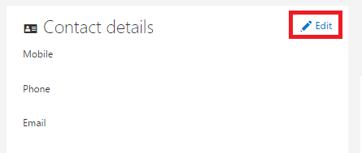

<properties
   pageTitle=""
   description=""
   services="powerbi"
   documentationCenter=""
   authors="guyinacube"
   manager="mblythe"
   backup=""
   editor=""
   tags=""
   qualityFocus="no"
   qualityDate=""/>

<tags
   ms.service="powerbi"
   ms.devlang="NA"
   ms.topic="article"
   ms.tgt_pltfrm="NA"
   ms.workload="powerbi"
   ms.date="09/21/2016"
   ms.author="asaxton"/>

# Power BI 的備用電子郵件地址

根據預設，您用來登入以使用 Power BI 的電子郵件地址用於傳送 Power BI 中的活動更新的資訊。  例如，當有人傳送共用邀請給您時就會移至這個位址。

有時候，您可以傳遞至備用電子郵件地址，而非您原本用來與 Power bi 註冊這些電子郵件。

若要這麼做的方法如下︰

1.  移至您 [Office 365 個人資訊] 頁面，](https://portal.office.com/account/#personalinfo)。  系統會提示您，如果電子郵件地址和密碼登入您用於 Power BI。

2.  Slick 連絡人詳細資料區段中的 [編輯] 連結。  

    > [AZURE.NOTE] 如果看不到的編輯連結，這表示您的電子郵件地址由您的 Office 365 系統管理員，您必須連絡的方式更新您的電子郵件地址。

    

3.  在 [備用電子郵件欄位中輸入您想要傳送到 Power BI 更新電子郵件地址。

> [AZURE.NOTE] 變更此設定不會影響哪些電子郵件地址用來傳送服務更新、 電子報，以及其他促銷通訊。  這些通常會被傳送電子郵件地址原本使用 Power bi 註冊時。

更多的問題嗎？ 
            [試用 Power BI 社群](http://community.powerbi.com/)
