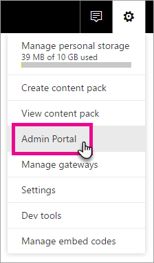
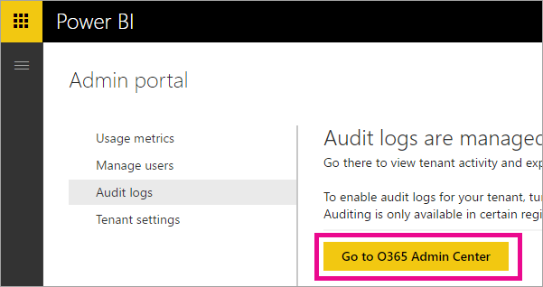

<properties
   pageTitle="您的組織中的稽核 Power BI"
   description="了解您可以使用 Power BI 使用稽核來監視和調查所執行的動作。 您可以使用的安全性和相容性中心，或使用 PowerShell。"
   services="powerbi"
   documentationCenter=""
   authors="guyinacube"
   manager="mblythe"
   backup=""
   editor=""
   tags=""
   qualityFocus="no"
   qualityDate=""/>

<tags
   ms.service="powerbi"
   ms.devlang="NA"
   ms.topic="article"
   ms.tgt_pltfrm="NA"
   ms.workload="powerbi"
   ms.date="10/11/2016"
   ms.author="asaxton"/>
# 您的組織中的稽核 Power BI

<iframe width="560" height="315" src="https://www.youtube.com/embed/zj4kA39jV_4?showinfo=0" frameborder="0" allowfullscreen></iframe>

了解您可以使用 Power BI 使用稽核來監視和調查所執行的動作。 您可以使用的安全性和相容性中心，或使用 PowerShell。

了解誰正在 Power BI 中哪個項目租用戶可以幫助您的組織符合其需求，例如會議法規與記錄管理重要的動作。

您可以篩選稽核資料依日期範圍、 使用者、 儀表板、 報表、 資料集和活動類型。 您也可以下載離線分析 csv （逗號分隔值） 檔案中的活動。

> [AZURE.NOTE] 在 Power BI 中的稽核功能處於預覽狀態，除了在 Austrailia 和歐洲的所有資料區中可用。

## 啟用稽核功能，在 Power BI 系統管理入口網站

您必須啟用稽核為您的組織，才能使用報表。 您可以在租用戶系統管理員入口網站的設定。

1.  選取 **齒輪圖示** 右上角。

2.  選取 **系統管理入口網站**。

    

3.  選取 **租用戶設定**。

    

4.  切換成開啟 **建立稽核記錄檔進行的內部活動稽核和法規遵循**。

5.  選取 **套用**。

Power BI 會開始記錄您的使用者執行 Power BI 中的各種活動。 記錄檔需要 48 小時的時間在 O365 安全性與相容性中心中顯示。 如需記錄哪些活動的詳細資訊，請參閱 [稽核由 Power BI 的活動清單](#list-of-activities-audited-by-power-bi)。

## 授權需求

稽核是 Power BI Pro 的功能和稽核事件只適用於 Power BI Pro 的使用者。  Power BI （免費） 授權的使用者將會顯示為 **免費使用者**。

如需有關如何取得和 Power BI Pro 的授權指派給使用者，在組織中的詳細資訊，請參閱 [採購 Power BI Pro](powerbi-admin-purchasing-powerb-bi-pro.md)。

如需有關如何限制可用的使用者登入的詳細資訊，請參閱 [啟用或停用個別使用者註冊 Azure Active Directory 中的](powerbi-admin-powerbi-free-in-your-organization.md#enable-or-disable-individual-user-sign-up-in-azure-active-directory)。

> [AZURE.NOTE] 若要啟用 Power BI 租用戶中的稽核，您需要至少一個 exchange 信箱授權租用戶中。

## 存取您的稽核記錄檔

若要稽核您的 Power BI 記錄檔，您必須瀏覽 O365 安全性與相容性中心。

1.  選取 **齒輪圖示** 右上角。

2.  選取 **系統管理入口網站**。

    

3.  選取 **稽核記錄檔**。

4.  選取 **前往 O365 系統管理中心**。

    

或者，您可以瀏覽 [Office 365 |安全性和法規](https://protection.office.com/#/unifiedauditlog)。

> [AZURE.NOTE] 若要提供非系統管理員帳戶具有存取權的稽核記錄檔，您必須指派權限的 Exchange Online 系統管理中心。 比方說，您可將使用者指派至現有的角色群組，例如組織管理，或您可以建立新的角色群組的稽核記錄檔的角色。 如需詳細資訊，請參閱 [Exchange Online 中的權限](https://technet.microsoft.com/library/jj200692\(v=exchg.150\).aspx)。

## 搜尋僅 Power BI 活動

您可以透過下列方式限制只 Power BI 活動結果。

1.  在 **稽核記錄搜尋** 頁面上，從下拉式清單選取 **活動** 下 **搜尋**。

2.  選取 **PowerBI 活動**。

    

3.  選取方塊外面任何地方選取，將它關閉。

您的搜尋現在經篩選後只 Power BI 活動。

## 依日期搜尋稽核記錄檔

您可以使用 [開始日期] 和 [結束日期] 欄位的日期範圍內搜尋記錄檔。 預設會選取過去七天。 日期和時間是以國際標準時間 (UTC) 格式顯示。 您可以指定的最大日期範圍是 90 天。 如果選定的日期範圍超過 90 天，則會顯示錯誤。

> [AZURE.NOTE] 如果您使用的 90 天的最大的日期範圍，請選取 [開始日期的目前時間。 否則，您會收到錯誤，指出開始日期是早於結束日期。 如果您已開啟稽核過去 90 天內，最大日期範圍無法啟動之前已開啟稽核的日期。


## 搜尋使用者的稽核記錄檔

您可以搜尋特定使用者所執行的活動的稽核記錄項目。 若要這樣做，請在 「 使用者 」 欄位中輸入一個或多個使用者名稱。  這是登入與 Power BI 的使用者名稱。 它看起來像電子郵件地址。
將此方塊保留空白，以傳回您組織中的所有使用者 （和服務帳戶） 的項目。


## 檢視搜尋結果

一旦您按下搜尋按鈕，搜尋結果會載入，而且一段時間後就會顯示在 [結果。 當搜尋完成後時，會顯示找到的結果數目。 

> [AZURE.NOTE] 最多 1000年個事件將會顯示;如果超過 1000 個事件符合搜尋準則，則會顯示最新的 1000 個事件。

結果會包含下列搜尋傳回的每個事件相關資訊。

|**資料行**|**定義**|
|---|---|
|日期|日期和時間 （以 UTC 格式），發生此事件。|
|IP 位址|活動記錄時所用之裝置的 IP 位址。 IP 位址會顯示在 [IPv4 或 IPv6 位址的格式。|
|使用者|使用者 （或服務帳戶） 執行者觸發事件的動作。|
|活動|使用者所執行的活動。 這個值會對應至您在清單中向下 Activitiesdrop 中選取的活動。 對於 Exchange 系統管理員稽核記錄的事件，此資料行中的值會是 Exchange 指令程式。|
|項目|物件，建立或修改對應的活動的結果。 例如，檢視或修改的檔案或已更新的使用者帳戶。 並非所有的活動有此資料行中的值。|
|Detail|活動有關的其他詳細資料。 同樣地，並非所有活動會都有值。|

> [AZURE.NOTE] 選取 [以排序結果的結果資料行標頭。 您可以排序結果從 A 到 Z 或 Z 到 a 按一下日期標頭來排序結果的最舊到最新或最新到最舊。

## 檢視事件的詳細資料

您可以檢視事件的詳細的搜尋結果清單中選取事件的記錄。 詳細資料] 頁面隨即出現，其中包含從事件記錄的詳細的屬性。 所顯示的屬性取決於 Office 365 服務發生事件時。 若要顯示其他詳細資訊，請選取 **更多資訊**。

以下是一些可能的詳細資料，會顯示。

|**參數**|**描述**|
|---|---|
|Id|稽核記錄的唯一識別碼。|
|RecordType|指出記錄的作業類型。 稽核記錄檔記錄的類型，請參閱 AuditLogRecordType 資料表詳細資料。|
|CreationTime|日期和時間在國際標準時間 (UTC) 的使用者執行活動時。|
|失敗|使用者或管理員活動的名稱。|
|OrganizationId|發生事件的組織的 Office 365 服務的 GUID。|
|UserType|使用者執行作業的類型。 上的使用者類型，請參閱使用者型別資料表以取得詳細資料。|
|使用者金鑰|執行活動之使用者的 Passport 唯一識別碼。|
|ResultStatus|表示動作 （在 [作業] 屬性中指定） 是否已成功。 可能的值為成功、 PartiallySucceded 或失敗。|
|ObjectId|適用於 SharePoint 和 OneDrive 商務活動、 檔案或資料夾的使用者存取的完整路徑名稱。|
|UserId|執行導致記錄; 該記錄的動作 （在 [作業] 屬性中指定） 的使用者 UPN （使用者主體名稱）例如，my_name@my_domain_name。 請注意系統帳戶 （例如 SHAREPOINT\system 或 NT AUTHORITY\SYSTEM） 所執行的活動記錄也會包含。|
|ClientIp|活動記錄時所用之裝置的 IP 位址。 IP 位址會顯示在 [IPv4 或 IPv6 位址的格式。|

## 使用 PowerShell 來搜尋

您可以使用 PowerShell 來存取您的登入為基礎的稽核記錄。 這是由存取 Exchange Online。 以下是命令的範例，以提取 Power BI 稽核記錄項目。

```
Set-ExecutionPolicy RemoteSigned
 
$UserCredential = Get-Credential
 
$Session = New-PSSession -ConfigurationName Microsoft.Exchange -ConnectionUri https://outlook.office365.com/powershell-liveid/ -Credential $UserCredential -Authentication Basic -AllowRedirection
 
Import-PSSession $Session
Search-UnifiedAuditLog -StartDate 9/11/2016 -EndDate 9/15/2016 -RecordType PowerBI -ResultSize 1000 | Format-Table | More
```

如需有關如何連接至 Exchange Online 的詳細資訊，請參閱 [連線到 Exchange Online PowerShell](https://technet.microsoft.com/library/jj984289\(v=exchg.160\).aspx)。

如需有關參數和搜尋 UnifiedAuditLog 命令的使用方式的詳細資訊，請參閱 [搜尋 UnifiedAuditLog](https://technet.microsoft.com/library/mt238501\(v=exchg.160\).aspx)。

## 匯出 Power BI 稽核記錄

您可以將 Power BI 稽核記錄檔匯出至 csv 檔案。

1.  選取 **匯出結果**。

2.  選取 [ **儲存載入結果** 或 **下載所有結果**。

    

## 記錄和使用者類型

稽核記錄項目會具有 RecordType 和 UserType 與項目的詳細資料的一部分。 Power BI 的所有項目將會有 20 個 RecordType。

如需完整清單，請參閱 [稽核記錄檔在 Office 365 中的詳細的屬性。](https://support.office.com/article/Detailed-properties-in-the-Office-365-audit-log-ce004100-9e7f-443e-942b-9b04098fcfc3)

## 由 Power BI 稽核的活動清單

|活動|說明|其他詳細資料|
|---|---|---|
|CreateDashboard|每次建立新的儀表板時，會記錄此活動。|-儀表板名稱。|
|EditDashboard|此活動會記錄每次重新命名儀表板。|-儀表板名稱。|
|DeleteDashboard|此活動會記錄每次刪除儀表板。|-儀表板名稱。|
|PrintDashboard|儀表板會列印每次時，會記錄此事件。|-儀表板名稱。<br/>資料集名稱|
|ShareDashboard|此活動會記錄每次共用儀表板。|-儀表板名稱。<br/>-收件者的電子郵件。<br/>資料集名稱。<br>-重新共用權限。|
|ViewDashboard|此活動會記錄每次儀表板檢視。|-儀表板名稱。|
|ExportTile|每次從儀表板磚匯出資料時，會記錄此事件。|並排名稱。<br/>資料集名稱。|
|DeleteReport|每當刪除報表時，會記錄此活動。|報告名稱。|
|ExportReport|每次從報表磚匯出資料時，會記錄此事件。|報告名稱。<br/>資料集名稱。|
|PrintReport|每次列印報表時，會記錄此事件。|報告名稱。<br/>資料集名稱。|
|PublishToWebReport|每次使用報表會發佈到網站時，會記錄此事件。|報告名稱。<br/>資料集名稱。|
|ViewReport|此活動會記錄每次檢視報表。|報告名稱。|
|ExploreDataset|此事件會記錄每次您瀏覽資料集選取它。|資料集名稱|
|DeleteDataset|每當刪除資料集時，會記錄此事件。|資料集名稱。|
|CreateOrgApp|每次建立組織內容套件時，會記錄此活動。|組織內容組件名稱。<br/>-儀表板名稱。<br/>報告名稱。<br/>資料集名稱。|
|CreateGroup|每次建立群組時，就會引發這項活動。|群組名稱。|
|AddGroupMembers|此活動會記錄每次加入至 Power BI 群組工作區的成員。|群組名稱。<br/>-電子郵件地址。|
|UpdatedAdminFeatureSwitch|每次變更管理功能切換時，會記錄此事件。|-參數名稱。<br/>新的切換狀態。|

## 請參閱

[Power BI 系統管理員入口網站](powerbi-admin-portal.md)  
[採購 Power BI Pro](powerbi-admin-purchasing-powerb-bi-pro.md)  
[權限在 Exchange Online](https://technet.microsoft.com/library/jj200692(v=exchg.150).aspx)  
[連線到 Exchange Online PowerShell](https://technet.microsoft.com/library/jj984289\(v=exchg.160\).aspx)  
[搜尋 UnifiedAuditLog](https://technet.microsoft.com/library/mt238501\(v=exchg.160\).aspx)  
[稽核記錄檔在 Office 365 中的詳細的屬性。](https://support.office.com/article/Detailed-properties-in-the-Office-365-audit-log-ce004100-9e7f-443e-942b-9b04098fcfc3)  
更多的問題嗎？ [試用 Power BI 社群](http://community.powerbi.com/)