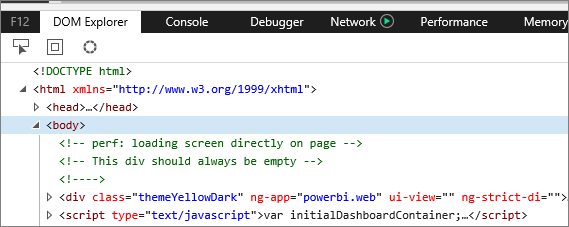
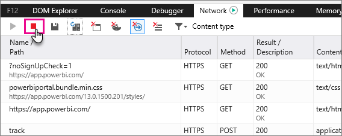
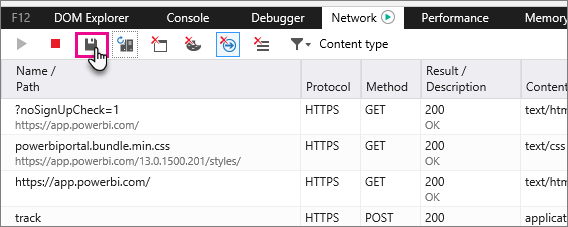

<properties 
   pageTitle="Power bi 的擷取其他診斷資訊"
   description="Power bi 的擷取其他診斷資訊"
   services="powerbi" 
   documentationCenter="" 
   authors="guyinacube" 
   manager="erikre" 
   backup=""
   editor=""
   tags=""
   qualityFocus="no"
   qualityDate=""/>
 
<tags
   ms.service="powerbi"
   ms.devlang="NA"
   ms.topic="article"
   ms.tgt_pltfrm="NA"
   ms.workload="powerbi"
   ms.date="10/10/2016"
   ms.author="asaxton"/>

# Power bi 的擷取其他診斷資訊  

## 擷取 Power bi 的其他診斷資訊  
這些指示提供兩個可能的選項，以手動方式從 Power BI web 用戶端收集其他診斷資訊。  只有其中一個這些選項時必須遵循。

## 擷取網路的邊緣和 Internet Explorer 
1.  瀏覽至 [Power BI](https://app.powerbi.com) 邊緣或 Internet Explorer。

2.  按 F12 來開啟邊緣開發人員工具。

3.  會顯示 [開發人員工具] 視窗︰ 

    

4.  切換至 [網路] 索引標籤。 它會列出已經淪陷的流量。 

    

5.  您可以瀏覽視窗中，並重現您可能會遇到任何問題。 您可以隱藏和顯示開發人員工具] 視窗中工作階段期間隨時按 F12。

6.  若要停止擷取，您可以選取紅色方塊，開發人員工具區域的 [網路] 索引標籤。

    

7.  磁碟片圖示以選取 **匯出為 HAR**

    

8. 提供檔案名稱，並儲存 HAR 檔案。

    HAR 檔案會包含瀏覽器視窗與 Power BI 之間的網路要求的所有資訊。  這包括每個要求，每個要求，以及任何錯誤資訊傳回給用戶端的精確時間戳記的活動識別碼。  這項追蹤也會包含用來填入螢幕上顯示視覺效果的資料。

9. 您可以提供 HAR 檔案以供檢閱的支援。

更多的問題嗎？ [試用 Power BI 社群](http://community.powerbi.com/)