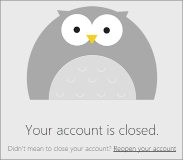

<properties 
   pageTitle="關閉您的 Power BI 帳戶"
   description="關閉您的 Power BI 帳戶"
   services="powerbi" 
   documentationCenter="" 
   authors="guyinacube" 
   manager="erikre" 
   backup=""
   editor=""
   tags=""
   qualityFocus="no"
   qualityDate=""/>
 
<tags
   ms.service="powerbi"
   ms.devlang="NA"
   ms.topic="article"
   ms.tgt_pltfrm="NA"
   ms.workload="powerbi"
   ms.date="10/10/2016"
   ms.author="asaxton"/>
# 關閉您的 Power BI 帳戶

如果您不想再使用 Power BI，您可以要求我們關閉您的 Power BI 帳戶。  關閉您的帳戶之後，您可以不會再登入 Power BI。  此外，您上傳，或建立、 Power BI 中的任何客戶資料會根據資料保留原則刪除在 Power BI 服務條款。

## Power BI （免費） 或 Power BI Pro 的個別使用者

如果您有一個免費帳戶，或支付 Power BI Pro 的個別訂閱時，會關閉您的帳戶，從 [設定] 畫面。

1. 選擇齒輪  右上角。

2. 選取 **設定**。

    

3. 
            **一般** > **關閉帳戶**

    
    
4. 選取的原因，從  **為何您要關閉您的帳戶？** （1）] 下拉式清單。  您可以選擇性地提供進一步資訊 (2)。 然後選取 **關閉帳戶**。

    
    
5. 確認您想要關閉您的帳戶。

    
    
6. 您會看到確認訊息已關閉您的帳戶。 您也將提供的連結來重新開啟您的帳戶。

    

## 受管理的租用戶使用者

您必須連絡您的租用戶系統管理員並要求他們要取消指派授權，從您的帳戶。

更多的問題嗎？ [試用 Power BI 社群](http://community.powerbi.com/)