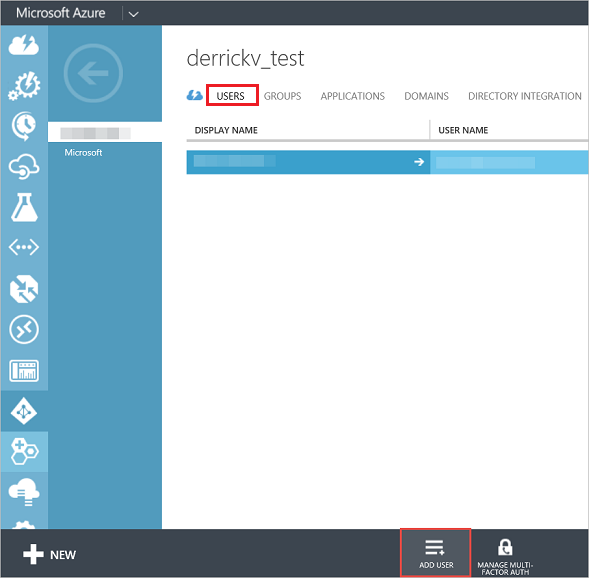

<properties
pageTitle="註冊自訂的 Azure 目錄"
description="您可以為開發人員，想要測試您的 Power BI 應用程式可使用 REST API。 在您的 Azure 訂閱中建立自訂的目錄，可以讓您來嘗試隔離的環境。 有若干事項您必須要取得 Power BI 才能使用該自訂目錄。"
services="powerbi"
documentationCenter=""
authors="guyinacube"
manager="erikre"
backup=""
editor=""
tags=""
qualityFocus="monitoring"
qualityDate="8/15/2016"/>

<tags
ms.service="powerbi"
ms.devlang="NA"
ms.topic="article"
ms.tgt_pltfrm="na"
ms.workload="powerbi"
ms.date="10/10/2016"
ms.author="asaxton"/>
# 註冊 Power BI （免費） 使用自訂的 Azure Active Directory 租用戶

如果您是開發人員，使用 Microsoft Azure，並想要建立 Power BI 應用程式使用 REST API，您可能要基於測試目的使用 Power BI 與自訂的 Azure Active Directory (AAD) 租用戶。  有的一些您需要如何做以讓啟動並執行。 這是有關使用 Azure Active Directory 租用戶建立與測試 Power BI。 

沒有額外的步驟，您需要執行至實際執行 Power BI 註冊，因為，您將不會有電子郵件伺服器的存取權的自訂網域 AAD 租用戶。

<iframe width="560" height="315" src="https://www.youtube.com/embed/97IfXEWZMfU?showinfo=0" frameborder="0" allowfullscreen></iframe>

## 建立自訂的目錄和新使用者

若要測試新的租用戶使用，您必須建立 Azure Active Directory 租用戶。 您可以透過 Azure 入口網站執行，藉由建立新的目錄。 完成之後，您要建立新的使用者，我們可以使用 Power bi 註冊。

### 建立 Azure Active Directory 租用戶

以下是如何設定 **Azure Active Directory**:

 1. 巡覽至 https://manage.windowsazure.com，並具有 Azure 訂用帳戶的帳戶登入。

 2. 選取 **ACTIVE DIRECTORY** 的左窗格中的 [管理] 圖示。

    

 3. 選取 **新增** 在頁面底部的按鈕。

 4. 選取 **應用程式服務** > **ACTIVE DIRECTORY** > **目錄** > **自訂建立**

    

 5. 在 **加入目錄** 頁面上，輸入名稱和網域名稱。 國家或地區，選擇美國或國家/地區所 Power BI 使用。

    

 6. 選擇 [確定] 圖示。 建立 Azure Active Directory。

### 將使用者加入您的 Azure Active Directory 租用戶

既然我們已經有新的租用戶，我們可以在我們的測試組織內建立使用者。

1. 巡覽至 https://manage.windowsazure.com，並具有 Azure 訂用帳戶的帳戶登入。

2. 選取 **ACTIVE DIRECTORY** 的左窗格中的 [管理] 圖示。

3. 在您 **Azure Active Directory**, ，請選取 **使用者**。

    

4. 在頁面的底部，選取 **新增使用者**。 使用者帳戶用來註冊 Power BI 應用程式。

5. 在 **告訴我們使用者本頁**:

    1. 如 **使用者類型**, ，請選取 **貴組織中的新使用者**。
    2. 輸入您 **使用者名**。
    3. 選取 **下一步**。

        

6. 在 **的使用者設定檔** 頁面上，輸入您 **顯示名稱**。 顯示名稱是必要的欄位。

    

7. 選取 **下一步**。 如 **角色**, ，您可以使用 **使用者**。

8. 選取 **建立** 建立暫時密碼。 在第一次登入時必須變更暫時密碼是指派給新使用者。

9. 在 **取得暫時密碼** 頁面複製暫時密碼，然後按一下 **完成** 圖示。 使用的暫時密碼當您第一次登入您的 AAD。

10. 選取後 **完成** 圖示、 新建立 Azure AD 使用者。

 您可以進一步了解在這個步驟 [建立 Azure Active Directory 租用戶](powerbi-developer-create-an-azure-active-directory-tenant.md)。

## 取得免費的授權，透過新增 Office 365 的訂用帳戶

如果您嘗試註冊 Power BI （免費） 與您建立自訂目錄中的新使用者，可能會在訊息，指出若要檢查您的驗證步驟的電子郵件給您。 不過，您並沒有此自訂目錄之網域的電子郵件伺服器。 

若要解決這個問題，我們必須從 Office 365 系統管理中心新增 Power BI （免費） 授權。

> [AZURE.IMPORTANT] 此步驟需要您提供信用卡資訊，但您不需要支付 （免費） 的 Power BI 授權。

> [AZURE.NOTE] 請確定您有至少一個使用者標示為 **全域管理員** 自訂目錄中。 這是讓您能夠存取 Office 365 系統管理中心。

1.  瀏覽至 [Office 365 系統管理中心](https://portal.office.com/admin/default.aspx), ，並以您為您的自訂目錄的全域系統管理員使用者登入。

2.  在左的導覽窗格中，選取 **計費** > **訂閱**。

3.  選取 **新增訂閱** 右邊。 如果看不到 **新增訂閱**, ，您可能沒有全域管理員角色。

    

4.  在其他的計劃，將滑鼠停留在 **省略號 （...）** Power bi （免費），然後選取 **立即購買**。

    

5.  輸入您想要加入，然後選取的授權數量 **立即簽出** 或 **新增至購物車**。

    > [AZURE.NOTE] 您可以視需要新增更在較晚的日期。

6.  簽出流程中輸入所需的資訊。

無須購買任何產品時使用這種方法，但是您必須輸入信用卡帳單資訊，或選擇收費。

如果您稍後決定您想要新增更多授權，您可以移回至 **新增訂閱**, ，然後選取 **變更授權數量** Power bi （免費）。

您現在可以將這些授權指派給您的使用者。 在檢查期間外，它可能已指派 Power BI （免費） 授權沒有指派任何授權的所有使用者。 [進一步了解](https://support.office.com/article/Assign-or-unassign-licenses-for-Office-365-for-business-997596b5-4173-4627-b915-36abac6786dc)

您可以驗證使用者是否具有授權指派給該帳戶，請前往 **使用者** > **作用中使用者** ，然後選取使用者。 在右側，您會看到 **指派授權**。

## 登入 Power BI

您現在應該可以登入 [Power BI](https://app.powerbi.com) 與您建立自訂目錄中的使用者。

## 請參閱

[建立 Azure Active Directory 租用戶](powerbi-developer-create-an-azure-active-directory-tenant.md)  
[Power BI 組織中的 （免費）](powerbi-admin-powerbi-free-in-your-organization.md)  
[什麼是 Azure AD 目錄？](https://msdn.microsoft.com/library/azure/jj573650.aspx)  
[如何取得 Azure Active Directory 租用戶](https://azure.microsoft.com/documentation/articles/active-directory-howto-tenant/)  
更多的問題嗎？ [試用 Power BI 社群](http://community.powerbi.com/)