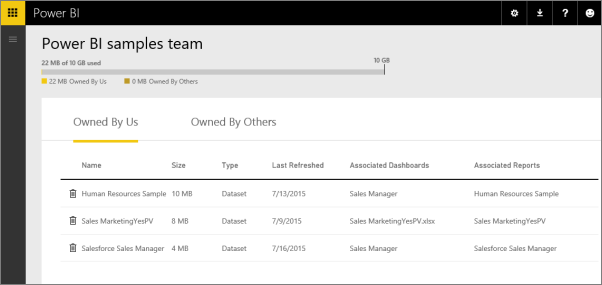
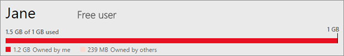

<properties 
   pageTitle="管理您在 Power BI 中的資料容量"
   description="管理您的資料容量和 Power BI 中的儲存體"
   services="powerbi" 
   documentationCenter="" 
   authors="guyinacube" 
   manager="mblythe" 
   backup=""
   editor=""
   tags=""
   qualityFocus="no"
   qualityDate=""/>
 
<tags
   ms.service="powerbi"
   ms.devlang="NA"
   ms.topic="article"
   ms.tgt_pltfrm="NA"
   ms.workload="powerbi"
   ms.date="08/15/2016"
   ms.author="asaxton"/>
# 管理您在 Power BI 中的資料容量

Power BI 提供兩種授權，Power BI （免費） 和 Power BI Pro，具有不同的資料容量限制︰

-   免費使用者有 1 GB 的資料容量上限。

-   Power BI Pro 的專業人員的使用者有 10 GB 的最大容量。

-   專業人員的使用者可以建立群組，最多 10 GB 資料容量每個。

在租用戶層級使用量總計不能超過 10 GB 每個 Pro 使用者跨所有 Pro 使用者和群組的租用戶中。 

閱讀有關的其他功能 [Power BI 價格模型](https://powerbi.microsoft.com/pricing)。

資料容量包括您自己的資料集和 Excel 報表，以及那些某人已與您共用。 資料集有任何您已上傳或連線到，包括 Power BI Desktop 檔案與您正在使用的 Excel 活頁簿的資料來源。 下列是也包含在資料容量。

-   Excel 範圍釘選到儀表板。

-   Reporting Services 內部視覺效果釘選到 Power BI 儀表板。

-   上傳的影像。

您共用儀表板的大小會因什麼已釘選到它。 例如，如果您從屬於兩個不同的資料集的兩份報表的項目釘選，大小會包含兩個資料集。

<a name="manage"/>
## 管理您所擁有的項目

查看多少資料容量，您在 Power BI 帳戶中，使用並管理您的帳戶。

1.  若要管理您自己的儲存體，請移至 **我的工作區** 左的導覽窗格的頂端。 

    

2.  選擇齒輪圖示  右上角 \> **管理個人儲存體**。 

    頂端列會顯示您已使用的儲存空間限制中有多少。

    

    資料集和報表會分隔到兩個索引標籤︰

    
                **我擁有的︰** 這些是報表和您已上傳至您的 Power BI 帳戶，包括服務的資料集，例如 Salesforce 和 Dynamics CRM 資料集。

            **擁有人︰** 其他人已與您分享這些報表和資料集。

3.  若要刪除的資料集或報表中，選取 [資源回收筒可以圖示 。

請記住您或其他人可能擁有的報表和資料集為基礎的儀表板。 如果您刪除資料集，這些報表和儀表板將無法再運作。

## 管理您的群組

1.  選取箭號旁 **我的工作區** \> 選取群組的名稱。

    

2.  選擇齒輪圖示  右上角 \> **管理群組的儲存體**。

    頂端列顯示多少群組的儲存體限制使用。

    

    資料集和報表會分隔到兩個索引標籤︰

    
                **我們擁有︰** 這些是報表和您或其他人已上傳至該群組的 Power BI 帳戶，包括服務的資料集，例如 Salesforce 和 Dynamics CRM 資料集。

            **擁有人︰** 其他人共用這些報表和資料集的群組。

3.  若要刪除的資料集或報表中，選取 [資源回收筒可以圖示 。
    >
            **注意︰** 任何群組的成員具有刪除群組的儲存體中的資料集和報表的權限。

請記住您或他人在群組中可能有報表和資料集為基礎的儀表板。 如果您刪除資料集，這些報表和儀表板將無法再運作。

## 資料集限制

沒有限制為 1 GB，每個資料集匯入至 Power BI。 如果您選擇要保留 Excel 經驗，而不是匯入資料，會限制為 250 MB 的資料集。

## 當達到限制時，會發生什麼事

當您按下您可以執行的資料容量限制時，您會看到服務中的提示。 

當您選取齒輪圖示 , ，您會看到紅色上顯示您已超過您的資料容量限制。

您也會看到這中指出 **管理個人儲存體**。

 
 
 當您嘗試執行的動作，便會叫用其中一個限制時，您會看到提示，指出已超過限制。 免費的使用者，您將有機會嘗試 Pro。 免費及專業人員的使用者將能夠 [管理](#manage) 儲存它們。
 
 **可用的對話方塊**
 
 
 
 **專業人員的對話方塊** 
 
 

 更多的問題嗎？ [試用 Power BI 社群](http://community.powerbi.com/)