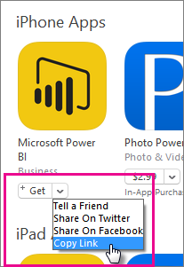
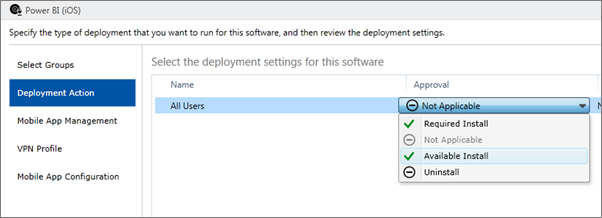

<properties
pageTitle="使用 Intune 設定行動應用程式"
description="如何使用 Microsoft Intune 設定 Power BI 行動應用程式。 這包括如何加入及部署，應用程式。 以及如何建立行動應用程式原則，控制安全性。"
services="powerbi"
documentationCenter=""
authors="guyinacube"
manager="mblythe"
backup=""
editor=""
tags=""
qualityFocus="no"
qualityDate=""/>

<tags
ms.service="powerbi"
ms.devlang="NA"
ms.topic="article"
ms.tgt_pltfrm="na"
ms.workload="powerbi"
ms.date="08/15/2016"
ms.author="asaxton"/>
# 設定 Power BI 行動應用程式使用 Microsoft Intune

Microsoft Intune 可讓組織管理裝置和應用程式。 Power BI 行動應用程式，適用於 iOS 和 Android，整合 intune，才能讓您管理您的裝置上的應用程式，並控制安全性。 您可以透過設定原則，控制需要存取 pin 控制應用程式如何處理資料，即使不使用應用程式時，加密應用程式資料等項目。

## 一般行動裝置管理設定

這份文件並非做為完整的設定指南適用於 Microsoft Intune。 如果您只是現在會將與 Intune 整合，有幾件事，您會想要確定您已設定。 [進一步了解](https://technet.microsoft.com/library/jj676587.aspx)

Microsoft Intune 可以同時存在與行動裝置管理 (MDM) Office 365 內。 [進一步了解](https://blogs.technet.microsoft.com/configmgrdogs/2016/01/04/microsoft-intune-co-existence-with-mdm-for-office-365/)

本文會假設已正確設定 Intune，以及您已經向 Intune 註冊的裝置。 共置現有 mdm 時，裝置會顯示在 MDM 註冊，但可用於在 Intune 管理。

## 步驟 1︰ 取得應用程式的 url

我們建立 Intune 應用程式之前，我們需要取得的應用程式的 url。 若是 iOS，我們將從取得此資訊 iTunes。 若是 Android，您可以從 Power BI 行動網頁取得。

儲存 url，您將需要它時，我們建立應用程式。

### iOS

若要取得適用於 iOS 的應用程式的 url，我們必須獲得 iTunes。

1. 開啟 iTunes。

2. 搜尋 *Power BI*。

3. 您應該會看到 **Microsoft Power BI** 底下列出 **iPhone 應用程式** 和 **iPad 應用程式**。 您可以使用，當您將相同的 url。

4. 選取 **取得** 下拉式清單，然後選取 **複製連結**。

    

它看起來應該如下所示。

    https://itunes.apple.com/us/app/microsoft-power-bi/id929738808?mt=8
    
### Android

您可以從 Google play 取得 url [Power BI 行動網頁](https://powerbi.microsoft.com/mobile/)。 按一下 **從 Google Play 下載** 圖示將會帶您到應用程式頁面。 您可以從瀏覽器網址列複製 URL。 它看起來應該如下所示。

    https://play.google.com/store/apps/details?id=com.microsoft.powerbim

## 步驟 2︰ 建立行動應用程式管理原則

行動應用程式管理原則可讓您強制執行存取 pin 碼等項目。 您可以建立一個 Intune 入口網站中。 

第一次可以建立應用程式或原則。 加入它們的順序並不重要。 他們將只需要同時存在於部署步驟。

1. 選取 **原則** > **設定原則**。

    

2. 選取 **國內**。

3. 在 **軟體** 您可以選取 Android 或 iOS 的行動應用程式管理。 若要快速開始，您可以選取 **使用建議的設定建立原則**, ，或者您可以建立自訂原則。
    
4. 編輯原則，以進行您想要的限制對應用程式。

## 步驟 3︰ 建立應用程式

參考或封裝儲存到 Intune 部署應用程式。 我們需要建立應用程式，並參考從 Google Play 或 iTunes 我們取得的應用程式 url。

第一次可以建立應用程式或原則。 加入它們的順序並不重要。 他們將只需要同時存在於部署步驟。

1. 移至 Intune 入口網站，然後選取 **應用程式** 從左側的功能表。

2. 選取 **將應用程式新增**。 這會啟動 **新增軟體** 應用程式。

### iOS

1. 選取 **應用程式商店的受管理 iOS 應用程式** 從下拉式功能表中選取。

2. 輸入應用程式的 url，我們從取得 [步驟 1](#step-1-get-the-url-for-the-application), ，然後選取 **下一步**。

    
    
3. 提供 **發行者**, ，**名稱** 和 **描述**。 您可以選擇性地提供 **圖示**。  **類別** 適用於公司入口網站應用程式。 在您完成選取 **下一步**。

4. 您可以決定是否要發行應用程式當作 **任何** （預設）、 **iPad** 或 **iPhone**。 根據預設，它會顯示 **任何** 而且將適用於這兩種裝置類型。 Power BI 應用程式是 iPhone 和 iPad 的相同 url。 選取 **下一步**。

5. 選取 **上載**。

> 附註︰ 您可能不會看到它顯示在應用程式清單中直到您重新整理頁面。 您可以按一下 **概觀** ，再回到 **應用程式** 取得重新載入頁面。

### Android

1. 選取 **外部連結** 從下拉式功能表中選取。

2. 輸入應用程式的 url，我們從取得 [步驟 1](#step-1-get-the-url-for-the-application), ，然後選取 **下一步**。

    
    
3. 提供 **發行者**, ，**名稱** 和 **描述**。 您可以選擇性地提供 **圖示**。  **類別** 適用於公司入口網站應用程式。 在您完成選取 **下一步**。

5. 選取 **上載**。

> 附註︰ 您可能不會看到它顯示在應用程式清單中直到您重新整理頁面。 您可以按一下 **概觀** ，再回到 **應用程式** 取得重新載入頁面。

## 步驟 4︰ 部署應用程式

加入應用程式之後，您必須將它部署，讓您的使用者可以使用。 這是您將會繫結原則的步驟建立的應用程式。

### iOS

1. 在應用程式畫面上，選取您所建立的應用程式。 然後選取 **管理部署...** 連結。

    

2. 在 **選取群組** ] 畫面中，您可以選擇您想要部署此應用程式屬於哪些的群組。 選取 **下一步**。

3. 在 **部署動作** ] 畫面中，您可以選擇您要部署此應用程式的方式。 選取 **可用安裝**, ，或 **必要安裝**, ，會讓應用程式可用來安裝隨使用者在公司入口網站。 完成之後，進行您的選擇選取 **下一步**。

    

4. 在 **行動應用程式管理** ] 畫面中，您可以選取我們在建立行動應用程式管理原則 [步驟 2](#step-2-create-a-mobile-application-management-policy)。 如果這是唯一的 iOS 原則，它會預設為您所做的原則。 選取 **下一步**。

    

5. 在 **VPN 設定檔** ] 畫面中，您可以選取原則，如果您有一個為您的組織。 其預設值為 **無**。 選取 **下一步**。

6. 在 **行動應用程式組態** ] 畫面中，您可以選取 **應用程式設定原則** 如果您建立了一個。 其預設值為 **無**。 這不是必要的。 選取 **完成**。

當您部署應用程式之後，它應該會顯示 **是** 的部署，請在應用程式] 頁面。

### Android

1. 在應用程式畫面上，選取您所建立的應用程式。 然後選取 **管理部署...** 連結。

    

2. 在 **選取群組** ] 畫面中，您可以選擇您想要部署此應用程式屬於哪些的群組。 選取 **下一步**。

3. 在 **部署動作** ] 畫面中，您可以選擇您要部署此應用程式的方式。 選取 **可用安裝**, ，或 **必要安裝**, ，會讓應用程式可用來安裝隨使用者在公司入口網站。 完成之後，進行您的選擇選取 **下一步**。

    

4. 在 **行動應用程式管理** ] 畫面中，您可以選取我們在建立行動應用程式管理原則 [步驟 2](#step-2-create-a-mobile-application-management-policy)。 如果這是只有 Android 可用的原則，它會預設為您所做的原則。 選取 **完成**。

    

當您部署應用程式之後，它應該會顯示 **是** 的部署，請在應用程式] 頁面。

## 步驟 5︰ 在裝置上安裝應用程式

您將安裝應用程式透過公司入口網站應用程式。 如果您尚未安裝公司入口網站，您可以透過在 iOS 或 Android 平台上的應用程式存放區取得它。 您將會以您組織的登入登入公司入口網站。

1. 開啟公司入口網站應用程式。

2. 如果您沒有看到列出為熱門應用程式的 Power BI 應用程式，請選取 **公司應用程式**。

    

3. 選取您所部署的 Power BI 應用程式。

    

4. 選取 [安裝] ****。

    

5. 如果您是在 iOS 上，它需要推送至您的應用程式。 選取 **安裝** 上推入] 對話方塊。

    
    
安裝之後，您會看到它是 **貴公司所管理**。 如果已啟用存取使用 pin，在原則中，您會看到下列項目。

## 視訊

<iframe width="560" height="315" src="https://www.youtube.com/embed/9HF-qsdQvHw?list=PLv2BtOtLblH1nPVPU2etFzTNmpz49dwXm" frameborder="0" allowfullscreen></iframe>

## 請參閱

[在 Microsoft Intune 主控台中設定及部署行動應用程式管理原則](https://technet.microsoft.com/library/dn878026.aspx)  
[行動裝置的 power BI 應用程式](powerbi-power-bi-apps-for-mobile-devices.md)  
更多的問題嗎？ [試用 Power BI 社群](http://community.powerbi.com/)