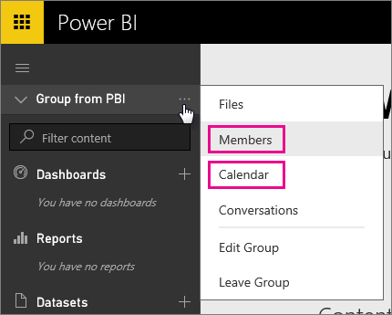
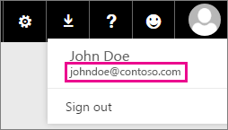

<properties 
   pageTitle="Office 365 專用的已知問題"
   description="Office 365 專用的客戶群的已知問題的支援。 本主題描述特定 Office 365 專用的客戶的問題。 這包括 「 群組 」 功能，以及與虛名網域 iPhone 應用程式的限制。"
   services="powerbi" 
   documentationCenter="" 
   authors="guyinacube" 
   manager="erikre" 
   backup=""
   editor=""
   tags=""
   qualityFocus="no"
   qualityDate=""/>
 
<tags
   ms.service="powerbi"
   ms.devlang="NA"
   ms.topic="article"
   ms.tgt_pltfrm="NA"
   ms.workload="powerbi"
   ms.date="10/10/2016"
   ms.author="asaxton"/>

# 支援 Office 365 專用的客戶群的已知問題

Power BI 現在支援 Office 365 專用的客戶。  如果您是 O365 專用的客戶，您可以從該租用戶的帳戶登入，並使用 Power BI。 目前有兩個已知的問題。

## 中

選取時 **成員** 或 **行事曆** 在群組的內容功能表中，您將會被重新導向至郵件應用程式改為。  
            **檔案** 和 **交談** 如預期般運作。

## iPhone 應用程式-使用虛名網域登入導致錯誤

時，在您登入 iPhone 應用程式中，使用登入使用虛名網域時，您可能會遇到錯誤。

*登入錯誤*  
*發生未預期的內部錯誤。 請再試一次。*

若要解決此問題，以登入列出當您按一下在虛名網域而不是 Power BI 服務中的 [使用者] 圖示上的電子郵件地址。

更多的問題嗎？ [試用 Power BI 社群](http://community.powerbi.com/)