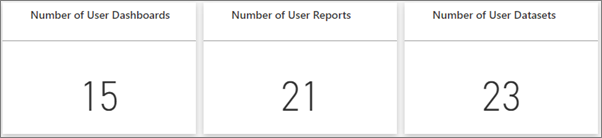
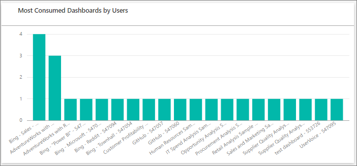
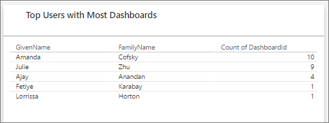
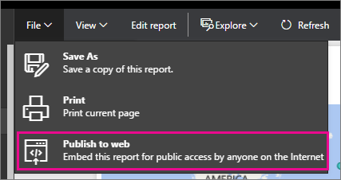
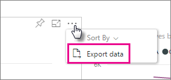

<properties
   pageTitle="管理入口網站"
   description="Power BI 的組織中的租用戶管理可讓系統管理員入口網站。 它包含使用計量，存取 Office 365 系統管理中心及設定等項目。"
   services="powerbi"
   documentationCenter=""
   authors="guyinacube"
   manager="mblythe"
   backup=""
   editor=""
   tags=""
   qualityFocus="no"
   qualityDate=""/>
<tags
   ms.service="powerbi"
   ms.devlang="NA"
   ms.topic="article"
   ms.tgt_pltfrm="NA"
   ms.workload="powerbi"
   ms.date="08/15/2016"
   ms.author="asaxton"/>
# Power BI 系統管理員入口網站

貴公司的 Power BI 租用戶管理是透過 Power BI 系統管理員入口網站。 身為全域系統管理員在 Office 365 中的所有使用者存取系統管理入口網站。 

## 如何取得系統管理員入口網站

若要取得 Power BI 系統管理員入口網站，請執行下列項目。

1. 選取設定齒輪右上角的 Power BI 服務。

2. 選取 **系統管理入口網站**。

> [AZURE.NOTE] 您的帳戶必須標示為 **全域管理員**, 、 Office 365 或 Azure Active Directory，才能存取 Power BI 系統管理員入口網站內。

在入口網站中，有 3 個索引標籤。 以下分別說明。
-   [使用計量](#usage-metrics)
-   [管理使用者](#manage-users)
-   [稽核記錄檔](#audit-logs)
-   [租用戶設定](#tenant-settings)

## 使用計量

第一個索引標籤的 [系統管理員入口網站是 **使用量度量**。 使用量度量報告可讓您監視組織內 Power BI 使用量。 它也提供了可查看哪些使用者和群組，最常使用 Power BI 中為您的組織。

> [AZURE.NOTE] 第一次存取儀表板，或您無法檢視 [儀表板很長一段之後再次瀏覽之後，您將可能載入螢幕時看到我們載入儀表板。

一次載入的儀表板，您會看到兩個區段的方塊。 第一個區段包含針對個別使用者的使用狀況資料，而且第二個區段群組的類似資訊在組織中。

以下是您會看到每個方塊中的分析︰

- 所有儀表板、 報表和使用者工作區中的資料集的相異計數

    

- 大部分使用儀表板具有存取權限的使用者數目。 例如，如果您有 3 個使用者，與您共用儀表板，也有兩個不同的使用者連線到內容套件加入其計數會是 6 (1 + 3 + 2)

    

- 最受歡迎的內容使用者連接到。 這是使用者可以連絡到完成取得資料的程序，因此 SaaS 內容組件、 組織內容組件、 檔案或資料庫的任何項目。

    

- 根據多少儀表板上使用者的檢視他們有，他們建立自己的儀表板和儀表板，共用都會。

    

- 有多少報表基礎上使用者的檢視

    

第二個區段會顯示相同類型的詳細資訊，但根據群組。 這可讓您查看組織中的群組是最常使用，他們使用何種資訊。

利用此資訊，您才能夠取得真正了解人員如何使用 Power BI 組織，而且必須能夠辨識這些使用者和群組，能夠非常貴組織中使用。

## 管理使用者

系統管理員入口網站中的第二個索引標籤是 **管理使用者**。 Power bi 的使用者管理係以 Office 365 系統管理中心，因此這個區段可讓您快速到達區來管理使用者、 系統管理員和 Office 365 內的群組。

當您按一下 **前往 O365 系統管理中心**, ，您直接移至 Office 365 系統管理中心登陸頁面上，若要管理您的租用戶使用者。

## 稽核記錄檔

系統管理員入口網站中的第三個索引標籤是 **稽核記錄檔**。 記錄檔位於 Office 365 安全性和相容性中心內。 此區段可讓您快速存取 Office 365 內該區域。 

如需稽核記錄檔的詳細資訊，請參閱 [稽核您組織中的 Power BI](powerbi-admin-auditing.md)

## 租用戶設定

系統管理員入口網站中的第三個索引標籤是 **租用戶設定**。 租用戶設定讓您更充分掌控哪些功能，可用於您的組織。 如果您有機密資料的考量，我們的功能可能無法最適合您的組織。 如果這種情況，您可以切換租用戶中。

> [AZURE.IMPORTANT] 這些是全域設定。 關閉它們會影響所有使用者，在您的組織中使用 Power BI ！

當您開啟和關閉的設定，您會看到一則通知，通知您知道已順利完成。 可能需要 10 分鐘的時間才會生效，您的租用戶中的每個人設定。

### 發行到整個組織內容組件

此設定會控制您的租用戶的使用者是否可以將內容組件發行到整個組織。

### 允許共用的外部使用者內容

此設定會決定是否可以共用儀表板使用者與您組織外部。

### 發佈到網站

此設定會決定您是否可以使用 **發佈到網站** 報告的功能。 [進一步了解](powerbi-service-publish-to-web.md)

### 匯出資料

此設定會決定您是否可以從磚或視覺效果來匯出資料。 [進一步了解](powerbi-service-export-data.md)

## 請參閱

[您的組織中的稽核 Power BI](powerbi-admin-auditing.md)  
[管理組織中的 Power BI](powerbi-admin-administering-power-bi-in-your-organization.md)  
更多的問題嗎？ [試用 Power BI 社群](http://community.powerbi.com/)