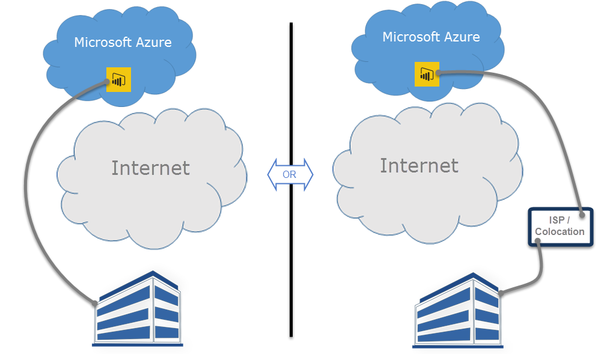

<properties
   pageTitle="Power BI 和 ExpressRoute"
   description="Power BI 和 ExpressRoute"
   services="powerbi"
   documentationCenter=""
   authors="davidiseminger"
   manager="mblythe"
   backup=""
   editor=""
   tags=""
   qualityFocus="no"
   qualityDate=""/>

<tags
   ms.service="powerbi"
   ms.devlang="NA"
   ms.topic="article"
   ms.tgt_pltfrm="NA"
   ms.workload="powerbi"
   ms.date="10/10/2016"
   ms.author="davidi"/>

# Power BI 和 ExpressRoute

使用 **Power BI** 和 **ExpressRoute**, ，您可以從貴組織建立的私人網路連線至 Power BI （或使用 ISP 的共置設備），略過網際網路以更妥善地保護您的 Power BI 的機密資料和連線。

            **ExpressRoute** 是一項 Azure 服務可讓您 （Power BI 的所在位置） 的 Azure 資料中心和您的內部部署基礎結構之間建立私人連線，或在 Azure 資料中心和共置環境之間建立私人連線。

您可以取得 [ExpressRoute 的詳細資訊](https://azure.microsoft.com/services/expressroute/) 或了解 [如何註冊](https://azure.microsoft.com/pricing/details/expressroute/)。

## Power BI ExpressRoute 例外狀況

Power BI 是透過 ExpressRoute，有一些例外狀況，其中取得 Power BI，或透過公用網際網路傳送資料相容。 這些特定例外狀況通常包含靜態資料，例如瀏覽器組態檔從最接近下載 **內容傳遞網路 (CDN)** 節點。 有一些廣泛的例外狀況套用至所有 Power BI，有一些特定服務或功能例外狀況，其中每一個都記載於下列各節。

### Power BI 和 ExpressRoute 的整體例外狀況

例外狀況 **Power BI** 和 **ExpressRoute** Power BI 來回傳輸的資料是經過公用網際網路，而不是私用 ExpressRoute 連結上傳輸的方式。

使用 ExpressRoute 的 Power BI 的兩個整體例外狀況是︰

-   從下載的靜態檔案 **內容傳遞網路 (CDN)** 和網站

-   
            **遙測** 公用網際網路上傳送的資料

Power BI 使用多個 **內容傳遞網路 (Cdn)** 或網站，以有效率地將映像所需的靜態內容和依據地理位置的地區設定，透過公用網際網路使用者的檔案。 這些靜態檔案包含產品的下載項目 (例如 **Power BI Desktop**, ，**內部資料閘道**, ，或 **Power BI 內容組件** 從各種獨立的服務提供者)，用來啟動並建立任何後續連線使用 Power BI，以及初始安全的 Power BI 登入頁面-瀏覽器設定檔的實際認證才會傳送 expressroute。   

某些 **遙測資料** 透過公用網際網路，並透過 ExpressRoute，也會傳送。 遙測資料包含使用狀況統計資料和類似的資料，傳送至服務，可用來監視使用量與活動。

### Power BI SaaS 應用程式和 ExpressRoute

當使用者啟動 Power BI 服務的連接 (powerbi.com 或透過 Cortana)，Power BI 登陸頁面、 登入頁面，並準備瀏覽器連接並與其互動 Power BI 的靜態檔案會擷取來自 CDN 或透過公用網際網路連線的網站。

一旦建立登入之後，後續的 Power BI 資料互動發生透過 ExpressRoute，除了特定的功能和服務的公用網際網路的資料而定︰

-   
            **地圖視覺效果** 需要 Bing 虛擬地球服務或 Bing 觀光服務，其中每個建立透過公用網際網路連線和資料傳輸。

-   Power BI 整合 **Cortana** 需要透過公用網際網路存取 Bing。

-   當 **自訂連結** 加入使用者，例如影像 widget 或視訊、 Power BI 要求根據提供的使用者，其可能或不可以使用 ExpressRoute 的連結的資料。

-   使用者可以傳送 **意見反應給 Power BI** 文字 （及選擇性映像） 中的 User Voice 回函機制，透過使用公用網際網路進行傳輸。

-    **Bing 新聞內容提供者** 會從 Bing 使用公用網際網路下載內容。

-   當連接到 **應用程式** （例如，內容組件），使用者通常需要輸入認證和設定使用 SaaS 提供者所提供的頁面。 這類網頁可以或不可以使用 ExpressRoute。

|使用者活動 |Destination|
|---|---|
|登陸頁面 （在之前的登入）| `maxcdn.bootstrapcdn.com ; ajax.aspnetcdn.com ; netdna.bootstrapcdn.com ; cdn.optimizely.com; google-analytics.com ` |
|登入 | `*.mktoresp.com ; *.aadcdn.microsoftonline-p.com ; *.msecnd.com ; *.localytics.com ; ajax.aspnetcdn.com`  |
|儀表板、 報表、 資料集管理 （包括對應和地理編碼）| `*.localytics.com ; *.virtualearch.net ; platform.bing.com; powerbi.microsoft.com; c.microsoft.com; app.powerbi.com; *.powerbi.com; dc.services.visualstudio.com `  |
|支援| `support.powerbi.com ; powerbi.uservoice.com ; go.microsoft.com `|

### Power BI Desktop 和 ExpressRoute

Power BI Desktop 也是 ExpressRoute 相容，下列清單所述的少數例外︰

-   
            **更新通知**, ，可用來偵測使用者是否有最新版本的 Power BI Desktop，經過公用網際網路。

-   某些 **遙測資料** 是經過公用網際網路。

-   
            **地圖視覺效果** 需要連接和資料傳輸到 **Bing 虛擬地球** 服務或 **Bing 地理編碼** 服務，其中每個建立透過公用網際網路。

-   
            **取得資料** 數個資料來源的這類 **Web** 或協力廠商 SaaS 提供者會透過公用網際網路。

### Power BI PaaS 和 ExpressRoute

Power BI 提供的 Api 與其他平台為基礎的功能可讓開發人員建立自訂的 Power BI 解決方案和應用程式。 透過公用網際網路傳輸 Power BI PaaS 資料時，會使用下列服務，除了遙測和本主題先前所述的 CDN 資料︰

|PaaS 活動 |使用的其他目的地 |
|---|---|
|公用內嵌 （遙測）| `c1.microsoft.com` |
|自訂視覺效果 (CDN) | `*.azureedge.net`  |

某些 **自訂視覺效果** 會建立由協力廠商部分由 Microsoft 建立。 這些可能或不可以使用 ExpressRoute。

### Power BI 行動和 ExpressRoute

本文件並未涵蓋 Power BI 行動應用程式使用。  

### 內部資料閘道與 ExpressRoute

當 **內部資料閘道** 用透過 Power BI，傳輸已 ExpressRoute 相容，除了記載於使用者的活動 **Power BI SaaS 應用程式和 ExpressRoute** 稍早在本主題中找到一節。  
