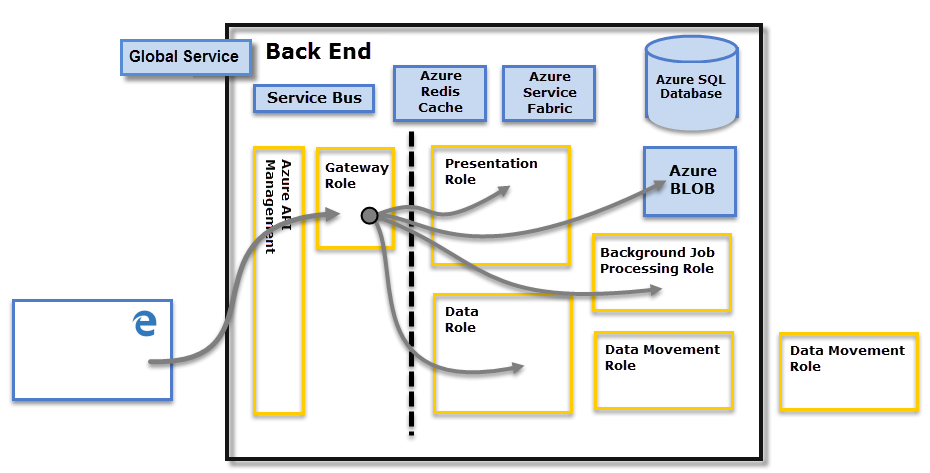

<properties
   pageTitle="Power BI 安全性"
   description="Power BI 的安全性。 Power BI 如何與 Azure Active Directory 和其他 Azure 服務。 本主題也包含會更深入的技術白皮書的連結。"
   services="powerbi"
   documentationCenter=""
   authors="guyinacube"
   manager="mblythe"
   backup=""
   editor=""
   tags=""
   qualityFocus="no"
   qualityDate=""/>

<tags
   ms.service="powerbi"
   ms.devlang="NA"
   ms.topic="article"
   ms.tgt_pltfrm="NA"
   ms.workload="powerbi"
   ms.date="09/28/2016"
   ms.author="asaxton"/>

# Power BI 安全性

如需 Power BI 安全性的詳細說明，請 [下載 Power BI 安全性白皮書](http://go.microsoft.com/fwlink/?LinkId=829185)。

Power BI 服務根據 **Azure**, ，這是 Microsoft 的雲端運算基礎結構與平台。 Power BI 服務架構根據兩個叢集 – Web 前端 (**WFE**) 叢集和 **後端** 叢集。 WFE 叢集會負責初始連線和驗證 Power BI 服務，並一次驗證後, 端處理所有後續的使用者互動。 Power BI 使用 Azure Active Directory (AAD) 來儲存和管理使用者識別和管理資料和中繼資料使用 Azure BLOB 和 Azure SQL Database，分別儲存。

## Power BI 架構

每個 Power BI 部署包含兩個叢集 – Web 前端 (**WFE**) 叢集，以及 **後端** 叢集。

 **WFE** 叢集管理 Power bi，以驗證用戶端，並為後續的用戶端連接至 Power BI 服務提供權杖使用 AAD 的初始連線和驗證程序。 也會使用 power BI **Azure 流量管理員** (ATM) 使用者流量導向至最接近的資料中心，取決於用戶端嘗試連線，驗證程序，並下載靜態內容和檔案的 DNS 記錄。 Power BI 使用 **Azure 內容傳遞網路** (CDN) 有效率地將映像所需的靜態內容和使用者的檔案會根據地理位置的地區設定。

 **後端** 叢集是如何驗證用戶端與 Power BI 服務互動。  **後端** 叢集管理視覺效果、 使用者儀表板、 資料集、 報表、 資料存放區、 資料連接、 資料重新整理，以及與 Power BI 服務互動的其他層面。  **閘道角色** 做為使用者要求與 Power BI 服務之間的閘道。 使用者不會互動直接與任何角色以外的其他 **閘道角色**。 
            **Azure API 管理** 最終處理 **閘道角色**。

> [AZURE.IMPORTANT] 請務必注意，只有 **Azure API 管理** (APIM) 和 **閘道** (GW，) 角色是透過公用網際網路存取。 它們提供驗證、 授權、 DDoS 保護、 節流、 負載平衡、 路由，以及其他功能。

## 資料存放區安全性
Power BI 使用兩個主要的儲存機制來儲存和管理資料︰ 從使用者上傳的資料通常會傳送至 **Azure BLOB** 儲存體，和所有中繼資料，以及系統本身的成品會儲存在 **Azure SQL Database**。

在點線 **後端** 叢集映像，上述方式，釐清只有兩個存取的使用者 （左邊的點線） 的元件和角色，才能夠存取由系統之間的界限。 當已驗證的使用者連接到 Power BI 服務連線和任何用戶端的要求會接受並由 **閘道角色** (最後來處理 **Azure API 管理**)，然後互動與 Power BI 服務的其他使用者的代表。 例如，當用戶端想要檢視儀表板， **閘道角色** 接受該要求，然後分別傳送要求至 **簡報角色** 擷取瀏覽器呈現在儀表板所需的資料。

## 使用者驗證

Power BI 使用 Azure Active Directory ([AAD](http://azure.microsoft.com/services/active-directory/)) 來驗證使用者登入 Power BI 服務，然後使用 Power BI 登入認證，每當使用者嘗試要求驗證的資源。 使用用來建立 Power BI 帳戶; 電子郵件地址與 Power BI 服務的使用者登入Power BI 會使用該登入電子郵件為 *有效的使用者名稱*, ，每當使用者嘗試連接到資料傳遞給資源。  *有效的使用者名稱* 接著會對應至 *使用者主體名稱* ([UPN](https://msdn.microsoft.com/library/windows/desktop/aa380525\(v=vs.85\).aspx) 和相關聯的 Windows 網域帳戶，驗證對其套用至已解決。

用於 Power BI 登入的工作電子郵件的組織 (例如 *david@contoso.com*)、 *有效的使用者名稱* upn 對應很簡單。 沒有使用 Power BI 登入的工作電子郵件的組織 (例如 *david@contoso.onmicrosoft.com*)、 對應 AAD 與內部部署之間需要認證 [目錄同步作業](https://technet.microsoft.com/library/jj573653.aspx) 才能正常運作。

Power bi 平台安全性也包含多租用戶環境的安全性、 網路安全性，以及新增額外 AAD 為基礎的安全性措施的能力。

## 資料和服務安全性

如需詳細資訊，請造訪 [Microsoft 信任中心](https://www.microsoft.com/trustcenter)。

如本文稍早所述，使用者的 Power BI 登入是內部部署 Active Directory 伺服器用來對應到 UPN 的認證。 不過，它是 **重要** 注意使用者負責它們共用的資料︰ 如果使用者連接到資料來源使用她的認證，然後共用報表 （或儀表板或資料集） 根據該資料，共用儀表板使用者未通過原始資料來源中，並授與存取報表。

例外狀況是通往 **SQL Server Analysis Services** 使用 **內部資料閘道**; 儀表板會快取在 Power BI，但存取基礎的報表或資料集起始驗證的使用者嘗試存取報表 （或資料集），並將只會授與存取權的使用者是否具有足夠的認證來存取資料。 如需詳細資訊，請參閱 [內部資料閘道深入探討](powerbi-gateway-onprem-indepth.md)。
