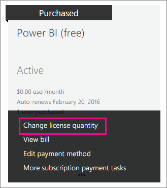

<properties
pageTitle="Power BI 組織中的 （免費）"
description="這篇文章檢視 Power BI 組織觀點 （免費） 的選項。 如果您是您的租用戶系統管理員，這會顯示您如何管理可用登 ups。"
services="powerbi"
documentationCenter=""
authors="guyinacube"
manager="mblythe"
backup=""
editor=""
tags=""
qualityFocus="no"
qualityDate=""/>

<tags
ms.service="powerbi"
ms.devlang="NA"
ms.topic="article"
ms.tgt_pltfrm="na"
ms.workload="powerbi"
ms.date="09/21/2016"
ms.author="asaxton"/>
# Power BI 組織中的 （免費）

這要看看如何在組織中使用 Power BI （免費） 供應項目。 組織表示您有一個租用戶，而且可以管理使用者與該租用戶內的服務。 身為管理員，您可以控制授權指派，或您可以允許使用者以個人身分註冊。 我們將探討 Power BI （免費） 授權，以及如何控制個別登上。

## 個別註冊與授權指派

組織中的使用者可以存取 Power BI 中兩個不同的方式。 他們可以個別註冊 Power BI，或您可以在 Office 365 系統管理入口網站中為它們指派 Power BI 授權。

允許設定個別登組織系統管理員減少負擔，藉由使用 Power BI 註冊免費的感興趣的使用者。 

獲得更多控制，您可以向上封鎖個別登並自行指派 Power BI 授權，Office 365 系統管理中心內。 這可讓您能夠具體表示哪些人可以存取您組織內有哪些服務。 這也是不錯的選擇有以應付稽核和需要知道誰完全使用何種工具。

## 如何取得無限制的授權區塊
Office 365 系統管理中心內下 **計費** > **授權**, ，您可能會或可能不會看到 Power BI （免費） 並無限制的授權。

 
首次有人以個人身分的 Power bi 註冊之後，會顯示此區塊的授權。 過程中，這個授權區塊附加到您的組織，並將授權指派給登入的使用者。

如果您封鎖個別使用者註冊時，沒有人已註冊，您將不會看到這個授權區塊。 您可以允許個別使用者正負號的 ups 和有一位使用者註冊，或您可以透過新增訂閱 Office 365 流程其中將討論下一步取得免費授權。

使用 Power BI （免費） 授權區塊之後，您可以指派這些授權給使用者。 [進一步了解](https://support.office.com/article/Assign-or-unassign-licenses-for-Office-365-for-business-997596b5-4173-4627-b915-36abac6786dc)

## 取得免費的授權，透過新增 Office 365 的訂用帳戶

1.  瀏覽至 [Office 365 系統管理中心](https://portal.office.com/admin/default.aspx)。
2.  在左的導覽窗格中，選取 **計費** > **訂閱**。
3.  選取 **新增訂閱 +** 右側。
4.  在其他的計劃，將滑鼠停留在 **省略號 （...）** Power bi （免費），然後選取 **立即購買**。

    

5.  輸入您想要加入，然後選取的授權數量 **立即簽出** 或 **新增至購物車**。

    > [AZURE.NOTE] 您可以視需要新增更在較晚的日期。

6.  簽出流程中輸入所需的資訊。

無須購買任何產品時使用這種方法，但是您必須輸入信用卡帳單資訊，或選擇收費。

如果您稍後決定您想要新增更多授權，您可以移回至 **新增訂閱**, ，然後選取 **變更授權數量** Power bi （免費）。

 
您現在可以指定這些授權給您的使用者。 [進一步了解](https://support.office.com/article/Assign-or-unassign-licenses-for-Office-365-for-business-997596b5-4173-4627-b915-36abac6786dc)

## 啟用或停用個別使用者註冊 Azure Active Directory 中

身為管理員，您可以選擇啟用或停用個別使用者登 ups 一部分的 Azure Active Directory (AAD)。 如果您知道如何運用 AAD PowerShell 命令，您可以啟用或停用，特定訂閱您自己。 [進一步了解](https://technet.microsoft.com/library/jj151815.aspx)

AAD 控制的設定，這是 **AllowAdHocSubscriptions**。 大多數的租用戶必須設定為 true，表示它已啟用此設定。 如果您透過協力廠商取得 Power BI，這可能會為 false，根據預設，這表示已停用。

1.  您必須先登入 Azure Active Directory 使用 Office 365 認證。 第一行會提示您輸入您的認證。 第二行連接到 Azure Active Directory。

        $msolcred = get-credential
        connect-msolservice -credential $msolcred
    
    

2.  一旦您登入，您可以發出下列命令，請參閱您的租用戶目前設定的。

        Get-MsolCompanyInformation | fl AllowAdHocSubscriptions

3.  您可以啟用 ($true) 或停用 ($false) AllowAdHocSubscriptions 此命令。

        Set-MsolCompanySettings -AllowAdHocSubscriptions $true

> [AZURE.NOTE] 此封鎖可防止註冊 Power BI 組織中的新使用者。 註冊 Power BI 之前停用組織的新註冊的使用者仍然會保留使用者的授權。

## 請參閱

[自助式註冊 Power bi](powerbi-service-self-service-signup-for-power-bi.md)  
[註冊 Power BI （免費） 使用自訂的 Azure Active Directory 租用戶](powerbi-admin-free-with-custom-azure-directory.md)  
更多的問題嗎？ [試用 Power BI 社群](http://community.powerbi.com/)