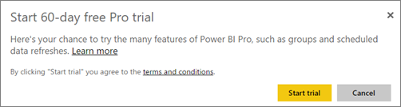

<properties 
   pageTitle="採購 Power BI Pro"
   description="採購 Power BI Pro"
   services="powerbi" 
   documentationCenter="" 
   authors="guyinacube" 
   manager="erikre" 
   backup=""
   editor=""
   tags=""
   qualityFocus="monitoring"
   qualityDate="08/15/2016"/>
 
<tags
   ms.service="powerbi"
   ms.devlang="NA"
   ms.topic="article"
   ms.tgt_pltfrm="NA"
   ms.workload="powerbi"
   ms.date="08/15/2016"
   ms.author="asaxton"/>
   
# 採購 Power BI Pro

Power BI Pro 提供免費的使用者沒有的功能的存取權。 這包括用於內部部署資料重新整理資料來源，例如 SQL Server、 群組及其他功能的內部部署資料閘道。 如需詳細資訊，請參閱 [Power BI Pro 內容-它是什麼？](powerbi-power-bi-pro-content-what-is-it.md)。

直接透過 Power BI 網站、 Office 365 系統管理中心或透過您的 Microsoft 代表或合作夥伴，您可以購買 Power BI Pro。 這篇文章將探討兩個試用版可用的選項 Power BI Pro，以及如何為個人或組織購買 Power BI Pro。

## 定價

Power BI Pro 的最新定價資訊及包含功能的資料表清單，請參閱 [Power BI 定價](https://powerbi.microsoft.com/pricing/)。

## Power BI Pro 60 天試用版

您已註冊您的免費帳戶之後，您可以選擇性地選擇免費試用專業版。 您必須於試用期間所有的 Pro 功能的存取權。 Power BI Pro 有免費版本的 Power BI 的所有功能和其他共同作業和資料重新整理功能。 它也會有更高的資料容量和串流處理限制的資料。 如需詳細資訊，請參閱 [Power BI Pro 內容-它是什麼？](powerbi-power-bi-pro-content-what-is-it.md)。 若要試用 60 天免費試用版 Power BI Pro，登入 Power BI，然後再試其中的 Power BI Pro 功能︰

-   建立及發行自訂 [內容組件](powerbi-service-organizational-content-packs-introduction.md)
-   共用 [可重新整理](powerbi-refresh-data.md) 小組儀表板和報表使用 [群組](powerbi-service-create-a-group-in-power-bi.md)
-   連接到內部資料使用 [個人閘道](powerbi-personal-gateway.md)
-   啟用即時的互動式連線到下列來源︰
    -   [SQL Server Analysis Services](powerbi-sql-server-analysis-services-tabular-data.md)
    -   [Azure HDInsight 上的 Spark](powerbi-spark-on-hdinsight-with-direct-connect.md)
    -   [Azure SQL 資料倉儲](powerbi-azure-sql-data-warehouse-with-direct-connect.md)
    -   [Azure SQL 資料庫](powerbi-azure-sql-database-with-direct-connect.md)

當您嘗試任何上述功能時，系統會提示您免費的試用版。 您也可以選擇讓前往齒輪圖示，並選取使用它 **管理個人儲存體**。 然後選取 **免費試用的 pro 提示** 右邊。

 
接著，您可以選取 **開始試用**。

> **附註**
>
>-   如果您需要更多時間評估 Power BI，您可以要求延長 60 天的試用期。
>-   利用此產品中的 Power BI Pro 試用版的使用者不會出現在 Office 365 系統管理入口網站 Power BI 專業人員的試用使用者 （它們顯示為 Power BI 免費使用者）。 它們會不過，顯示為 Power BI Pro 試用版中的使用者 **管理儲存體** Power BI 中的頁面。
>-   如果您是 IT 系統管理員想要取得並部署至組織中的多個使用者的 Power BI 試用版授權，而不需要單獨接受試用版條款的個別使用者，您可以註冊 [試用 Power BI Pro 訂閱](https://portal.office.com/Signup/MainSignup15.aspx?OfferId=d59682f3-3e3b-4686-9c00-7c7c1c736085&dl=POWER_BI_PRO)。  您必須是 Office 365 全域或計費管理員或建立新的租用戶註冊試用版的系統管理員。 [進一步了解](powerbi-admin-purchasing-power-bi-pro.md)

### 看起來像這樣服務內

當您在服務中，您可以確認您有 Pro 試用帳戶，請前往 **齒輪* 圖示，然後選取 **管理個人儲存體**。

## 採購 Power BI Pro 以個人身分

您可以購買 Power BI Pro 從 [開始]，或者可以選擇您的免費試用結束後，升級到 Pro。 如果您的帳戶是組織的一部分，您可以購買 Power BI Pro 以個人身分如果組織未停用個別購買情況。

若要購買 Power BI Pro 以個人身分，您可以執行下列程式碼。

1.  瀏覽至 [powerbi.com](https://www.powerbi.com)。

2.  選取 **產品** > **定價**。

3.  選取 **購買**。

    

4.  回答引導購買所提出的問題。 為個別且將會選取一個選項 **自行**。 

    

    > [AZURE.NOTE] 如果您有興趣購買您的小組或組織所需的選項，您可以閱讀貴組織購買 Power BI Pro。 [進一步了解]()

5.  如果您尚未登入 Power BI，您必須使用帳戶登入 Power BI （免費）。

6.  您必須提供資訊以進行購買。

### 看起來像這樣服務內

當您在服務中，您可以確認您有 Pro 帳戶移至 **齒輪** 圖示，然後選取 **可管理個人儲存體**。

## 試用 Office 365 中的訂閱

您可以取得 Power BI Pro 試用版，為您的組織。 訂閱之後，您可以將 Power BI Pro 的授權指派給您的使用者。 [進一步了解](https://support.office.com/article/Assign-or-unassign-licenses-for-Office-365-for-business-997596b5-4173-4627-b915-36abac6786dc)

> [AZURE.NOTE] 沒有限制的每個租用戶一個組織的試用版。 這表示，如果有人已經套用至租用戶 Power BI Pro 試用版，您無法再做一次。 如果您需要這方面的協助，您可以連絡 [Office 365 計費支援](https://support.office.microsoft.com/article/Contact-Office-365-for-business-support-Admin-Help-32a17ca7-6fa0-4870-8a8d-e25ba4ccfd4b?CorrelationId=552bbf37-214f-4202-80cb-b94240dcd671&ui=en-US&rs=en-US&ad=US#BKMK_call_support)。
 
1.  瀏覽至 [Office 365 系統管理中心](https://portal.office.com/admin/default.aspx)。
2.  在左的導覽窗格中，選取 [計費 > 訂用帳戶。
3.  選取 [新增訂閱 + 右邊。
4.  在其他的計劃，將滑鼠停留在省略符號 （...） 的 Power BI Pro 然後選取開始免費試用版。

    

5.  [確認訂單畫面中，選取立即試用。
6.  選取 [訂單收據上的 [繼續]。

在 **計費** > **訂閱**, ，您會看到 **Power BI Pro 試用** 列出可用的 25 個授權。 這是一個月試用版。

### 看起來像這樣服務內

當您在服務中，您可以確認您有 Pro 帳戶移至 **齒輪** 圖示，然後選取 **可管理個人儲存體**。 會指示這是試用版的使用者。

## 在 Office 365 購買訂閱

您可以購買 Power BI Pro 組織透過 Office 365 系統管理中心。 訂閱之後，您可以將 Power BI Pro 的授權指派給您的使用者。 [進一步了解](https://support.office.com/article/Assign-or-unassign-licenses-for-Office-365-for-business-997596b5-4173-4627-b915-36abac6786dc)
 
1.  瀏覽至 [Office 365 系統管理中心](https://portal.office.com/admin/default.aspx)。
2.  在左的導覽窗格中，選取 [計費 > 訂用帳戶。
3.  選取 [新增訂閱 + 右邊。
4.  在其他計劃，將滑鼠停留在省略符號 （...） 的 Power BI Pro，選取 [立即購買。

    

5.  輸入您想要加入，然後選取核取現在或新增至購物車的授權數量。

    > [AZURE.NOTE] 您可以視需要新增更在較晚的日期。

6.  簽出流程中輸入所需的資訊。

> [AZURE.NOTE] 如果您已經有了 Power BI Pro 試用版，它會直接移至簽出畫面，要求輸入您想要的授權數量。

在 **計費** > **訂閱**, ，您會看到 **Power BI Pro** 列出。 如果您稍後決定您想要新增更多授權，您可以移回至 **新增訂閱**, ，然後選取 **變更授權數量**。

### 看起來像這樣服務內

當您在服務中，您可以確認您有 Pro 帳戶移至 **齒輪** 圖示，然後選取 **可管理個人儲存體**。
 

## 請參閱

[自助式註冊 Power bi](powerbi-service-self-service-signup-for-power-bi.md)  
[Power BI 組織中的 （免費）](powerbi-admin-powerbi-free-in-your-organization.md)  
更多的問題嗎？ [試用 Power BI 社群](http://community.powerbi.com/)