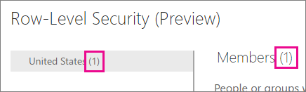
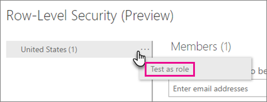
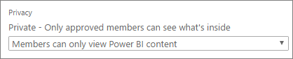

<properties
pageTitle="有了 Power BI 的資料列層級安全性 (RLS)"
description="如何設定匯入的資料集，和 DirectQuery，Power BI 服務中的資料列層級安全性。"
services="powerbi"
documentationCenter=""
authors="guyinacube"
manager="mblythe"
backup=""
editor=""
tags=""
qualityFocus="no"
qualityDate=""/>

<tags
ms.service="powerbi"
ms.devlang="NA"
ms.topic="article"
ms.tgt_pltfrm="na"
ms.workload="powerbi"
ms.date="10/18/2016"
ms.author="asaxton"/>
# 有了 Power BI 的資料列層級安全性 (RLS)

<iframe width="560" height="315" src="https://www.youtube.com/embed/67fK0GoVQ80?showinfo=0" frameborder="0" allowfullscreen></iframe>

Power BI 的資料列層級安全性 (RLS) 可以用來限制資料存取，針對指定的使用者。 篩選器會限制資料列層級的資料。 您可以定義在角色中的篩選器。

> [AZURE.NOTE] RLS 是 Pro 功能。 您可以進一步瞭解 [Pro 內容](powerbi-power-bi-pro-content-what-is-it.md) 是。

您現在可以設定 RLS 匯入 Power BI 使用 Power BI Desktop 資料模型。 您也可以使用 DirectQuery，例如 SQL Server 的資料集上設定 RLS。 之前，您便只能夠在內部部署 Analysis Services 模型在 Power BI 外部實作 RLS。 Analysis Services 即時連接，您可以設定資料列層級安全性之內部模型上。 [安全性] 選項不會顯示即時連接的資料集。

[AZURE.INCLUDE [include-short-name](../includes/rls-desktop-define-roles.md)]

[AZURE.INCLUDE [include-short-name](../includes/rls-desktop-view-as-roles.md)]

## 管理安全性模型

若要管理您的資料模型的安全性，您要執行下列作業。

1.  選取 **省略號 （...）** 資料集。
2.  選取 **安全性**。

    
 
這樣會帶您到 [RLS] 頁面上，以將成員加入至您在 Power BI Desktop 中建立的角色。 包含的資料集擁有者將會看到可用的安全性。 如果資料集是在群組中，只有系統管理員群組的就會看到 [安全性] 選項。 

您只能建立或修改 Power BI Desktop 中的角色。

## 使用成員

### 新增成員

您可以新增成員至角色所輸入的電子郵件地址或使用者名稱安全性您想要新增的群組或通訊群組清單。 這個成員必須為組織內。 您無法加入 Power BI 中建立群組。

 
您也可以查看有多少角色的角色名稱旁邊，或成員旁邊的括號中的數字的一部分。

 
### 移除成員

您可以選取其名稱旁邊的 [X，以移除成員。 
 

## 驗證 Power BI 服務中的角色

您可以驗證您所定義的角色正常運作所測試的角色。 

1. 選取 **省略號 （...）** ，角色旁。
2. 選取 **測試資料做為角色**

然後，您會看到可供此角色的報表。 未在此檢視中顯示儀表板。 藍色列的上方，您會看到套用的功能。

您可以測試其他角色或角色的組合，藉由選取 **現在檢視為**。

您可以選擇檢視資料當做特定人員，或者您也可以選取組合使用可用的角色來驗證。 

若要返回正常檢視，請選取 **回資料列層級安全性**。

[AZURE.INCLUDE [include-short-name](../includes/rls-usernames.md)]

## RLS 使用 Power BI 中的群組

如果您將 Power BI Desktop 報表發行至 Power BI 服務內的群組時，角色會套用至唯讀的成員。 您必須指出成員只能檢視 Power BI 內容內的群組設定。

> [AZURE.WARNING] 如果您已設定的群組成員具有編輯權限，RLS 角色不會套用它們。 使用者可以查看所有的資料。

[AZURE.INCLUDE [include-short-name](../includes/rls-limitations.md)]

[AZURE.INCLUDE [include-short-name](../includes/rls-faq.md)]

## 請參閱

            [使用 Power BI Desktop 的資料列層級安全性 (RLS)](powerbi-desktop-rls.md)  
更多的問題嗎？ 
            [試用 Power BI 社群](http://community.powerbi.com/)