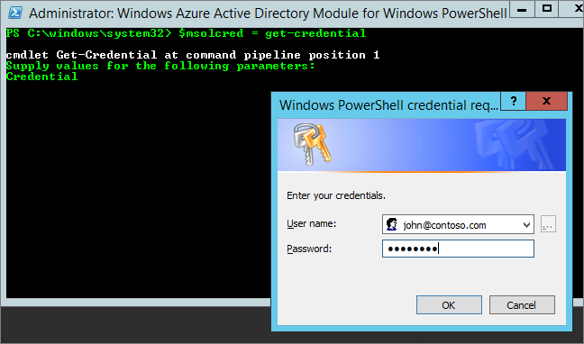

<properties
pageTitle="無法加入 O365 夥伴的 Power BI"
description="無法加入 Power BI 與 Office 365 同步夥伴。 新聞訂閱方式的模型是使用 Office 365 的採購模型。"
services="powerbi"
documentationCenter=""
authors="guyinacube"
manager="mblythe"
backup=""
editor=""
tags=""
qualityFocus="no"
qualityDate=""/>

<tags
ms.service="powerbi"
ms.devlang="NA"
ms.topic="article"
ms.tgt_pltfrm="na"
ms.workload="powerbi"
ms.date="08/15/2016"
ms.author="asaxton"/>
# 無法新增 Office 365 夥伴訂用帳戶的 Power BI

Office 365 讓公司可以轉售 Office 365 結合在一起，並且與他們自己的解決方案，整合提供單一窗口與客戶購買、 帳單和支援。

如果您想要取得 Power BI，連同您的 Office 365 訂閱，我們建議您連絡您的合作夥伴，若要這樣做。 如果您的夥伴不提供 Power BI，您會有不同的選項，您可以考慮。

1. 也可以從另一個通道，直接從 Microsoft 或其他協力廠商購買服務。 此選項不適用於根據它們之間的夥伴關係的所有客戶。 若要驗證，請前往 **Office 365 系統管理入口網站** > **計費** > **訂閱**。 如果您看 **訂閱**, ，您可以直接取得 Microsoft 的服務，或您也可以連絡提供 Power BI 合作夥伴。

    

2.  如果看不到 **訂閱** 底下列出 **計費**, ，您無法向 Microsoft 直接或其他協力廠商購買。 

    

如果您不能直接購買 Power BI 的 Power BI 訂用帳戶類型根據您感興趣，您仍有一些選項。

[Power BI （免費）](#power-bi-free)

[Power BI Pro](#power-bi-pro)

## Power BI （免費）

如果您不滿意 Power bi 的免費供應項目，您可以註冊免費的服務。 根據預設，會停用個別登增量備份，也就是特定訂閱。 當您嘗試註冊 Power BI 時，您會看到一則訊息指出，您的 IT 部門已經關閉登 Microsoft Power bi。

    Your IT department has turned off signup for Microsoft Power BI.

若要啟用特定的訂閱，您可以連絡他們開啟您的夥伴和要求。 如果您是租用戶系統管理員，而且知道如何運用 Azure Active Directory PowerShell 命令，您可以自行啟用特定訂閱。 [進一步了解](https://technet.microsoft.com/library/jj151815.aspx)

1. 您必須先登入 Azure Active Directory 使用 Office 365 認證。 第一行會提示您輸入您的認證。 第二行連接到 Azure Active Directory。

        $msolcred = get-credential
        connect-msolservice -credential $msolcred

    

2. 一旦您登入，您可以發出下列命令以啟用免費登 ups。

        Set-MsolCompanySettings -AllowAdHocSubscriptions $true

## Power BI Pro

如果您想要購買 Power BI Pro 的訂閱，您必須使用您的夥伴，請考慮您有哪些選項。

- 新增 Power BI 的組合，讓您可以向其購買同意您的夥伴。
- 您的夥伴便能轉為 「 的模型，可以購買 Power BI 直接向 Microsoft 或其他協力廠商負責提供 Power BI。

這段影片中探討 Office 365 新聞訂閱和採購 Power BI:

<iframe width="560" height="315" src="https://www.youtube.com/embed/C357phT94A8" frameborder="0" allowfullscreen></iframe>

## 請參閱

[使用 Windows PowerShell 管理 Azure AD](https://technet.microsoft.com/library/jj151815.aspx)  
更多的問題嗎？ [試用 Power BI 社群](http://community.powerbi.com/)
