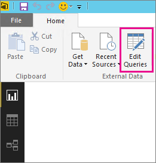

<properties
   pageTitle="不支援的資料來源重新整理的疑難排解"
   description="不支援的資料來源重新整理的疑難排解"
   services="powerbi"
   documentationCenter=""
   authors="guyinacube"
   manager="mblythe"
   backup=""
   editor=""
   tags=""
   qualityFocus="no"
   qualityDate=""/>

<tags
   ms.service="powerbi"
   ms.devlang="NA"
   ms.topic="article"
   ms.tgt_pltfrm="NA"
   ms.workload="powerbi"
   ms.date="08/15/2016"
   ms.author="asaxton"/>

# 不支援的資料來源重新整理的疑難排解  

嘗試設定排定的重新整理的資料集時，您可能會看到錯誤。

        You cannot schedule refresh for this dataset because it gets data from sources that currently don’t support refresh.

這會使用 Power BI Desktop 中的資料來源不支援重新整理。 您必須尋找您所使用的資料來源和支援在資料來源的清單進行比對比較 [Power BI 中的資料重新整理](powerbi-refresh-data.md)。 

## 尋找資料來源  
如果您不確定使用的資料來源，您可以找到使用 Power BI Desktop 中的下列步驟。  

1.  在 Power BI Desktop，請確定您位於 **報表** 窗格。  
    

2.  選取 **編輯查詢** 從功能區列。  
    

3.  選取 **進階編輯器**。  
    

4.  請記下所列的來源提供者。  在此範例中，提供者是 ActiveDirectory。  
    

5.  比較清單中找到支援的資料來源的提供者 [Power BI 中的資料重新整理](powerbi-refresh-data.md)。  您會發現 Active Directory 不支援的資料來源重新整理。  

## 另請參閱

[資料重新整理](powerbi-refresh-data.md)  
[Power BI 閘道個人](powerbi-personal-gateway.md)  
[內部資料閘道](powerbi-gateway-onprem.md)  
[疑難排解內部部署資料閘道](powerbi-gateway-onprem-tshoot.md)  
[疑難排解 Power BI 閘道-個人](powerbi-admin-troubleshooting-power-bi-personal-gateway.md)  
更多的問題嗎？ [試用 Power BI 社群](http://community.powerbi.com/)