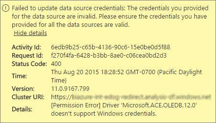
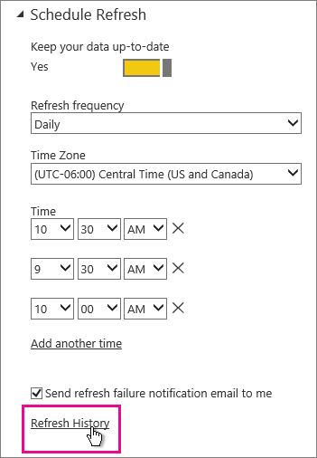

<properties 
   pageTitle="疑難排解 Power BI 閘道-個人"
   description="疑難排解 Power BI 閘道-個人"
   services="powerbi" 
   documentationCenter="" 
   authors="guyinacube" 
   manager="mblythe" 
   backup=""
   editor=""
   tags=""
   qualityFocus="monitoring"
   qualityDate="07/25/2016"/>
 
<tags
   ms.service="powerbi"
   ms.devlang="NA"
   ms.topic="article"
   ms.tgt_pltfrm="NA"
   ms.workload="powerbi"
   ms.date="09/06/2016"
   ms.author="asaxton"/>
# 疑難排解 Power BI 閘道-個人

以下會透過使用 Power BI 閘道-個人時，可能會遇到一些常見的問題。 

> [AZURE.NOTE] 如果您遇到下列資訊沒有列出的問題，您可以在要求以取得進一步協助 [社群網站](http://community.powerbi.com/), ，或者您可以建立 [支援票證](https://powerbi.microsoft.com/support/)。

## 更新為最新版本 
 
閘道器版本已過期時，可能出現很多問題。  它是一般最好先確定您是在最新版本。  一個月以上未更新閘道，您可能要考慮安裝最新版的閘道，並查看可以重現問題。

## 安裝

            **個人閘道是 64 位元** -如果您的電腦是 32 位元，您將無法安裝個人閘道。 您的作業系統必須是 64 位元。 您必須安裝 64 位元版本的 Windows，或在 64 位元電腦上安裝個人閘道。

            **個人閘道無法安裝為服務，即使您電腦的本機系統管理員** -如果使用者是在本機系統管理員群組的電腦，但群組原則不允許該使用者名稱登入為服務，安裝可能會失敗。  目前，請確定群組原則可讓使用者登入為服務。 我們正努力解決此問題。 [進一步了解](https://technet.microsoft.com/library/cc739424.aspx)

            **操作已逾時** -這是常見，如果您正在安裝個人閘道的電腦 （實體機器或 VM） 具有單一核心處理器。 關閉任何應用程式和關閉任何非必要的處理序，請再次嘗試安裝。

            **資料管理閘道器或 Analysis Services 連接器無法安裝在同一部電腦當做個人閘道** -如果您已經有 Analysis Services 連接器或資料管理閘道器安裝，您必須先解除安裝該連接器或閘道，然後再嘗試安裝個人閘道。

 > [AZURE.NOTE] 如果您在安裝期間遇到的問題，安裝程式記錄檔可以提供可協助您解決問題的資訊。 請參閱 [安裝程式記錄檔](#SetupLogs) 如需詳細資訊。
 
 
            **Proxy 設定**
 您可能會遇到問題，如果您的環境需要使用 proxy 設定個人閘道。 若要深入了解如何設定 proxy 資訊，請參閱 [Power BI 閘道的 proxy 設定](powerbi-gateway-proxy.md)

## 排程重新整理

**錯誤︰ 雲端中儲存的認證已遺失。**

您可以設定中取得此錯誤 \<資料集\> 如果已排定的重新整理，然後解除安裝再重新安裝個人閘道。 當您解除安裝個人閘道時，已設定為重新整理資料集的資料來源認證會移除從 Power BI 服務。

            **解決方案︰** 在 Power BI，移至資料集的重新整理設定。 管理資料來源，並顯示錯誤，任何資料來源中按一下 [編輯認證並再次登入的資料來源。

**錯誤︰ 資料集所提供的認證不正確。 請更新認證，透過重新整理或在資料來源設定] 對話方塊中，以繼續。**

            **方案**︰ 如果您收到的認證，這可能表示︰

-   請確定使用者名稱和密碼，用來登入的資料來源是最新狀態。 在 Power BI，移至重新整理資料集的設定。 在管理資料來源，按一下 [編輯認證，來更新資料來源的認證。

-   混搭程式定域機組來源之間的內部部署來源，在單一查詢中，將無法重新整理在個人閘道，如果其中一個來源會使用 OAuth 進行驗證。 這個範例是 CRM Online 和本機 SQL Server 之間交互式。 這將會失敗，因為 CRM Online 需要 OAuth。

    這是已知的問題，並查看。 若要解決此問題，有另一個定域機組來源和內部部署來源查詢並使用合併列印或附加查詢，以將它們結合。

**錯誤︰ 不支援的資料來源。**

            **解決方案︰** 如果您收到不支援的資料來源中重新整理排程設定，這可能表示︰ 

-   資料來源目前不支援在 Power BI 中的重新整理。 

-   Excel 活頁簿不包含資料模型中，只有工作表資料。 Power BI 目前只支援重新整理如果上傳的 Excel 活頁簿包含資料模型。 當您匯入 Excel 中使用 Power Query 資料時，請務必選擇要載入至資料模型的選項。 這可確保資料匯入資料模型。 

**錯誤: [無法結合資料] &lt;查詢部分&gt;/&lt;...&gt;/&lt;…&gt; 存取的資料來源的隱私權等級無法一起使用。 請重建這個資料組合。**

            **方案**︰ 此錯誤是因為隱私權層級的限制以及您使用的資料來源的類型。 [進一步了解](powerbi-refresh-enable-fast-combine.md)

**錯誤︰ 資料來源錯誤︰ 無法將值轉換 「\[資料表\]」 輸入資料表。**

            **方案**︰ 此錯誤是因為隱私權層級的限制以及您使用的資料來源的類型。 [進一步了解](powerbi-refresh-enable-fast-combine.md)

**錯誤︰ 沒有足夠的空間，這個資料列。**

如果您有單一資料列大於 4 MB 的大小，會發生這項目。 您必須判斷資料列已從資料來源，並嘗試篩選出或減少該資料列的大小。

## 資料來源

            **遺失的資料提供者** – 個人閘道只有 64 位元。 它需要 64 位元版本的安裝個人閘道安裝所在的同一部電腦上的資料提供者。 比方說，如果 Microsoft Access 中的資料集的資料來源，您必須安裝 64 位元的 ACE 提供者的個人閘道安裝在相同電腦上。  
            **注意︰** 有 32 位元 Excel，您就無法在同一部電腦上安裝 64 位元的 ACE 提供者。

            **Access 資料庫不支援 Windows 驗證** -Power BI 目前只支援匿名存取資料庫。 我們正在努力啟用 Windows 驗證存取資料庫。

            **當輸入資料來源的認證登入錯誤** -如果您在輸入資料來源的 Windows 認證時，收到錯誤，如下所示可能還是可以在舊版的個人閘道。 
            [安裝最新版本的 Power BI 閘道個人](https://powerbi.microsoft.com/gateway/)。

  

            **錯誤︰ 選取 Windows 驗證使用 ACE OLEDB 資料來源時登入錯誤** -如果輸入資料來源認證使用 ACE OLEDB 提供者的資料來源時，收到下列錯誤︰

Power BI 目前不支援 Windows 驗證使用 ACE OLEDB 提供者的資料來源。

            **解決方案︰** 若要解決這個錯誤，您可以選取匿名驗證。 對於舊版的 ACE OLEDB 提供者，匿名認證相當於 Windows 認證。

## 並排顯示重新整理

如果您收到的錯誤進行重新整理儀表板] 磚，請參閱下列文件。

[並排顯示錯誤的疑難排解](powerbi-refresh-troubleshooting-tile-errors.md)

## 疑難排解的工具

### 重新整理記錄  

            **重新整理記錄** 可以協助您了解哪些發生錯誤，以及提供有用的資料，如果您需要建立支援要求。 您可以檢視同時排程，以及在需要時重新整理。 以下是如何可以獲得 **重新整理記錄**。

1.  在 Power BI 瀏覽窗格中，在 **資料集**, ，選取的資料集 &gt; 開啟的功能表 &gt; **排程重新整理**。
    

2.  在 **設定...**&gt; **排程重新整理**, ，請選取 **重新整理記錄**。  
    
  
    

### 事件記錄檔  
有數個可以提供資訊的事件記錄檔。 前兩個， **資料管理閘道器** 和 **PowerBIGateway**, ，如果您是系統管理員在電腦上的存在。  如果您不是系統管理員，而且您使用的個人閘道，您會看到內的記錄項目 **應用程式** 記錄檔。

 **資料管理閘道器** 和 **PowerBIGateway** 記錄檔存在於 **應用程式及服務記錄檔**。

### Fiddler 追蹤  

            [Fiddler](http://www.telerik.com/fiddler) 是透過監視 HTTP 流量的 Telerik 免費的工具。  您可以請參閱上一步]，並提出的 Power bi 服務從用戶端電腦。 這可能會顯示錯誤和其他相關的資訊。

<a name="SetupLogs">
### 安裝程式記錄檔
如果 **個人閘道**, ，無法安裝，您會看到顯示安裝程式記錄檔的連結。 這可以顯示有關失敗詳細資料。 這些是 Windows 安裝記錄檔，或也稱為 MSI 記錄檔。 它們可以是相當複雜且難以閱讀。 通常在底部，會產生錯誤，但判斷錯誤的原因並非易事。 它可能是不同的記錄檔中錯誤的結果或高的層級記錄檔中的錯誤是因。 

或者，您可以移至您 **Temp 資料夾** （%temp%)，搜尋的檔案開頭的 **電源\_BI\_**。

> [AZURE.NOTE] %Temp%到可能需要暫時的子資料夾。   **電源\_BI\_** 檔案會出現在暫存目錄的根目錄。  您可能需要向上一個層級或兩個。

## 另請參閱

[Power BI 閘道設定 proxy 設定](powerbi-gateway-proxy.md)  
[資料重新整理](powerbi-refresh-data.md)  
[Power BI 閘道個人](powerbi-personal-gateway.md)  
[並排顯示錯誤的疑難排解](powerbi-refresh-troubleshooting-tile-errors.md)  
[疑難排解內部部署資料閘道](powerbi-gateway-onprem-tshoot.md)  
更多的問題嗎？ [試用 Power BI 社群](http://community.powerbi.com/)