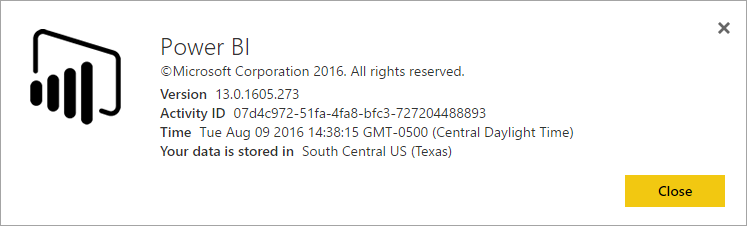

<properties
   pageTitle="我的 Power BI 租用戶位於何處？"
   description="了解您的 Power BI 租用戶所在的位置，以及如何選取該位置。 這是一定要了解，因為它可以影響您有與服務互動。"
   services="powerbi"
   documentationCenter=""
   authors="guyinacube"
   manager="mblythe"
   backup=""
   editor=""
   tags=""
   qualityFocus="no"
   qualityDate=""/>

<tags
   ms.service="powerbi"
   ms.devlang="NA"
   ms.topic="article"
   ms.tgt_pltfrm="NA"
   ms.workload="powerbi"
   ms.date="09/16/2016"
   ms.author="asaxton"/>
# 我的 Power BI 租用戶位於何處？

<iframe width="560" height="315" src="https://www.youtube.com/embed/0fOxaHJPvdM?showinfo=0" frameborder="0" allowfullscreen></iframe>

了解您的 Power BI 租用戶所在的位置，以及如何選取該位置。 這是一定要了解，因為它可以影響您有與服務互動。

## 如何判斷您的 Power BI 租用戶所在的位置

尋找您的租用戶 」 中的區域中，您可以執行下列作業。

1. 選取 **嗎？** 在 Power BI 服務。

2. 選取 **解 Power BI**。

3. 尋找值旁邊 **您的資料會儲存在**。 這是您所在的區域。

## 如何選取資料區域

資料區域根據第一次建立租用戶時已選取的國家/地區。 這適用於註冊 Office 365 Powe rBI 除了為共用此資訊。 如果這是新的租用戶，當您註冊時，您會看到一個下拉式清單中的國家/地區。

此選項時，哪些磁碟機的資料儲存位置。 Power BI 會選擇這個選項最接近的資料區域。

> [AZURE.WARNING] 無法變更此選取項目 ！

更多的問題嗎？ [試用 Power BI 社群](http://community.powerbi.com/)