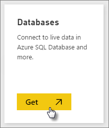
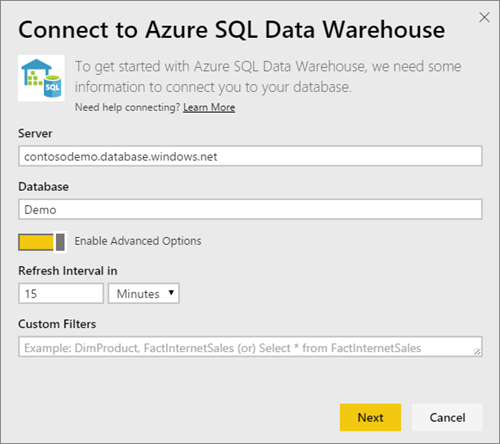

<properties 
   pageTitle="Azure SQL 資料倉儲和 DirectQuery"
   description="Azure SQL 資料倉儲和 DirectQuery"
   services="powerbi" 
   documentationCenter="" 
   authors="guyinacube" 
   manager="mblythe" 
   backup=""
   editor=""
   tags=""
   qualityFocus="no"
   qualityDate=""/>
 
<tags
   ms.service="powerbi"
   ms.devlang="NA"
   ms.topic="article"
   ms.tgt_pltfrm="NA"
   ms.workload="powerbi"
   ms.date="09/21/2016"
   ms.author="asaxton"/>

# Azure SQL 資料倉儲和 DirectQuery

Azure SQL 資料倉儲和 DirectQuery 可讓您建立動態報告根據資料與度量您已經有 Azure SQL 資料倉儲中。 使用 DirectQuery，查詢會傳送回到您的 Azure SQL 資料倉儲，即時，當您瀏覽資料。 加上的小數位數 SQL 資料倉儲可讓使用者在數分鐘內針對數 tb 的資料建立動態報告。 此外，導入 **Power BI 中開啟** ] 按鈕可讓使用者不必手動指定資訊直接連線至其 SQL 資料倉儲的 Power BI。

附註︰ 當使用 SQL 資料倉儲連接器︰

-   連接 （細節請見下文） 時，請指定完整的伺服器名稱

-   請確定伺服器防火牆規則設定為 [允許存取 Azure 服務]

-   每個動作，例如選取資料行或新增篩選條件會直接查詢資料倉儲

-   磚會設定為大約每隔 15 分鐘重新整理，而不需要重新整理排程。  這可以調整進階設定中，當您連接。

-   問答集不適用於 DirectQuery 資料集

-   不會自動挑選結構描述變更

隨著我們持續改善使用體驗，可能會變更這些限制和備註。 若要連接的步驟如下所述。

## 使用 '在 Power BI 中開啟] 按鈕

SQL 資料倉儲與 Power BI 之間移動的最簡單方式是使用 **Power BI 中開啟** Azure 預覽入口網站中的按鈕。 此按鈕可讓您順暢地開始在 Power BI 中建立新的儀表板。

1. 若要開始，瀏覽至您在 Azure 預覽入口網站中的 SQL 資料倉儲執行個體。 請注意，SQL 資料倉儲中只能有出現在 Azure 預覽入口網站這一次。

2. 按一下 [ **Power BI 中開啟** 按鈕

    

3. 如果我們無法將您直接登入，或您沒有 Power BI 帳戶，您必須登入。

4. 您會被導向至 SQL 資料倉儲連線頁面中，從預先填入您 SQL 資料倉儲的資訊。 輸入您的認證，並叫用連接以建立連接。

## 透過 Power BI 連接

SQL 資料倉儲也會列在 Power BI 取得資料] 頁面上。 

1. 選取 **取得資料** 左的導覽窗格的底部。  

    

2. 內 **資料庫**, ，請選取 **取得**。

    

3. 選取 **SQL 資料倉儲** \> **連接**。

    

4. 輸入連接所需的資訊。  **尋找參數** 下一節將示範這項資料位置位於您的 Azure 入口網站。

    
   
    
   
    

    > 
            **請注意**︰ 使用者名稱會在您的 Azure SQL 資料倉儲執行個體中定義的使用者。

5. 藉由選取新的磚或新建立的資料集，以星號表示鑽研資料集。 此資料集必須與您的資料庫相同的名稱。

    

6. 您可以瀏覽的所有資料表和資料行。 選取資料行，將查詢傳送回來源，以動態方式建立視覺效果。 篩選器也會轉譯成回到您的資料倉儲的查詢。 這些視覺效果可以儲存在新的報表，並釘選回到您的儀表板。

    

## 尋找參數值

Azure Preview 入口網站中可以找到您完整的伺服器名稱和資料庫名稱。 請注意，SQL 資料倉儲中只能有出現在 Azure 預覽入口網站這一次。

## 請參閱

[開始使用 Power BI](powerbi-service-get-started.md)  
[取得 Power BI 中的資料](powerbi-service-get-data.md)  
[Azure SQL 資料倉儲](https://azure.microsoft.com/en-us/documentation/services/sql-data-warehouse/)  
更多的問題嗎？ [試用 Power BI 社群](http://community.powerbi.com/)