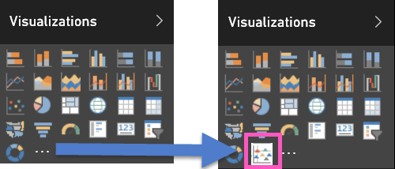
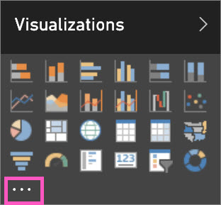
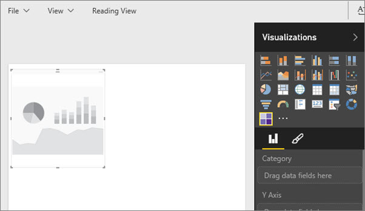

<properties
   pageTitle="將自訂視覺效果加入 Power BI 報表"
   description="將自訂視覺效果加入 Power BI 報表"
   services="powerbi"
   documentationCenter=""
   authors="mihart"
   manager="mblythe"
   backup=""
   editor=""
   tags=""
  featuredVideoId="gido6wr5pvE"
  qualityFocus="no"
   qualityDate=""/>

<tags
   ms.service="powerbi"
   ms.devlang="NA"
   ms.topic="article"
   ms.tgt_pltfrm="NA"
   ms.workload="powerbi"
   ms.date="08/25/2016"
   ms.author="mihart"/>
# 將自訂視覺效果加入 Power BI 報表

您已經 [下載自訂的視覺化範本](powerbi-custom-visuals-download-from-the-gallery.md) 並儲存至您的電腦或另一個位置。  匯入的視覺化範本報表以便加入，為您的視覺效果] 窗格的選項，為下一個步驟。
    

監看式將下載的自訂視覺效果，並將它加入至他的報告。 然後依照自己試試看以下視訊的逐步指示。

<iframe width="560" height="315" src="https://www.youtube.com/embed/gido6wr5pvE" frameborder="0" allowfullscreen></iframe>

>
            **重要**︰ 自訂的視覺化範本會加入至匯入特定的報表。 如果您想要在另一個報表中使用的視覺化範本，您需要將它匯入以及該報表。
使用儲存的自訂視覺效果時 **另存新檔** 選項，自訂的視覺化範本的複本儲存在新的報表。

1. 開啟 [Power BI](http://app.powerbi.com) ，選取您要加入自訂視覺效果的報表。  

2.  在報表開啟 [編輯檢視](powerbi-service-interact-with-a-report-in-editing-view.md)。

2. 在 **視覺效果** ] 窗格中，選取省略符號 （...）。

    

3. 選取 **匯入** 並瀏覽至您儲存下載的自訂視覺效果 （.pbiviz 檔案） 的位置。

4. 
            **重要**︰ 檢視警告，並確保視覺效果是來自可信任的來源。 Microsoft 建議您搭配您的 IT 部門如果您不確定是否要使用特定自訂視覺化您取得 Power BI 視覺效果庫、 透過電子郵件，或從其他來源。
請參閱 [檢閱安全性與隱私權的自訂視覺效果](powerbi-custom-visuals-review-for-security-and-privacy.md)。

5. 選取 [開啟] ****。 自訂視覺效果圖示 (也稱為 *範本*) 加入至視覺效果] 窗格。

    

    自訂的視覺化範本會加入至特定報表的視覺效果] 窗格時匯入。 您已可供您選取並使用該報表中。
    如果您想要在另一個報表中使用視覺效果，您需要將它匯入該報表的視覺效果窗格。

    使用儲存的自訂視覺效果時 **另存新檔** 選項，自訂的視覺化範本的複本儲存在新的報表。

    當您匯入自訂的視覺化範本，您無法移除特定報表的視覺效果] 窗格。 如果您使用它來建立視覺效果，您可以移除視覺效果。但是圖示仍然會留在視覺效果] 窗格中。

6. 編輯檢視] 中選取 [自訂視覺效果] 圖示。  這樣會增加報表畫布浮水印 （範本）。

    

7. 將欄位拖曳至要建立視覺效果的範本。 （選擇性） 釘選視覺效果的儀表板。 此範例顯示資料表 Heatmap 自訂視覺效果。

    

8. 繼續使用，並瀏覽此視覺效果，如同任何其他 （原生） 在 Power BI 視覺效果。

### 請參閱

            [Microsoft 的自訂視覺播放 YouTube](https://www.youtube.com/playlist?list=PL1N57mwBHtN1vIjfvuBIzZllrmKo-Vz6x)

            [在 Power BI 中的視覺效果](powerbi-service-visualizations-for-reports.md)

            [在 Power BI 自訂視覺效果](powerbi-custom-visuals.md)

            [Power BI 自訂視覺效果的組件庫](https://app.powerbi.com/visuals)

            [使用 Power BI Desktop 中的自訂視覺效果](powerbi-custom-visuals-use.md)

            [檢閱安全性與隱私權的自訂視覺效果](powerbi-custom-visuals-review-for-security-and-privacy.md)

            [開始使用自訂視覺效果的開發人員工具 （預覽）](powerbi-custom-visuals-getting-started-with-developer-tools.md)

            [視訊︰ 與 Sachin Patney Nico Cristache 建立 Power bi 自訂視覺效果](https://www.youtube.com/watch?v=kULc2VbwjCc)

更多的問題嗎？ 
            [試用 Power BI 社群](http://community.powerbi.com/)
