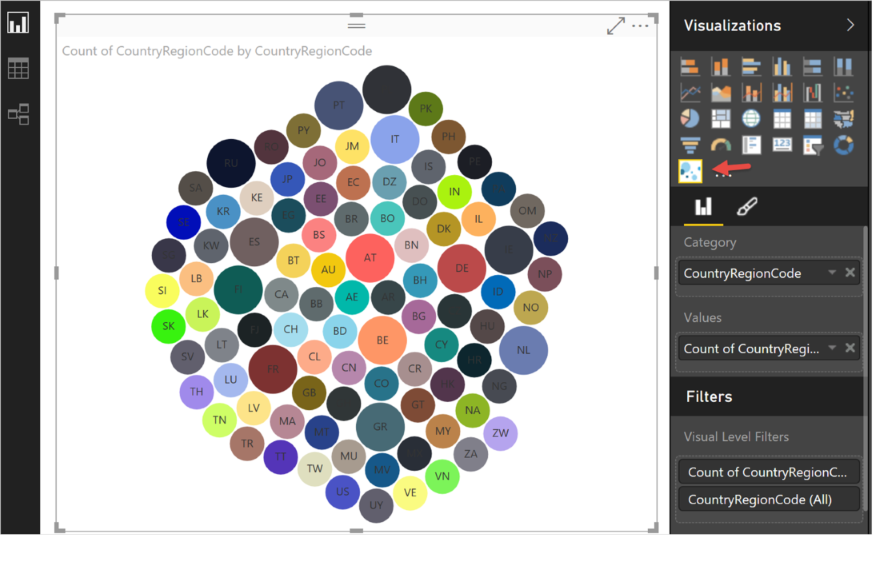

<properties
   pageTitle="建立並提交視覺效果，組件庫"
   description="建立並提交視覺效果，組件庫"
   services="powerbi"
   documentationCenter=""
   authors="guyinacube"
   manager="mblythe"
   backup=""
   editor=""
   tags=""
   qualityFocus="no"
   qualityDate=""/>

<tags
   ms.service="powerbi"
   ms.devlang="NA"
   ms.topic="article"
   ms.tgt_pltfrm="NA"
   ms.workload="powerbi"
   ms.date="09/23/2016"
   ms.author="asaxton"/>

# 建立並提交視覺效果，組件庫

要建立您自己的 visual，並將它加入至視覺效果庫中的其他人使用？  只要遵循幾個步驟執行。

## 使用 Power BI 開發人員工具建立的自訂視覺效果

您可以建立使用 Power BI 開發人員工具的自訂視覺效果。 在 Power BI 中 **開發人員工具**, 、 設計和撰寫自訂視覺效果，以測試自訂視覺效果 **TypeScript** 程式碼，並建立 CSS。 一旦測試過您的自訂視覺效果，您可以將它匯出至 Power BI 或提交到 **Power BI 視覺效果** 組件庫。

若要深入了解開發人員工具，請參閱 [開始著手開發人員工具](powerbi-custom-visuals-getting-started-with-developer-tools.md)。

## 送出至 Power BI 自訂視覺效果庫您自訂視覺效果

送出至 Power BI 視覺效果庫透過電子郵件程式自訂視覺效果。 若要了解做法，請參閱 [開始著手開發人員工具](powerbi-custom-visuals-getting-started-with-developer-tools.md#submit-your-visual-to-the-power-bi-custom-visual-gallery)。

## 請參閱

[在 Power BI 自訂視覺效果](powerbi-custom-visuals.md)  
[從組件庫下載的自訂視覺效果](powerbi-custom-visuals-download-from-the-gallery.md)  
[報表 （Power BI 服務） 中使用的自訂視覺效果](powerbi-custom-visuals-add-to-report.md)  
[報表 (Power BI Desktop) 中使用的自訂視覺效果](powerbi-custom-visuals-use.md)  
更多的問題嗎？ [試用 Power BI 社群](http://community.powerbi.com/)
