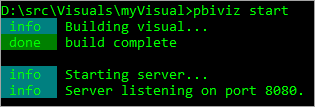

<properties
   pageTitle="使用自訂的視覺化開發人員工具建立的自訂視覺效果"
   description="自訂視覺效果可讓您以符合使用者的需求，並符合您的應用程式的設計。 了解如何建立使用開發人員工具的 Power bi 自訂視覺效果。"
   services="powerbi"
   documentationCenter=""
   authors="guyinacube"
   manager="mblythe"
   backup=""
   editor=""
   tags=""
   qualityFocus="no"
   qualityDate=""/>

<tags
   ms.service="powerbi"
   ms.devlang="NA"
   ms.topic="article"
   ms.tgt_pltfrm="NA"
   ms.workload="powerbi"
   ms.date="09/23/2016"
   ms.author="asaxton"/>

# 使用自訂的視覺化開發人員工具建立的自訂視覺效果

自訂視覺效果可讓您以符合使用者的需求，並符合您的應用程式的設計。 了解如何建立使用開發人員工具的 Power bi 自訂視覺效果。

> [AZURE.NOTE] 您可以使用這份文件以取得啟動並執行。 如需深入的資訊，請參閱中的參考資訊 [Power BI 視覺效果 git 儲存機制](https://github.com/Microsoft/PowerBI-visuals)。

## 需求

- NodeJS 4.0 以上的版本 （5.0 或更新建議） [下載 NodeJS](https://nodejs.org)

## 安裝 NodeJS 和 Power BI 工具

若要建立的自訂視覺效果，您必須安裝 NodeJS。 NodeJS，才能執行命令列工具。

1. 下載並安裝 [NodeJS](https://nodejs.org)。 4.0 或更新版本，但是它建議有 5.0 或更新版本。

2. 安裝程式命令列工具。 從命令提示字元執行下列命令。

        npm install -g powerbi-visuals-tools

3. 您可以確認安裝工具則藉由執行下列命令，不含任何參數。

        pbiviz

    您應該會看到的是說明輸出。

    <pre><code>
         +syyso+/
    oms/+osyhdhyso/
    ym/       /+oshddhys+/
    ym/              /+oyhddhyo+/
    ym/                     /osyhdho
    ym/                           sm+
    ym/               yddy        om+
    ym/         shho /mmmm/       om+
     /    oys/ +mmmm /mmmm/       om+
    oso  ommmh +mmmm /mmmm/       om+
   ymmmy smmmh +mmmm /mmmm/       om+
   ymmmy smmmh +mmmm /mmmm/       om+
   ymmmy smmmh +mmmm /mmmm/       om+
   +dmd+ smmmh +mmmm /mmmm/       om+
         /hmdo +mmmm /mmmm/ /so+//ym/
               /dmmh /mmmm/ /osyhhy/
                 //   dmmd
                       ++

       PowerBI Custom Visual Tool

    使用方式︰ pbiviz [選項] [命令]

    命令︰

    新的 [名稱] 按一下 [建立新的視覺資訊有關目前 visual 起始開始目前 visual 套件封裝目前 visual pbiviz 檔案更新 [版本] 顯示資訊更新 api 定義和目前的視覺效果中的結構描述。 如果指定的說明 [cmd] 顯示的 [cmd] 會變更版本

    選項：

    -h，--說明輸出使用量資訊-V，--版本輸出的版本號碼-安裝憑證安裝 localhost 憑證
    </code></pre>

< 名稱"ssl-setup"></a>
### 伺服器憑證安裝

若要啟用 visual studio 的即時預覽，則需要信任的 https 伺服器。 您可以開始之前，您必須安裝 SSL 憑證，這將允許在網頁瀏覽器中載入的視覺資產。 

> [AZURE.NOTE] 這是用於開發人員工作站的一次性設定。

若要 *新增* 憑證時，執行下列命令。

    pbiviz --install-cert

**Windows 作業系統**

1. 選取 **安裝憑證...***.

    

2. 選取 **目前使用者** ]，然後選取 **下一步**。

    

3. 選取 **以下的存放區中所有憑證的位置** ，然後選取 **瀏覽**。

4. 選取 **受信任的根憑證授權單位** ，然後選取 **確定**。 選取 **下一步**。

    

5. 選取 **完成**。

    

6. 選取 **是** 在安全性警告對話方塊。

    

7. 關閉任何已開啟的瀏覽器。

> [AZURE.NOTE] 如果無法辨識的憑證，您可能需要重新啟動電腦。

**OSX**

1. 如果在左上方鎖定已鎖定，選取以解除鎖定。 搜尋 *localhost* 並連按兩下憑證。

    


2. 選取 **永遠信任** ，然後關閉視窗。

    

3. 輸入您的使用者名稱和密碼。 選取 **更新設定**。

    

4. 關閉任何已開啟的瀏覽器。

> [AZURE.NOTE] 如果無法辨識的憑證，您可能需要重新啟動電腦。

## 啟用 visual 開發人員的即時預覽

若要啟用即時預覽您的自訂視覺效果，請遵循下列步驟。 這可讓視覺效果，編輯報告時，可用於 Power BI 服務。

1. 瀏覽並登入 [app.powerbi.com](https://app.powerbi.com)。

2. 選取 **齒輪圖示** ，然後選取 **設定**。

    

3. 選取 **開發人員** ，然後選取 **啟用開發人員測試 visual**。

    

4. 選取 **Visual 開發人員** 中 **視覺化** 窗格。

    

    > [AZURE.NOTE] 這需要您已執行 `pbiviz start` 從開發電腦上視覺化的資料夾。 如需有關建立視覺效果的詳細資訊，請參閱 [預留位置](#placeholder) 在這篇文章。

5. 在報表畫布中選取視覺效果。 您可以將資料繫結進行其他視覺效果的方式相同。

您現在可以開始開發 visual studio。

## 建立新的視覺效果

您可以執行下列命令來建立新的 visual 專案。

```
pbiviz new My Visual name
```

您可以取代 *My Visual Name* 想要提供視覺效果的名稱。 這之後可以變更藉由修改 `name` 和 `displayName` 欄位內所產生 `pbiviz.json` 檔案。

此命令會建立新的資料夾中的直接執行命令。 它會產生 visual studio 的基本入門範本。 當命令完成時，您可以開啟的目錄，然後使用您喜好的編輯器来開始使用新的 visual studio。

## 在 Power BI 中測試 visual studio

您可以測試 visual studio 中報表和儀表板中的 Power BI 服務。

<a name="running-your-visual"></a>
### 執行 visual studio

您可以透過下列方式來執行 visual studio。

1. 開啟提示。

2. 變更您的目錄，以視覺化的資料夾。 這是包含的資料夾 `pbiviz.json` 檔案。

3. 執行下列命令。

    ```
    pbiviz start
    ```

    

如果您是在錯誤的位置，您會看到類似下列的錯誤。

```
    error  LOAD ERROR Error: pbiviz.json not found. You must be in the root of a visual project to run this command.
        at e (C:\Users\[user]\AppData\Roaming\npm\node_modules\powerbi-visuals-tools\lib\VisualPackage.js:67:35)
        at Function.loadVisualPackage (C:\Users\[user]\AppData\Roaming\npm\node_modules\powerbi-visuals-tools\lib\VisualPackage.js:62:16)
        at Object.<anonymous> (C:\Users\[user]\AppData\Roaming\npm\node_modules\powerbi-visuals-tools\bin\pbiviz-start.js:43:15)
        at Module._compile (module.js:556:32)
        at Object.Module._extensions..js (module.js:565:10)
        at Module.load (module.js:473:32)
        at tryModuleLoad (module.js:432:12)
        at Function.Module._load (module.js:424:3)
        at Module.runMain (module.js:590:10)
        at run (bootstrap_node.js:394:7)
```

### 在 Power BI 中檢視 visual studio

若要在報表中檢視 visual studio，請移至該報表，然後選取 [視覺效果中的 **視覺效果** 窗格。

> [AZURE.NOTE] 您必須執行 `pbiviz start` 命令之前，先執行此動作為 discribed 中 [執行 visual studio](#running-your-visual) 一節。


然後，您會看到視覺效果的入門範本。


|工具列項目|說明|
|---|---|
|重新整理 visual|手動重新整理視覺效果，如果已停用自動重新載入。|
|切換自動重新載入|開啟時，視覺效果會在每次您儲存 visual 檔案時自動更新。|
|顯示 dataview|顯示偵錯視覺項目的基礎資料檢視|
|取得說明|在 GitHub 中的文件|
|傳送意見反應|讓我們知道是否有反正我們改善使用經驗 ！ （需要 GitHub 帳戶）|

## 封裝用於 Power BI Desktop 和發佈 visual studio

您可以載入到 visual studio 之前 [Power BI Desktop](https://powerbi.microsoft.com/desktop/), ，或與社群分享 [Power BI 視覺化的組件庫](https://visuals.powerbi.com), ，您必須產生 `pbiviz` 檔案。

您可以透過下列方式來封裝 visual studio。

1. 開啟提示。

2. 變更您的目錄，以視覺化的資料夾。 這是包含的資料夾 `pbiviz.json` 檔案。

3. 執行下列命令。

    ```
    pbiviz package
    ```

此命令會建立 `pbiviz` 中 `dist/` 視覺化專案的目錄。 如果已經有 `pbiviz` 檔案存在，將會覆寫。

## 更新視覺效果 API 版本

當您建立 visual 使用 `pbiviz new`, ，適當的 API 型別定義和 json 結構描述的副本都會複製到 visual studio 的目錄。 您可以使用 `pbiviz update` 命令，視需要更新這些檔案。 這可以是很有用，如果我們發行的修正程式過去的 API 版本，或您想要更新至最新的 API 版本。

### 更新現有的 API 版本

如果我們發行的更新現有的 API，您可以透過下列方式取得最新版本。

```
#Update your version of pbiviz
npm install -g powerbi-visuals-tools

#Run update from the root of your visual project, where pbiviz.json is located
pbiviz update
```

這會下載最新的工具，從 npm 包括已更新的類型定義與結構描述。 使用 `pbiviz update` 將會覆寫 `apiVersion` 屬性，在您 *pbiviz.json* fiel 的最新版本。

### 升級至不同的 API 版本

您可以使用相同的步驟，如先前所述，更新為不同的 API 版本。 您可以明確指定您想要使用的 API 版本。

```
#Update your version of pbiviz
npm install -g powerbi-visuals-tools

#Run update from the root of your visual project, where pbiviz.json is located
pbiviz update 1.2.0
```

這會更新 yoru visual api 1.2.0 版。 您可以取代 `1.2.0` 不論版本與您想要使用。

> [AZURE.WARNING] 工具所使用的預設 API 版本一律為穩定版本的 API。 任何版本晚於預設的 API 版本是不穩定和受變更。 他們可能會遇到非預期的行為和 Power BI 服務與 Power BI Desktop 之間有不同的行為。 目前的穩定 API 版本，請參閱 [變更記錄檔，](https://github.com/Microsoft/PowerBI-visuals/blob/master/ChangeLog.md)。 如需有關發行前版本的詳細資訊，請參閱 [藍圖](https://github.com/Microsoft/PowerBI-visuals/blob/master/Roadmap/README.md)。

## 在 visual 專案

Visual 專案是在執行時建立的資料夾 `pbiviz new` 命令。 

### 檔案結構

|項目|說明|
|---|---|
|資產 /|用來儲存視覺化資產 （圖示、 螢幕擷取畫面等）。|
|dist /|當您執行 `pbiviz package`, ，pbiviz 檔案將會產生以下。|
|src /|Visual studio 的 typescript 程式碼。|
|樣式 /|Visual studio 較少的樣式。|
|.gitignore|會告知 git 忽略檔案不應儲存機制中的追蹤。|
|capabilities.json|用來定義 [功能](https://github.com/Microsoft/PowerBI-visuals/blob/master/Capabilities/Capabilities.md) 的視覺效果。|
|package.json|使用 [npm](https://www.npmjs.com/) 管理模組。|
|pbiviz.json|主要設定檔。|
|tsconfig.json|Typescript 編譯器設定。 深入了解 [tsconfig.json](https://www.typescriptlang.org/docs/handbook/tsconfig-json.html)。|

### pbiviz.json

這個檔案是 visual studio 的主要組態檔。 它包含中繼資料，以及您建置 visual studio 所需的檔案的相關資訊。

```
{
    "visual": {
        "name": "myVisual", // internal visual name (should not contain spaces)
        "displayName": "My Visual!", // visual name displayed to user (used in gallery)
        "guid": "PBI_CV_xxxxxxx", // a unique id for this visual MUST BE UNIQUE
        "visualClassName": "Visual" // the entry class for your visual
        "version": "1.0.0", // visual version. Should be semantic version (increment if you update the visual)
        "description": "", // description used in gallery
        "supportUrl": "", // url to where users can get support for this visual
        "gitHubUrl": "" // url to the source in github (if applicable)
    },
    "apiVersion": "1.0.0", //API version this visual was created with
    "author": {
        "name": "", // your name
        "email": "" // your e-mail
    },
    "assets": {
        "icon": "assets/icon.png" // relative path to your icon file (20x20 png)
    },
    "style": "style/visual.less", // relative path to your less file
    "capabilities": "capabilities.json" // relative path to your capabilities definition 
}
```

### 視覺化來源 (TypeScript)

視覺化程式碼應該以 TypeScript 支援更進階的功能和早期存取 ES6/ES7 功能的 JavaScript 的超集。

所有的 TypeScript 檔案應該儲存在 `src/` 目錄並將它們加入至 `files` 陣列中 `tsconfig.json`。 這可讓載入 TypeScript 編譯器，以及以何種順序。

Visual studio 建置完成後，所有的 TypeScript 就會編譯成單一的 JavaScript 檔案。 這可讓您從其他檔案參考匯出的項目，而不需要手動 `require` 它們只要 tsconfig 中所列的兩個檔案。

您可以建立多檔案，並為您的類別必須建立 visual studio。

深入了解 [TypeScript](http://www.typescriptlang.org/)。

### 視覺化樣式 （小於）

視覺化樣式會使用階層式樣式表 (CSS) 來處理。 您 convience，我們會使用較少預先編譯器可支援一些進階的功能，例如巢狀結構、 變數、 mixins、 條件、 迴圈等等。如果您不想使用上述任何功能，您可以撰寫一般 CSS 較少的檔案中。

所有較少檔案應該儲存在 `style/` 目錄。 在指定的檔案 `style` 欄位內您 `pbiviz.json` 載入檔案。 應該使用載入任何其他檔案 `@import`。

深入了解 [小於](http://lesscss.org/)。

## 偵錯

如需偵錯您的自訂視覺效果的祕訣，請參閱 [偵錯指南](https://github.com/Microsoft/PowerBI-visuals/blob/master/tools/debugging.md)。

## 送出至 Power BI 自訂視覺圖庫 visual studio

您可以 [提交 visual studio](https://app.powerbi.com/visuals/info#submit) 要包含在 Power BI 視覺效果的組件庫中。 這牽涉到傳送電子郵件與附加程式 pbiviz 檔案。

## 疑難排解

**找不到 Pbiviz 命令 （或類似的錯誤）**

如果您執行 `pbiviz` 在終端機 / 命令列中，您應該會看到說明畫面。 如果沒有，未正確安裝。 請確定您已至少安裝 NodeJS 4.0 版。

如需詳細資訊，請參閱 [安裝 NodeJS 和 Power BI 工具](#install-nodejs-and-the-power-bi-tools)...

**找不到偵錯 visual 在視覺效果] 索引標籤**

Visual 偵錯中的提示圖示看起來 **視覺效果** ] 索引標籤。


如果您沒有看到它，請確定您已經啟用了 Power BI 設定內。 

> [AZURE.NOTE] Visual 偵錯目前僅提供的 Power BI 服務中，而不是在 Power BI Desktop 或行動裝置應用程式。 封裝的視覺效果仍然可以使用每個地方。

如需詳細資訊，請參閱 [啟用即時預覽視覺化的開發人員的](#enable-live-preview-of-developer-visual)...

**無法連絡 visual 伺服器**

命令執行 visual 伺服器 `pbiviz start` 您終端機 / 命令列從視覺化專案的根目錄中。 如果伺服器正在執行，很可能未正確安裝 SSL vertificates。

如需詳細資訊，請參閱 [執行 visual studio](#running-your-visual) 或 [伺服器憑證安裝](#ssl-setup)。


## 請參閱

[在 Power BI 中的視覺效果](powerbi-service-visualizations-for-reports.md)  
[在 Power BI 自訂視覺效果](powerbi-custom-visuals.md)  
[Power BI 自訂視覺效果的組件庫](https://app.powerbi.com/visuals)  
[TypeScript](http://www.typescriptlang.org/)  
[較少的 CSS](http://lesscss.org/)  
更多的問題嗎？ [試用 Power BI 社群](http://community.powerbi.com/)