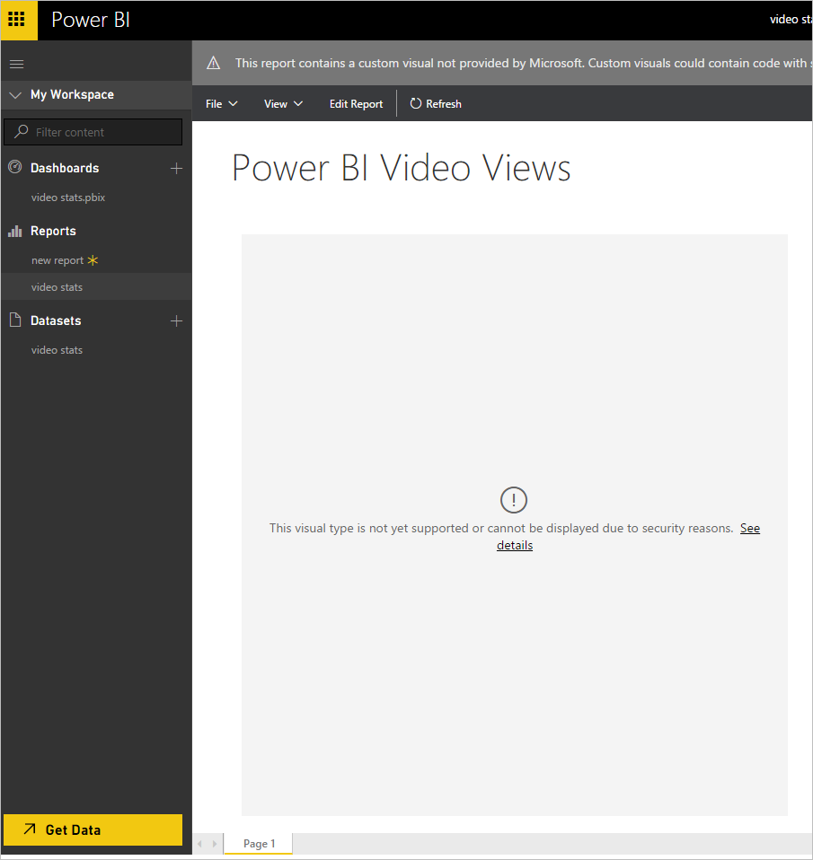

<properties
   pageTitle="檢閱安全性與隱私權的自訂視覺效果"
   description="啟用自訂視覺效果之前，您應該檢閱，安全性和隱私權進行視覺化確定如果符合組織的標準。"
   services="powerbi"
   documentationCenter=""
   authors="guyinacube"
   manager="erikre"
   backup=""
   editor=""
   tags=""
   qualityFocus="no"
   qualityDate=""/>

<tags
   ms.service="powerbi"
   ms.devlang="NA"
   ms.topic="article"
   ms.tgt_pltfrm="NA"
   ms.workload="powerbi"
   ms.date="10/10/2016"
   ms.author="asaxton"/>

# 檢閱安全性與隱私權的自訂視覺效果

啟用自訂視覺效果之前，您應該檢閱，安全性和隱私權進行視覺化確定如果符合組織的標準。

## 啟用自訂視覺效果

在報表中的自訂視覺效果已停用，直到您選擇 **啟用自訂視覺效果** ，如下所示。  

## 啟用自訂視覺效果之前的考量  

> [AZURE.WARNING] 自訂視覺效果可能包含程式碼與安全性或隱私權風險。因此，直到您選擇啟用自訂視覺效果已停用在報表中的自訂視覺效果。 以下是決定是否要啟用的自訂視覺效果的一些考量︰

1. 請確定您信任作者及來源的報表中使用自訂視覺效果

2. 如果您不確定如何因應，您應該連絡您的 IT 團隊權衡上是否應該啟用您檢視的報表的自訂視覺效果。

3. 如果其他人與您共用報表，其中包含自訂視覺效果，即使它們是關閉的同事，覺得無法義務啟用自訂視覺效果。 它也沒關係回過頭來考慮是否很重要的工作。 您總是可以查詢其他人的報表，而不需要自訂視覺效果時提供您不想把握自訂視覺效果。

## 若要啟用的自訂視覺效果的 IT 專業人員的安全性最佳作法  

> [AZURE.WARNING] 自訂視覺效果可能包含程式碼與安全性或隱私權風險。因此，直到您選擇啟用自訂視覺效果已停用在報表中的自訂視覺效果。 有數個要評估的安全性與隱私權的自訂視覺效果，您可以遵循的最佳作法。

1.  實作在組織內的自訂視覺效果的 vetting 程序。 驗證自訂視覺效果會與透過內部網站，例如 SharePoint 文件庫或 OneNote 文件的內部使用者共用。
2.  提供商務上的使用者自訂視覺效果的適當用法的指引和商務使用者之安全性和隱私權問題來傳送電子郵件群組。
3.  評估自訂視覺化 pbiviz 檔案中的 JavaScript 程式碼。

**若要評估 JavaScript 程式碼中的自訂視覺效果**

自訂視覺效果使用 JavaScript，因此可以包含安全性或隱私權風險。 如果您從不明來源收到的自訂視覺效果或 pbix 檔案的自訂視覺效果，您可以看看安全 JavaScript。

若要評估的自訂視覺效果中的 JavaScript 程式碼，擷取自訂的視覺化程式碼。 以下是如何解壓縮程式碼︰  

1. 將.pbiviz 檔案儲存到資料夾。

2. 將檔案重新命名為.zip 檔案。

3. 將 zip 檔案解壓縮至本機資料夾。

## 自訂視覺化檔案內容

Pbiviz 檔案的內容如下︰

| **檔案**                     | **說明**                                                                                                                                                           |
|:-----------------------------|:--------------------------------------------------------------------------------------------------------------------------------------------------------------------------|
| ./package.json               | 資訊清單檔，指出要載入的自訂視覺效果的檔案。                                                                                                 |
| 。 / 資源                  | 包含 CSS、 TypeScript 和 JavaScript 使用的自訂視覺效果。                                                                                                   |
| ./resources/&lt;名稱&gt;     | &lt;名稱&gt; 自訂視覺效果的名稱。                                                                                                                            |
| ./resources/&lt;名稱&gt;.css | 自訂視覺效果 css 資源檔。                                                                                                                              |
| ./resources/&lt;名稱&gt;.js  | 當使用者按一下 [啟用自訂視覺效果，或在使用者匯入自訂視覺效果之後執行的程式碼。 警告的 JavaScript 程式碼可能包含安全性或隱私權風險。 |
| ./resources/&lt;名稱&gt;.ts  | TypeScript 格式 visual JavaScript 原始程式碼。 警告 JavaScript 或 TypeScript 程式碼可能包含安全性或隱私權風險。                            |
| ./resources/&lt;名稱&gt;.png | 視覺效果對使用者顯示的圖示。                                                                                                                                |

Pbiviz 檔案解壓縮之後，您可以評估程式碼。 以下是一些最佳作法和要尋找的威脅。

## 若要評估的 JavaScript 或 TypeScript 程式碼的最佳作法

            **JavaScript** 或 **TypeScript** 程式碼可能包含安全性或隱私權風險。 以下是一些最佳作法和要尋找的威脅。

### 若要評估 JavaScript 程式碼的最佳作法

-  務必要評估的.js 檔案內容。 這是實際執行的程式碼。 這可能是.ts 檔案的內容不編譯成自訂視覺效果中包含的.js 檔案。

-  務必要評估.ts 檔案內容。 您可以將.ts 檔案載入 **開發人員工具**, 、 匯出視覺效果，以及比較產生的.js 檔案中新建立的.pbiviz 視覺效果中所包含的原始.js 檔的檔案

-  請檢查自訂視覺效果的圖示不類似於使用者是熟悉太接近其他視覺效果。

-  務必要評估的視覺物件中的測試帳戶具有最低權限，且沒有任何機密資料的存取權。 在理想情況下測試帳戶是本機帳戶，而非 Power BI 服務沒有登入的資訊。

### 在 JavaScript 程式碼中尋找的威脅

-  在編輯和檢視模式中使用視覺效果時，請檢查網路活動。 請確定您滿意所進行的要求。 您不會看到 Power BI 網域之外的資源要求除非 visual 作者已事先傳達這。

-  您會看到留下的 Power BI 網域的任何資料應該符合預期的是何種 'normal' 使用。 例如如果視覺效果實作視訊播放器來檢視視訊從其他站台使用 iFrame，正確呈現視訊的 IFrame 要求應該傳送一些資訊。 不過，如果您看到正在透過網路傳送整個資料集，您可能會進一步調查如果這是所需和所需。

-  檢查是否個人識別資料正在傳送或儲存的自訂視覺效果。

-  請檢查正在嘗試自訂視覺效果存取本機資源，例如檔案寫入磁碟，或存取 cookie。

-  檢查是否有看似混亂的程式碼或不清楚的目的碼的自訂視覺效果。

-  儲存您在過去檢閱每個 visual 副本。

-  如果您要檢閱您先前檢閱視覺效果的更新，請務必檢查是否有變更。 一律套用到更新相等時的嚴謹，如同第一次收到供檢閱視覺效果

-  如果您尋找可疑或不清楚，請連線到出我們在這裡提供協助。

## 請參閱

[在 Power BI 中的視覺效果](powerbi-service-visualizations-for-reports.md)  
[在 Power BI 自訂視覺效果](powerbi-custom-visuals.md)  
[Power BI 自訂視覺效果的組件庫](https://app.powerbi.com/visuals)  
[報表中加入自訂視覺效果 (Power BI Desktop)](powerbi-custom-visuals-use.md)  
[報表中加入自訂視覺效果 （Power BI 服務）](powerbi-custom-visuals-add-to-report.md)  
[從組件庫下載自訂視覺效果](powerbi-custom-visuals-download-from-the-gallery.md)  
[建立並提交到資源庫的視覺效果](powerbi-custom-visuals-create-for-the-gallery.md)  
[開始使用自訂視覺效果的開發人員工具 （預覽）](powerbi-custom-visuals-getting-started-with-developer-tools.md)  
[視訊︰ 與 Sachin Patney Nico Cristache 建立 Power bi 自訂視覺效果](https://www.youtube.com/watch?v=kULc2VbwjCc)  
更多的問題嗎？ [試用 Power BI 社群](http://community.powerbi.com/)