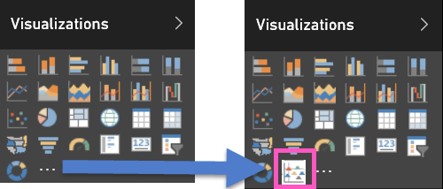

<properties
   pageTitle="報表中加入自訂視覺效果 （桌面）"
   description="桌面中對報表新增的自訂視覺效果"
   services="powerbi"
   documentationCenter=""
   authors="mihart"
   manager="mblythe"
   backup=""
   editor=""
   tags=""
   qualityFocus="monitoring"
   qualityDate="03/15/2016"/>

<tags
   ms.service="powerbi"
   ms.devlang="NA"
   ms.topic="article"
   ms.tgt_pltfrm="NA"
   ms.workload="powerbi"
   ms.date="09/30/2016"
   ms.author="mihart"/>

# 報表中加入自訂視覺效果 （桌面）  

您已經 [下載自訂的視覺化範本](powerbi-custom-visuals-download-from-the-gallery.md) 並儲存至您的電腦或另一個位置。  匯入的視覺化範本報表以便加入，為您的視覺效果] 窗格的選項，為下一個步驟。

>[AZURE.IMPORTANT]
自訂的視覺化範本新增至特定報表匯入。 如果您想要在另一個報表中使用的視覺化範本，您需要將它匯入以及該報表。
使用儲存的自訂視覺效果時 **另存新檔** 選項，自訂的視覺化範本的複本儲存在新的報表。

1. 開啟 Power BI Desktop，然後選取您要加入自訂視覺效果的報表。  在報表開啟 [編輯檢視](powerbi-service-interact-with-a-report-in-editing-view.md)。

2.  有兩個自訂的視覺化範本匯入選項︰ 從 **檔案** 功能表或從 **視覺效果** 窗格。

    **從桌面檔案功能表**

    - 在報表上 **檔案** ] 功能表上，選擇 [ **匯入** &gt; **Power BI 自訂視覺**。 您必須在 [編輯] 檢視。  
      

    **從 [視覺效果] 窗格**
    - 在 **視覺效果** ] 窗格中，選擇 [ **插入 （...）**。
        

    - 選取 **匯入自訂視覺效果**。  
        

3. 
            **檢閱警告**。

    自訂視覺項目具有您在使用自訂視覺效果，並可以代替您執行動作的報表中資料的存取權。 如果在檢視報表時，與其他人共用報表自訂視覺效果就可以完成相同，但針對您的同事。 請小心檢閱自訂視覺效果，以確定其來自可信任的來源。 Microsoft 建議您搭配您的 IT 部門如果您不確定是否要使用特定自訂視覺化您取得 Power BI 視覺效果庫、 透過電子郵件，或從其他來源。  

    

4. 選取在.pbiviz 檔案 **開啟** ] 對話方塊。

5. 圖示 (也稱為 *範本*) 加入至您 **視覺效果** 窗格。  

    

6. 選取自訂的視覺化範本，以如同使用任何視覺效果] 窗格中的其他範本加入至報表。 加入欄位和篩選器，並建立 visual studio。

7.  如同任何其他 visual 格式化自訂視覺效果。  從 ** 視覺效果** ] 窗格中，選取 [小畫家] 圖示。 可用的格式化選項會根據視覺效果類型而有所不同。

### 請參閱

[自訂視覺效果加入 Power BI 服務中的報表](powerbi-custom-visuals-add-to-report.md)  
[建立並提交的自訂視覺效果](powerbi-custom-visuals-create-for-the-gallery.md)  
[在 Power BI 中的視覺效果](powerbi-service-visualizations-for-reports.md)  
回到 [中 Power BI 自訂視覺效果](powerbi-custom-visuals.md)  
[Power BI 自訂視覺效果的組件庫](https://app.powerbi.com/visuals)  
更多的問題嗎？ [試用 Power BI 社群](http://community.powerbi.com/)
