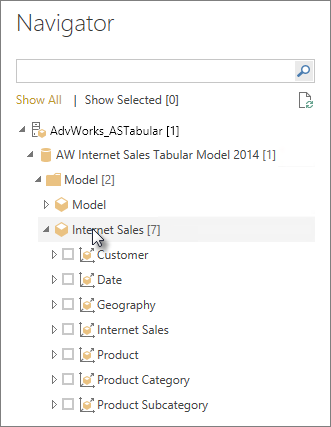

<properties
   pageTitle="Power BI Desktop 中的 analysis Services 表格式資料"
   description="Power BI Desktop 中的 analysis Services 表格式資料"
   services="powerbi"
   documentationCenter=""
   authors="davidiseminger"
   manager="mblythe"
   backup=""
   editor=""
   tags=""
   qualityFocus="no"
   qualityDate=""/>

<tags
   ms.service="powerbi"
   ms.devlang="NA"
   ms.topic="article"
   ms.tgt_pltfrm="NA"
   ms.workload="powerbi"
   ms.date="09/29/2016"
   ms.author="davidi"/>
# Power BI Desktop 中的 analysis Services 表格式資料

使用 Power BI Desktop，有兩種方式，您可以連接到並從您的 SQL Server Analysis Services 表格式模型取得資料︰ 使用即時連接或選取項目，來探索並匯入至 Power BI Desktop。

讓我們仔細看。

            **藉由使用即時連接探索** – 當使用即時連接，項目在表格式模型或觀點來看，就像資料表，資料行和量值會出現在 Power BI Desktop 欄位] 清單中。 若要以新的高度互動方式瀏覽表格式模型，您可以使用 Power BI Desktop 的進階視覺效果和報告工具。

當即時連線時，表格式模型中的沒有資料會匯入 Power BI Desktop。 每次您互動視覺效果，Power BI Desktop 查詢表格式模型，並計算得到的結果。 您永遠在查看最新的資料。 請記住，表格式模型是非常安全。 在 Power BI Desktop 中出現的項目取決於您連線到您權限為表格式模型。

當您在 Power BI Desktop 建立動態報告時，您可以共用它們發行至 Power BI 網站。 當您發行至表格式模型的 Power BI Desktop 檔案與即時連接至您的 Power BI 網站時，必須安裝並由系統管理員設定內部部署資料閘道。 若要深入了解，請參閱 [內部資料閘道](powerbi-gateway-onprem.md)。

            **選取的項目，並匯入至 Power BI Desktop** – 當您連接時使用此選項時，您可以在您的表格式模型或檢視方塊中選取資料表、 資料行和量值等項目，並載入 Power BI Desktop 模型。 您可以進一步調整您想要使用 Power BI Desktop 的進階查詢編輯器。 您可以使用 Power BI Desktop 的模型化功能，進一步模型資料。 Power BI Desktop 和表格式模型之間沒有即時連接會保留。 然後，您可以瀏覽您的 Power BI Desktop 模型離線，或發行至 Power BI 網站。

## 若要連接到表格式模型

1. 在 Power BI Desktop 上 **首頁** 索引標籤上，按一下 [ **取得資料**。

 

2. 按一下 [ **SQL Server Analysis Services 資料庫**, ，然後按一下 [ **連接**。

 

3. 輸入伺服器名稱，然後選取 [連線模式。 

 

4. 此步驟取決於您選取的連線模式︰

-   如果您要連線即時、 在 [導覽] 中選取的表格式模型或檢視方塊。

    

-   如果選取項目，並取得資料導覽] 中，選取 [表格式模型或檢視方塊。 您可以進一步選取僅特定資料表或載入的資料行。 若要圖形之前載入資料，按一下 [編輯] 以開啟 [查詢編輯器。 當您準備好時，按一下 [載入] 以將資料匯入 Power BI Desktop。
>  

## 常見問題集

            **問題︰** 我需要內部部署資料閘道嗎？

            **答案是︰** 它相依。 如果您要即時連接表格式模型中，但是不想發佈到 Power BI 網站中使用 Power BI Desktop，您不需要閘道。 相反地，如果您想在發佈至您的 Power BI 網站，資料閘道，才能確保 Power BI 服務和內部部署 Analysis Services 伺服器之間的安全通訊。 請務必連絡 Analysis Services 伺服器管理員才能安裝資料閘道。

如果您選擇 [選取項目，並取得資料，您所匯入表格式模型資料於您的 Power BI Desktop 檔案，所以沒有閘道時需要。

 

            **問題︰** 從 Power BI 服務，與從 Power BI Desktop 即時連接即時連接到表格式模型之間的差異為何？

            **答案是︰** 時即時從連接到表格式模型網站至 Analysis Services 資料庫內部組織中的 Power BI 服務中，內部部署資料閘道，才能使用它們之間的安全通訊。 當即時從連接到表格式模型 Power BI Desktop，閘道不需要因為 Power BI Desktop 與 Analysis Services 伺服器，您要連線至這兩個執行內部部署組織中。 不過，如果您將 Power BI Desktop 檔案發行至 Power BI 網站時，不需要閘道。

 

            **問題︰** 如果我建立即時連接時，可以連接到相同的 Power BI Desktop 檔案中的另一個資料來源？

            **答案是︰** [否]。 您無法探索即時資料，並連接到另一種在相同檔案中的資料來源。 如果您已匯入資料，或是連接到 Power BI Desktop 檔案中的不同資料來源，您必須建立新的檔案，以即時探索。

 

            **問題︰** 我建立即時連接時，如果我可以編輯模型或 Power BI Desktop 中的查詢嗎？

            **答案是︰** [否]。 探索即時資料時，所有的查詢與模型的 Power BI Desktop 功能已停用。

 

            **問題︰** 如果我建立即時連接時，是否安全？

            **答案是︰** [是]。 目前的 Windows 認證會用來連接到 Analysis Services 伺服器。 您不能使用基本或即時 Power BI 服務或探索時，Power BI Desktop 中的預存的認證。

 

            **問題︰** 導覽] 中查看模型和檢視方塊。 有何不同？

            **答案是︰** 檢視方塊是表格式模型的特定檢視。 它可能包含特定的資料表、 資料行或量值，視唯一的資料分析需求而定。 表格式模型一定會包含至少一個觀點來看，可能包括在模型中的所有項目。 如果您不確定應該選取，請洽詢您的系統管理員。

## 在初始連線後變更伺服器名稱

一旦您建立探索即時連接 Power BI Desktop 檔案，可能會有某些情況的下您要連接切換到另一部伺服器。 例如，如果連接到開發伺服器，以及之前發行至 Power BI 服務時，您可以建立 Power BI Desktop 檔案，您要連接切換到實際執行伺服器。

1. 選取 **編輯查詢** 從功能區。

 

2. 輸入新的伺服器名稱。

 
