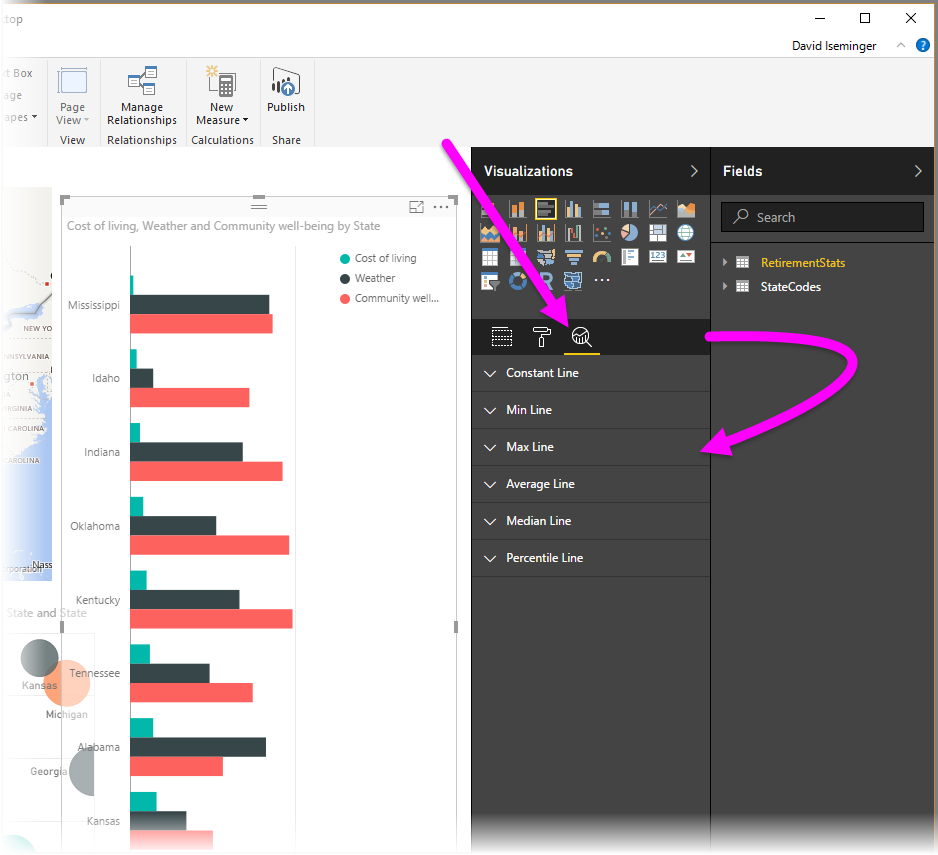
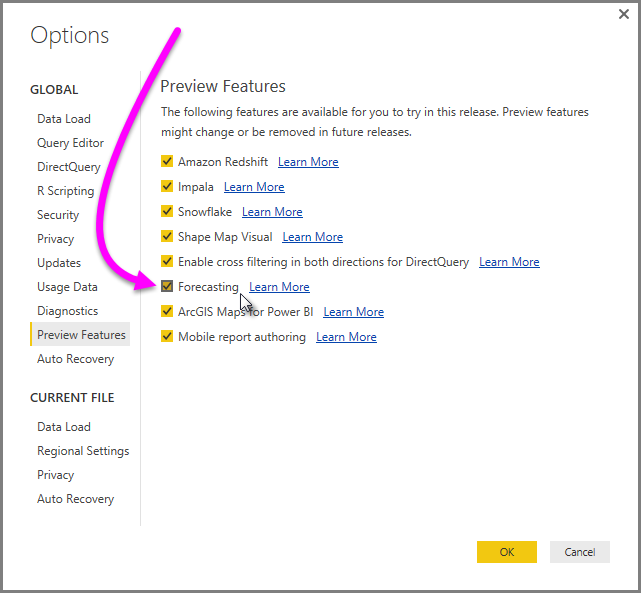
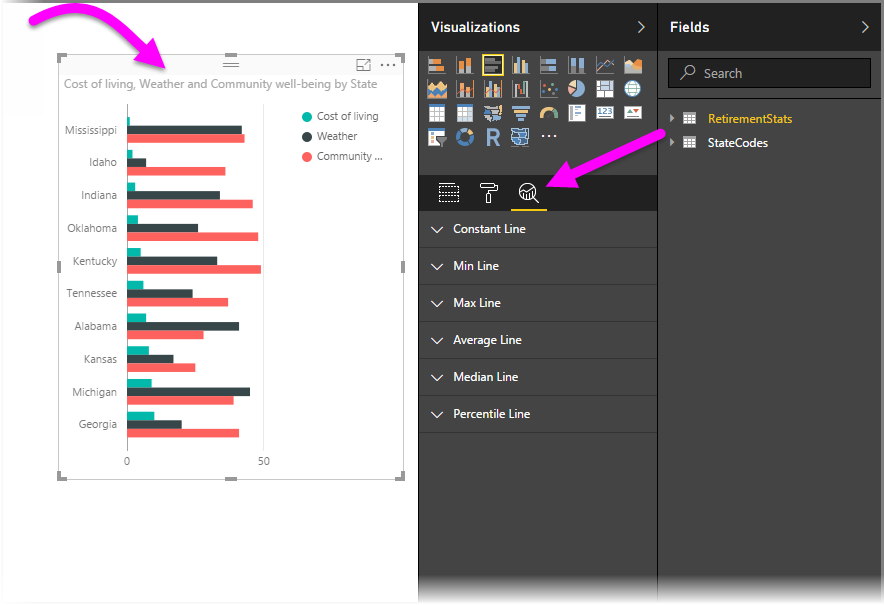
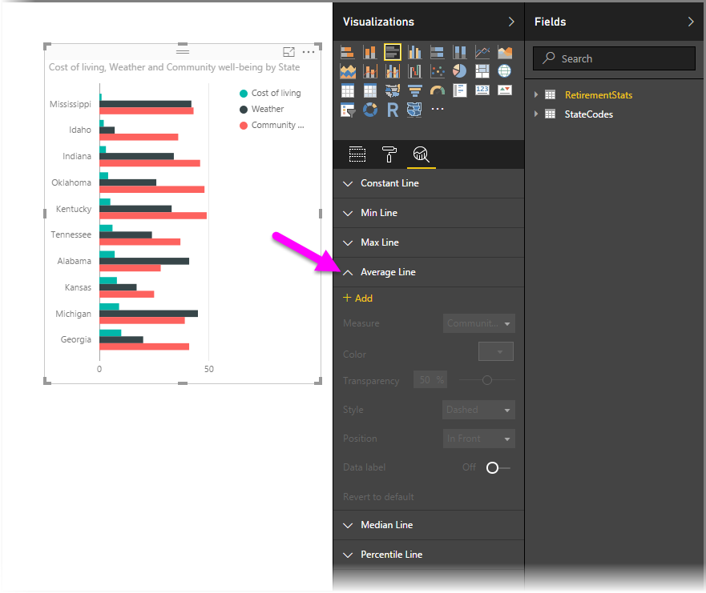
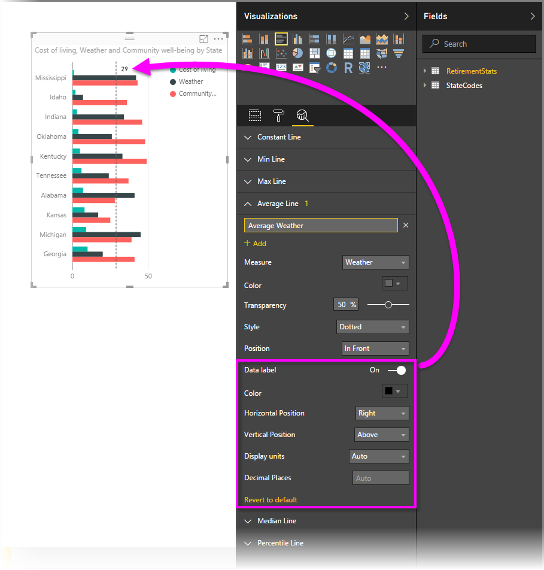
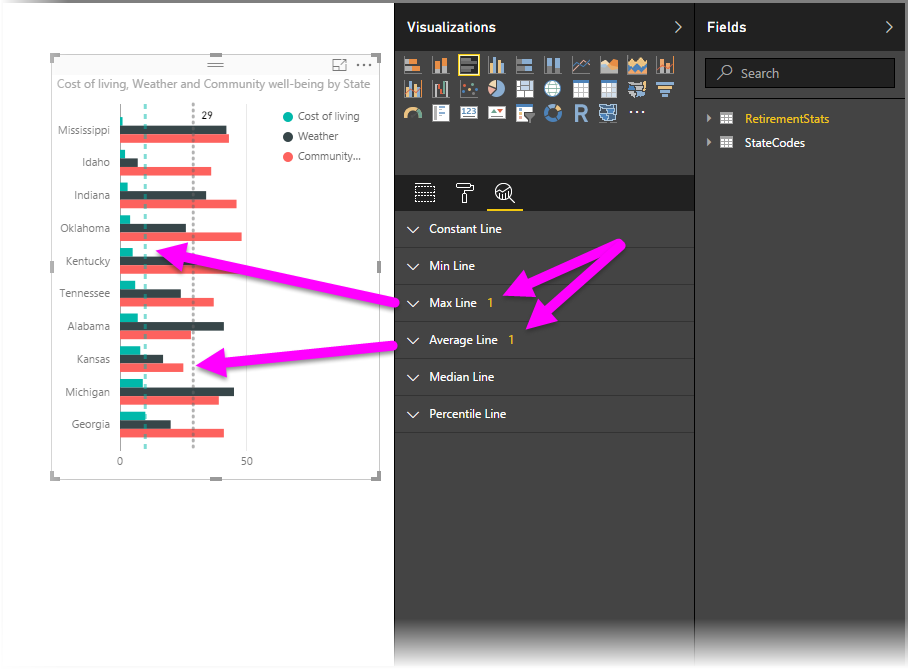
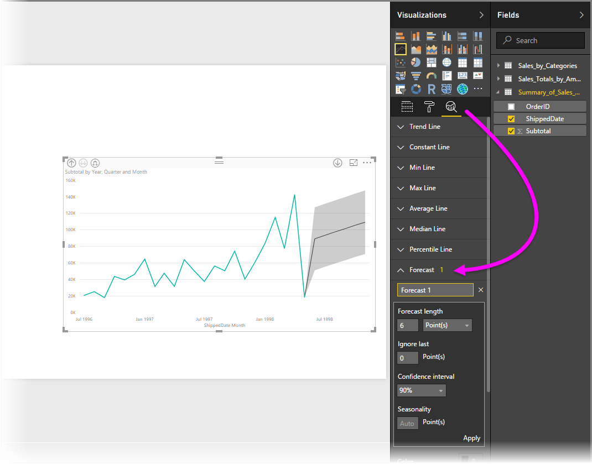

<properties
   pageTitle="在 Power BI Desktop 分析窗格"
   description="在 Power BI Desktop 中建立動態參考程式碼行的視覺效果"
   services="powerbi"
   documentationCenter=""
   authors="davidiseminger"
   manager="mblythe"
   backup=""
   editor=""
   tags=""
   qualityFocus="no"
   qualityDate=""/>

<tags
   ms.service="powerbi"
   ms.devlang="NA"
   ms.topic="article"
   ms.tgt_pltfrm="NA"
   ms.workload="powerbi"
   ms.date="09/08/2016"
   ms.author="davidi"/>

# 在 Power BI Desktop 分析窗格

使用 **分析** ] 窗格中的 **Power BI Desktop**, ，您可以新增動態 *參考線* 至視覺效果，並提供重要的趨勢或洞察焦點。  **分析** 窗格位於 **視覺效果** Power BI Desktop，開頭為 2016 年 8 月發行的區域 (2.37.4464.321 版或更新版本)，如下所示。

>   注意︰ **分析** 當您選取視覺效果 Power BI Desktop 畫布上的時，才會出現窗格。

## 啟用預測 （預覽）

此外，使用 9 月 2016年版的 **Power BI Desktop** (2.39.4526.362 版或更新版本)，您也可以執行 *預測* 從 **分析** 窗格。 您必須啟用這項預覽功能，移至 **檔案 > 選項和設定 > 選項** 然後選取 **預覽功能** 從左窗格中。 選取此核取方塊旁 **預測** 啟用功能，如下圖所示。 您必須重新啟動 **Power BI Desktop** ，您的變更才會生效。

## 使用 [分析] 窗格

使用 **分析** ] 窗格中，您可以建立下列類型的動態參考程式碼行 （並非所有線條都都適用於所有視覺化類型）︰

-   X 軸常數列
-   Y 軸常數列
-   最小線條
-   最大線條
-   平均線路
-   中間的線條
-   百分位數列

下列各節顯示如何使用 **分析** 窗格和視覺效果中的動態參考程式碼行。

若要檢視可用的動態參考線條視覺效果，請遵循下列步驟︰

1.  選取或建立視覺效果，然後選取 [ **分析** 圖示從 **視覺效果** 一節。

    

2.  選取您想要建立以展開其選項的線條類型的向下箭號。 在此情況下，我們將嘗試選取 **平均線**。

    

3.  若要建立新的一行，請選取 **+ 新增**。 您接著可以指定列的名稱，只要按兩下文字方塊，然後輸入您的名稱。

    您的程式行，例如選取各種選項及其 *色彩*, ，*透明度*, ，*樣式* 和 *位置* （相對於視覺項目的資料元素），以及是否要包含的標籤。 重要的是，您可以選取和 **量值** 要視覺效果中您可依據所選取的列 **量值** 下拉式清單，其中會自動填入資料視覺效果中的項目。 在此情況下，我們將嘗試選取 *天氣* 為量值，它標示 *平均天氣*, ，以及自訂數個其他選項，如下所示。

    

4.  如果您想要有資料標籤出現，請移動 **資料標籤** ] 滑桿。 當您這樣做時，取得其他選項的資料標籤，如下圖所示。

    

5.  請注意旁邊顯示的數字 **平均行** 項目 **分析** 窗格。 會告訴您目前擁有 visual studio，以及哪些類型的動態線條數目。 如果我們將加入 **最大行** 的 *成本的生活*, ，您可以看到 **分析** ] 窗格會顯示，我們現在也有 **最大行** 動態參考列套用至這個 visual。

    

如果您所選取視覺效果不能套用至它的動態參考程式碼行 (在此情況下， **對應** visual)，當您選取時，您會看到下列 **分析** 窗格。

有各種有趣的內幕，您可以反白顯示藉由建立動態參考帶有 **分析** 窗格。

我們打算更多的功能和功能，包括展開視覺項目可以有動態參考行套用，因此請回來查看通常為最新消息。

## 適用於預測

您可以使用 **預測** 功能選取視覺效果，然後展開 [ **預測** 區段 **分析** 窗格。 您可以指定多輸入修改預測，例如 *預測長度*, 、 *信賴區間*, ，等等。 下圖顯示基本列 visual 預測套用，但是您可以使用您的想像力 (玩一玩 *預測* 功能) 以查看如何套用在您的模型。

## 限制

能夠使用動態參考線根據 visual 所使用的類型。 下列清單顯示動態程式碼行目前可用的哪一個視覺效果︰

利用動態程式碼行，還有下列視覺效果︰

-   區域圖
-   折線圖
-   散佈圖
-   叢集的直條圖
-   叢集橫條圖

只能使用下列的視覺效果 *常數列* 從 **分析** 窗格︰

-   堆疊的區域
-   堆疊的橫條圖
-   堆疊的直條圖
-   100%堆疊橫條圖
-   100%堆疊直條圖

下列的視覺效果，如 *趨勢線* 是目前唯一的選項︰

-   非堆疊線
-   叢集的直條圖

最後，非笛卡兒視覺項目目前無法套用動態的程式行會 **分析** ] 窗格中，例如︰

-   矩陣
-   圓形圖
-   甜甜圈
-   資料表

## 詳細資訊

有各種用途，您可以使用 Power BI Desktop。 如需有關其功能的詳細資訊，請參閱下列資源︰

-   [新 Power BI Desktop](powerbi-desktop-latest-update.md)
-   [下載 Power BI Desktop](powerbi-desktop-get-the-desktop.md)
-   [開始使用 Power BI Desktop](powerbi-desktop-getting-started.md)
-   [使用 Power BI Desktop 查詢概觀](powerbi-desktop-query-overview.md)
-   [Power BI Desktop 中的資料類型](powerbi-desktop-data-types.md)
-   [圖形，並結合資料與 Power BI Desktop](powerbi-desktop-shape-and-combine-data.md)
-   [在 Power BI Desktop 常見查詢工作](powerbi-desktop-common-query-tasks.md)    

 
