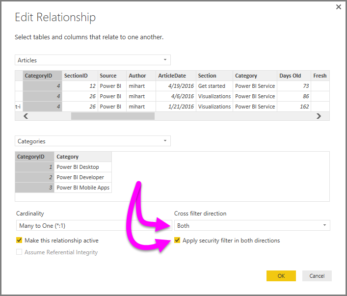

<properties
   pageTitle="雙向交叉篩選在 Power BI Desktop （預覽）"
   description="啟用交叉篩選使用 Power BI Desktop 中的 DirectQuery"
   services="powerbi"
   documentationCenter=""
   authors="davidiseminger"
   manager="mblythe"
   backup=""
   editor=""
   tags=""
   qualityFocus="no"
   qualityDate=""/>

<tags
   ms.service="powerbi"
   ms.devlang="NA"
   ms.topic="article"
   ms.tgt_pltfrm="NA"
   ms.workload="powerbi"
   ms.date="09/29/2016"
   ms.author="davidi"/>

# 雙向交叉篩選在 Power BI Desktop （預覽） 中使用 DirectQuery

篩選資料表以建立適當的檢視表的資料，當報表建立者 （和資料模型設定） 也面臨挑戰決定如何篩選套用至報表。篩選資料表的內容，而被其中一端的關聯性，但其他配置未，通常需要複雜的 DAX 公式，以取得所需的結果。

雙向交叉篩選、 報表建立者 （與資料模型設定） 現在可以更充分掌控使用相關的資料表，啟用要套用這些篩選器時，如何套用篩選器 *兩者* 邊資料表關聯性。 這是具有傳播資料表關聯性的另一端的第二個關聯資料表的篩選內容。

A [詳細的白皮書](http://download.microsoft.com/download/2/7/8/2782DF95-3E0D-40CD-BFC8-749A2882E109/Bidirectional%20cross-filtering%20in%20Analysis%20Services%202016%20and%20Power%20BI.docx) 是可用來說明雙向交叉篩選在 Power BI Desktop 白皮書另涵蓋 SQL Server Analysis Services 2016 (兩者都有相同的行為）。

-   下載 [雙向交叉篩選的 Power BI Desktop](http://download.microsoft.com/download/2/7/8/2782DF95-3E0D-40CD-BFC8-749A2882E109/Bidirectional%20cross-filtering%20in%20Analysis%20Services%202016%20and%20Power%20BI.docx) 白皮書

### 啟用雙向交叉篩選 directquery

若要使用交叉篩選 directquery，您必須先啟用它。 這是預覽功能，這表示它的可用性和行為時可能有所變更即將發行的 Power BI Desktop。

啟用 Power BI Desktop 中的 DirectQuery 交叉篩選，請選取 **檔案 > 選項和設定 > 選項**, ，然後核取方塊旁 **啟用交叉篩選雙向 directquery**, ，如下圖所示。

> 
            **注意︰** 在建立交叉篩選 Power BI Desktop 中的 DAX 公式時，使用 *UserPrincipalName* (這通常是相同的使用者登入，例如 *joe@contoso.com*) 而不是 *UserName*。 因此，您可能需要建立對應的相關的資料表 *UserName* （或員工編號，例如） 至 *UserPrincipleName*。

若要啟用交叉篩選，在 **編輯關聯性** 必須選取關聯性，下列對話方塊︰

-    **交叉篩選方向** 必須設為 **兩者**
-    **套用安全性篩選雙向** 也必須選取

    

如需詳細資訊，以及如何雙向交叉篩選運作的範例，請參閱 [白皮書](http://download.microsoft.com/download/2/7/8/2782DF95-3E0D-40CD-BFC8-749A2882E109/Bidirectional%20cross-filtering%20in%20Analysis%20Services%202016%20and%20Power%20BI.docx) 本文稍早所述。
