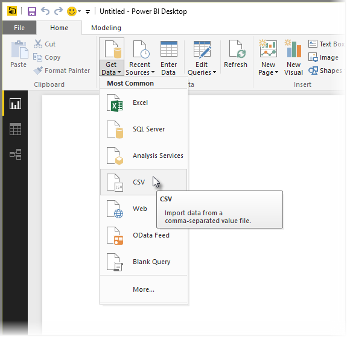

<properties
   pageTitle="連接至 Power BI Desktop 中的 CSV 檔案"
   description="輕鬆地連接到並在 Power BI Desktop 中使用 CSV 檔案資料"
   services="powerbi"
   documentationCenter=""
   authors="davidiseminger"
   manager="mblythe"
   backup=""
   editor=""
   tags=""
   qualityFocus="no"
   qualityDate=""/>

<tags
   ms.service="powerbi"
   ms.devlang="NA"
   ms.topic="article"
   ms.tgt_pltfrm="NA"
   ms.workload="powerbi"
   ms.date="09/29/2016"
   ms.author="davidi"/>

# 連接至 Power BI Desktop 中的 CSV 檔案

連線至以逗號分隔值 (*CSV*) 從 Power BI Desktop 檔案很像連接至 Excel 活頁簿。 兩者都很簡單，和本文章會引導您了解如何連接到任何您具有存取權的 CSV 檔案。

若要開始，從 Power BI Desktop 選取 **取得資料 > CSV** 從 **首頁** 功能區。

選取您的 CSV 檔從 **開啟** 出現的對話方塊。

當您選取 **開啟**, ，Power BI Desktop 存取檔案，並判斷特定的檔案屬性，例如檔案來源，分隔符號類型，以及多少資料列應該用來偵測資料類型，在檔案中。

這些檔案屬性和選項會顯示在頂端的下拉式清單選取項目 **CSV 匯入** 對話方塊視窗中，如下所示。 您可以變更任何這些偵測到的設定以手動方式，是藉由從下拉式清單選取器的任何選擇另一個選項。

當您滿意所做的選擇時，您可以選取 **負載** 檔案匯入至 Power BI Desktop，或者您可以選取 **編輯** 開啟 **查詢編輯器** 進一步圖形或匯入之前轉換資料。

一旦您將資料載入 Power BI Desktop，您看到資料表和其資料行 （其中會顯示為 Power BI Desktop 中的欄位） 中 **欄位** ] 窗格中的，[報告] 檢視中 Power BI Desktop 右側。

這是您只需要 – 從 CSV 檔案資料現在是 Power BI Desktop。

您可以使用 Power BI Desktop 中的資料來建立視覺效果，報表或其他您可能想要使用連線，例如 Excel 活頁簿、 資料庫或任何其他資料來源匯入的資料進行互動。

## 詳細資訊

有各式各樣的資料，您可以連接到使用 Power BI Desktop。 如需有關資料來源的詳細資訊，請參閱下列資源︰

-   [開始使用 Power BI Desktop](powerbi-desktop-getting-started.md)

-   [Power BI Desktop 中的資料來源](powerbi-desktop-data-sources.md)

-   [圖形，並結合資料與 Power BI Desktop](powerbi-desktop-shape-and-combine-data.md)

-   [連接到 Power BI Desktop 中的 Excel 活頁簿](powerbi-desktop-connect-excel.md)   

-   [Power BI Desktop 中直接輸入資料](powerbi-desktop-enter-data-directly-into-desktop.md)   
