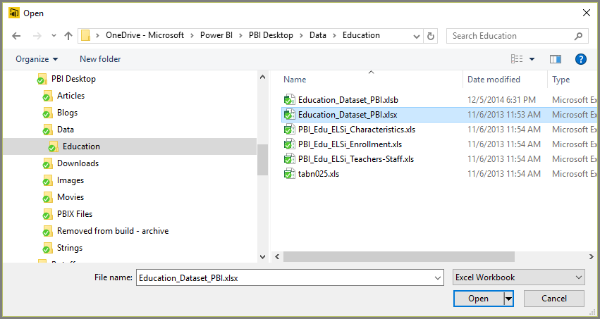
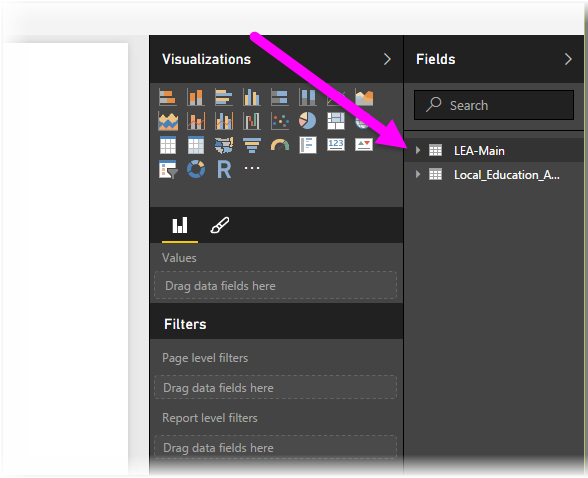

<properties
   pageTitle="連接到 Excel 中 Power BI Desktop"
   description="輕鬆地連接到和使用 Power BI Desktop 中的 Excel 活頁簿資料"
   services="powerbi"
   documentationCenter=""
   authors="davidiseminger"
   manager="mblythe"
   backup=""
   editor=""
   tags=""
   qualityFocus="no"
   qualityDate=""/>

<tags
   ms.service="powerbi"
   ms.devlang="NA"
   ms.topic="article"
   ms.tgt_pltfrm="NA"
   ms.workload="powerbi"
   ms.date="09/29/2016"
   ms.author="davidi"/>

# 連接到 Excel 中 Power BI Desktop

從 Power BI Desktop 連接到 Excel 活頁簿可以很簡單，，本文將逐步引導您。

在 Power BI Desktop 選取 **取得資料 > Excel** 從 **首頁** 功能區。

選取您的活頁簿從 **開啟** 出現的對話方塊。

Power BI Desktop 顯示資料表資料的其他項目中的活頁簿 **導覽** 視窗。 當您在左窗格中選取資料表時，資料的預覽會出現在右窗格中。

您可以選取 [載入] 按鈕，匯入資料，或如果您想要編輯的資料使用 **查詢編輯器** 前將它送回 Power BI Desktop，請選取 **編輯** ] 按鈕。

當您載入資料時，會顯示 Power BI Desktop **載入** 視窗，並顯示活動相關聯載入資料。  

Power BI Desktop 完成時，顯示的資料表和欄位從 Excel 活頁簿匯入它 **欄位** ] 窗格中，在桌面的右邊。

這樣就大功告成了 ！

您現在可以開始使用 Power BI Desktop 中的 Excel 活頁簿匯入的資料建立視覺效果，報表或其他您可能想要使用連線，例如其他 Excel 活頁簿、 資料庫或任何其他資料來源匯入的資料進行互動。

## 詳細資訊

有各式各樣的資料，您可以連接到使用 Power BI Desktop。 如需有關資料來源的詳細資訊，請參閱下列資源︰

-   [開始使用 Power BI Desktop](powerbi-desktop-getting-started.md)

-   [Power BI Desktop 中的資料來源](powerbi-desktop-data-sources.md)

-   [圖形，並結合資料與 Power BI Desktop](powerbi-desktop-shape-and-combine-data.md)

-   [連接至 Power BI Desktop 中的 CSV 檔案](powerbi-desktop-connect-csv.md)   

-   [Power BI Desktop 中直接輸入資料](powerbi-desktop-enter-data-directly-into-desktop.md)   
