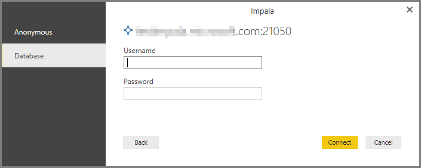

<properties
   pageTitle="連接到 Impala 資料庫在 Power BI Desktop （預覽）"
   description="輕鬆地連接到並在 Power BI Desktop 使用 Impala 資料庫"
   services="powerbi"
   documentationCenter=""
   authors="davidiseminger"
   manager="mblythe"
   backup=""
   editor=""
   tags=""
   qualityFocus="no"
   qualityDate=""/>

<tags
   ms.service="powerbi"
   ms.devlang="NA"
   ms.topic="article"
   ms.tgt_pltfrm="NA"
   ms.workload="powerbi"
   ms.date="10/03/2016"
   ms.author="davidi"/>

# 連接到 Impala 資料庫在 Power BI Desktop （預覽）

在 Power BI Desktop，您可以連接到 **Impala** 資料庫，就像任何其他資料來源在 Power BI Desktop 將基礎資料。 這一版的 **Impala** 連接器處於預覽狀態，並可能有所變更。

## 啟用 Impala （預覽） 功能

若要存取 **Impala** 連接器，您必須先啟用這項預覽功能。 在 **Power BI Desktop**, ，請選取 **檔案 > 選項和設定 > 選項** 接著在 **選項** 視窗中，選取 **預覽功能** 區段，並啟用 **Impala**, ，如下所示。

您核取該方塊，當您開啟 **Impala** 預覽功能。 您必須重新啟動 Power BI Desktop，變更才會生效。 一旦您這樣做，預覽功能使用。

## 連接到 Impala 資料庫

一旦您已啟用預覽功能，來連接到 **Impala** 資料庫選取 **取得資料** 從 **首頁** Power BI Desktop 在功能區。 選取 **資料庫** 從左邊，與您的類別，請參閱 **Impala (Beta)**。

在 **Impala** 視窗出現時，輸入或貼入方塊中，貼上 Impala 伺服器的名稱，然後選取 **確定**。 請注意，您可以選擇 **匯入** 資料直接在 Power BI，或者您可以使用 **DirectQuery**。 您可以深入了解 [使用 DirectQuery](powerbi-desktop-use-directquery.md)。

當系統提示您放入您的使用者名稱和密碼，或以匿名方式-連接被支援。

>
            **注意︰** 一旦您將放在您的使用者名稱和密碼為特定 **Impala** 伺服器，Power BI Desktop 中的後續連接嘗試使用這些相同的認證。 您可以修改這些認證，請前往 **檔案 > 選項和設定 > 資料來源設定**。

成功連線之後， **導覽** ] 視窗隨即出現，並顯示在伺服器上，您可以從中選取一或多個項目匯入並使用中的可用資料 **Power BI Desktop**。

## 考量和限制

有一些限制和考量来牢記在心，在此預覽版本 **Impala** 連接器︰

-   未來規劃包括啟用重新整理支援使用 **Power BI 閘道**。

## 詳細資訊

有各式各樣的資料，您可以連接到使用 Power BI Desktop。 如需有關資料來源的詳細資訊，請參閱下列資源︰

-   [開始使用 Power BI Desktop](powerbi-desktop-getting-started.md)

-   [Power BI Desktop 中的資料來源](powerbi-desktop-data-sources.md)

-   [圖形，並結合資料與 Power BI Desktop](powerbi-desktop-shape-and-combine-data.md)

-   [連接到 Power BI Desktop 中的 Excel 活頁簿](powerbi-desktop-connect-excel.md)   

-   [Power BI Desktop 中直接輸入資料](powerbi-desktop-enter-data-directly-into-desktop.md)   
