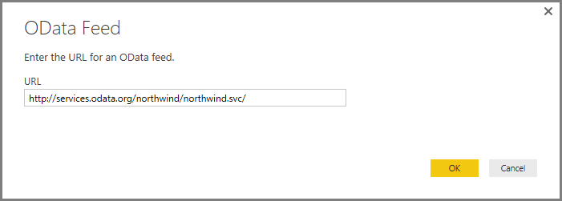
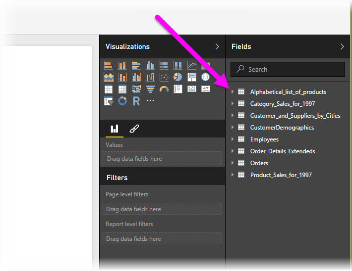

<properties
   pageTitle="連接到 Power BI Desktop 中的 OData 摘要"
   description="輕鬆地連接到並使用 Power BI Desktop 中的 OData 摘要"
   services="powerbi"
   documentationCenter=""
   authors="davidiseminger"
   manager="mblythe"
   backup=""
   editor=""
   tags=""
   qualityFocus="no"
   qualityDate=""/>

<tags
   ms.service="powerbi"
   ms.devlang="NA"
   ms.topic="article"
   ms.tgt_pltfrm="NA"
   ms.workload="powerbi"
   ms.date="09/29/2016"
   ms.author="davidi"/>

# 連接到 Power BI Desktop 中的 OData 摘要

在 Power BI Desktop，您可以連接到 **OData 摘要** ，並使用基礎資料，就像在 Power BI Desktop 中的任何其他資料來源。

若要連接到 OData 摘要，請選取 **取得資料 > OData 摘要** 從 **首頁** Power BI Desktop 在功能區。

在 **OData 摘要** 出現的視窗中，輸入或貼上您 OData 摘要 URL] 方塊，然後選取 **確定**。

Power BI Desktop 連接到 OData 摘要，並顯示可用的資料表和其他資料項目的 **導覽** 視窗。 當您選取的項目右邊的窗格 **導覽** ] 視窗會顯示資料的預覽。 您可以選取您要匯入的表格。  **導覽** ] 視窗會顯示目前選取之資料表的預覽。

您可以選擇 **編輯** ] 按鈕，以啟動 **查詢編輯器**, ，供您圖形及轉換從 OData 摘要匯入至 Power BI Desktop 之前的資料。 您可以選取或 **負載** ] 按鈕，然後匯入所有您在左窗格中選取的資料元素。

當我們選取 **負載**, ，Power BI Desktop 匯入選取的項目，並顯示 **負載** 視窗的匯入進度。

完成後，Power BI Desktop 選取的資料表和其他資料元素，可讓在 **欄位** ] 窗格中，找到的右邊 *報表* Power BI Desktop 中的檢視。

這樣就大功告成了 ！

您現在準備要匯入的資料從 OData 摘要 Power BI Desktop 中用來建立視覺效果，報表或其他您可能想要使用連線，例如其他 Excel 活頁簿、 資料庫或任何其他資料來源匯入的資料進行互動。

## 詳細資訊

有各式各樣的資料，您可以連接到使用 Power BI Desktop。 如需有關資料來源的詳細資訊，請參閱下列資源︰

-   [開始使用 Power BI Desktop](powerbi-desktop-getting-started.md)

-   [Power BI Desktop 中的資料來源](powerbi-desktop-data-sources.md)

-   [圖形，並結合資料與 Power BI Desktop](powerbi-desktop-shape-and-combine-data.md)

-   [連接到 Power BI Desktop 中的 Excel 活頁簿](powerbi-desktop-connect-excel.md)   

-   [Power BI Desktop 中直接輸入資料](powerbi-desktop-enter-data-directly-into-desktop.md)   
