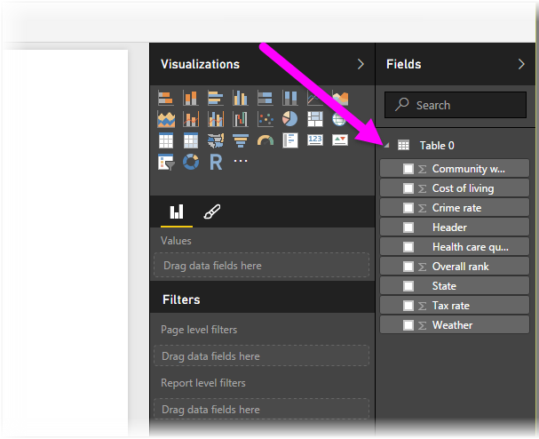

<properties
   pageTitle="從 Power BI Desktop 連接至 Web 網頁"
   description="輕鬆地連接到和使用 Power BI Desktop 中的網頁上的資料"
   services="powerbi"
   documentationCenter=""
   authors="davidiseminger"
   manager="mblythe"
   backup=""
   editor=""
   tags=""
   qualityFocus="no"
   qualityDate=""/>

<tags
   ms.service="powerbi"
   ms.devlang="NA"
   ms.topic="article"
   ms.tgt_pltfrm="NA"
   ms.workload="powerbi"
   ms.date="09/29/2016"
   ms.author="davidi"/>

# 從 Power BI Desktop 連接至 Web 網頁

您可以連線至網頁，和其資料匯入至 Power BI Desktop，若要在視覺效果和資料模型中使用。

在 Power BI Desktop 選取 **取得資料 > Web** 從 **首頁** 功能區。

對話方塊隨即出現，詢問您要匯入資料的網頁的 url。

一旦您已輸入 （或貼上） 的 URL，選取 **確定**。 Power BI Desktop 將連接至該頁面上，然後呈現頁面的可用資料 **導覽** 視窗。 當您選取其中一個可用的資料元素，例如資料表的整個頁面， **導覽** ] 視窗中顯示該資料的預覽視窗的右側。

您可以選擇 **編輯** ] 按鈕，以啟動 **查詢編輯器**, ，供您圖形及轉換之前匯入至 Power BI Desktop 該網頁上的資料。 您可以選取或 **負載** ] 按鈕，然後匯入所有您在左窗格中選取的資料元素。

當我們選取 **負載**, ，Power BI Desktop 匯入選取的項目，並讓它們能夠 **欄位** ] 窗格中，找到在 Power BI Desktop 中的 [報告] 檢視的右邊。

就是連接到 Web 網頁，並將其資料帶入 Power BI Desktop。

在這裡，您可以將這些欄位拖曳到報表畫布，並建立您想要的所有視覺效果。 您也可以使用此資料從該網頁上就像任何其他資料 – 您可以圖形，您可以在模型中，建立它與其他資料來源之間的關聯性並若非執行您想要建立只是您想的 Power BI 報表。

若要查看連線到在深入的探討，動作的網頁，看看 [Power BI Desktop 入門指南](powerbi-desktop-getting-started.md)。

## 詳細資訊

有各式各樣的資料，您可以連接到使用 Power BI Desktop。 如需有關資料來源的詳細資訊，請參閱下列資源︰

-   [Power BI Desktop 中的資料來源](powerbi-desktop-data-sources.md)

-   [圖形，並結合資料與 Power BI Desktop](powerbi-desktop-shape-and-combine-data.md)

-   [連接到 Power BI Desktop 中的 Excel 活頁簿](powerbi-desktop-connect-excel.md)   

-   [連接至 Power BI Desktop 中的 CSV 檔案](powerbi-desktop-connect-csv.md)   

-   [Power BI Desktop 中直接輸入資料](powerbi-desktop-enter-data-directly-into-desktop.md)   
