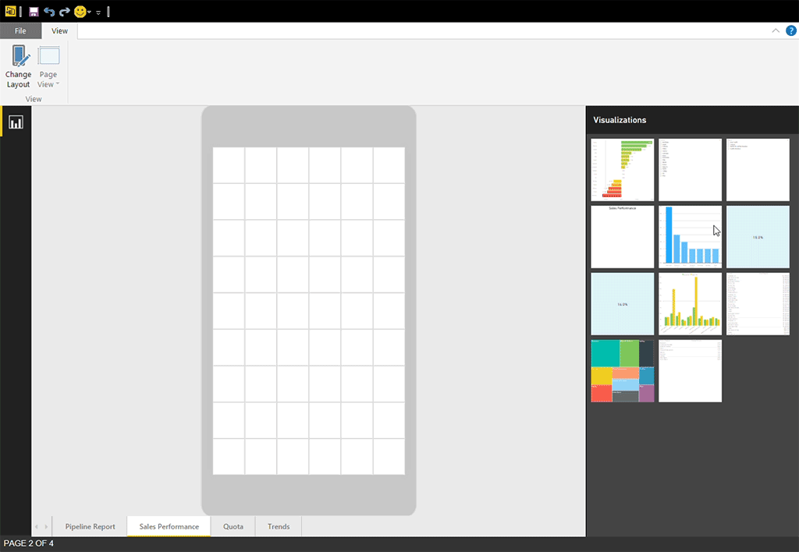
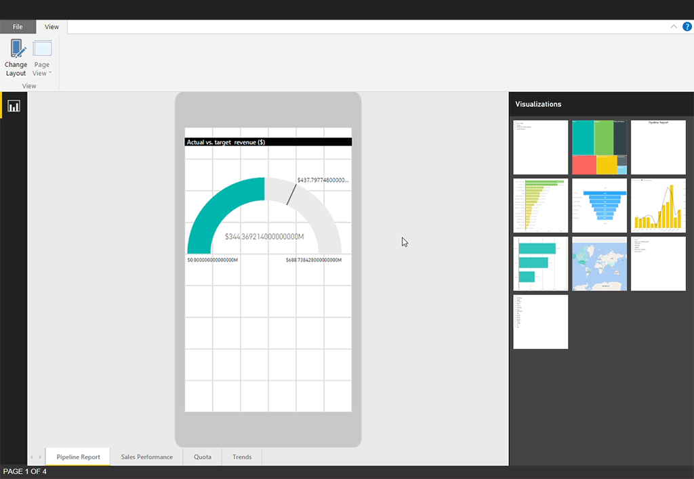

<properties 
   pageTitle="建立報表的 Power BI 電話應用程式最佳化"
   description="了解如何最佳化在 Power BI Desktop 適用於 Power BI 電話應用程式的報表頁面。"
   services="powerbi" 
   documentationCenter="" 
   authors="maggiesMSFT" 
   manager="mblythe" 
   backup=""
   editor=""
   tags=""
   qualityFocus="no"
   qualityDate=""/>
 
<tags
   ms.service="powerbi"
   ms.devlang="NA"
   ms.topic="article"
   ms.tgt_pltfrm="NA"
   ms.workload="powerbi"
   ms.date="09/27/2016"
   ms.author="maggies"/>

# 建立報表的 Power BI 電話應用程式最佳化

當您 [Power BI Desktop 中建立報表](powerbi-desktop-report-view.md), ，您可以改善它藉由建立專為行動電話的報表版本使用行動電話上的經驗。 您可以採用電話的報表重新整理，並調整視覺效果，或許不包括所有的這些最佳的體驗。  

## 在 Power BI Desktop 電話的報表頁面的版面配置設定

之後您 [Power BI Desktop 中建立報表](powerbi-desktop-report-view.md), ，您可以將它最佳化電話。

1. 在 Power BI Desktop 選取 **報表檢視** 左側的導覽列中。

    

2. 在 **首頁** 索引標籤上，選取 **變更版面配置**。  

    

    您會看到空白畫布電話。 在原始的報表] 頁面上的視覺效果皆列於右側的 [視覺效果] 窗格。
 
2. 若要加入至電話配置的視覺效果，將它從視覺效果] 窗格拖曳到電話的畫布上。

    電話報表使用格線版面配置。 行動畫布中拖曳視覺效果時，它們貼齊至該資料格。

    

    您可以將部分或所有主要報表頁面視覺效果加入電話報表] 頁面。 您可以新增每個 visual 只能出現一次。

3.  儀表板和行動儀表板上並排顯示的一樣，您可以調整格線，視覺效果。

    > [AZURE.NOTE] 電話報表方格在面對電話大小不同，讓報表看起來適合小型-和大型螢幕電話上。

    

## 建立電話的報表配置的相關注意事項
- 多頁報表，您可以最佳化所有網頁或只有少數。 
- 在電話上，您頁之間移動來自撥動或點選 [頁面] 功能表。
- 您無法修改只電話的格式設定。 格式化是主要和行動配置間一致。 例如，字型的大小，將會相同。
- 若要變更視覺效果，例如變更其格式設定資料集、 篩選器或任何其他屬性，傳回到一般撰寫模式的報表。

    > 
            **秘訣**︰ 根據預設，Power BI 提供標題和行動應用程式中的電話報表的頁面名稱。 如果您在報表中建立文字的標題和頁面名稱的視覺效果，請考慮不將它們加入您電話的報表。     

## 移除電話版面配置中的視覺效果

-  若要移除視覺效果，請按一下電話在畫布上，視覺效果的右上方的 X 或選取它並按 **刪除**。

    > [AZURE.NOTE] 移除此視覺效果只從行動畫布移除、 視覺效果和原始的報表將不會影響。
    
    

## 增強交叉分析篩選器中正常運作電話報告
交叉分析篩選器提供畫布上篩選報表資料。 在設計規則撰寫模式的報表中的交叉分析篩選器時，您可以修改某些交叉分析篩選器設定，使其更便於在電話報表中︰

- 決定是否報表讀者可以選取一部或多個項目。
- 垂直或水平，則請交叉分析篩選器。 
- 將交叉分析篩選器讓報表更容易掃描周圍的方塊。

深入了解 [在 Power BI 服務中建立交叉分析篩選器](powerbi-learning-3-4-create-slicers.md)。

## 發行電話報表
- 若要將發行 phone 版本的報表，請您 [發行主報表從 Power BI Desktop 到 Power BI 服務](powerbi-desktop-upload-desktop-files.md), ，和電話版本發行一次。

    深入了解 [共用與權限的 Power BI](powerbi-service-how-should-i-share-my-dashboard.md)。

## 在電話上檢視最佳化與非最佳化的報表 

在行動應用程式的行動電話上，Power BI 會自動偵測最佳化與非最佳化電話報告。 如果電話最佳化的報表，Power BI 電話應用程式自動電話報告模式中開啟報表。

如果電話最佳化的報表不存在，就會開啟報表中未最佳化，橫向] 檢視。  

在電話報表中，當變更電話的方向為橫向會開啟非最佳化的檢視中的報告與原始報表配置中，是否與否，最佳化報表。

如果您只最佳化某些頁面，讀取器會看到 [縱向] 檢視中的訊息，指出報表可供以橫向。

報表讀取者可以開啟他們的電話側邊看到以橫向模式] 頁面。

## 在電話上的最佳化的電話報表進行互動

您可以捲動電話報表、 跨反白顯示，並選取視覺效果和在焦點模式下開啟視覺效果。 深入了解是什麼樣子來 [適合您的電話的 Power BI 報表與互動](powerbi-mobile-view-phone-report.md)。

## 視覺效果電話報表中的調整規模
Power BI 電話報告使用稱為 「 虛擬像素為單位 」 的概念確保各種裝置最佳化的體驗，螢幕大小，同時外型規格。  

在建立電話報表時，視覺項目對齊至方格。 在方格中，某些層面，例如正方形的大小是相對於螢幕的大小，以及其他層面，例如端間距都維持不變。
這可讓在不同的螢幕大小正確調整格線。

例如，"方形"SE iPhone 上方格的大小會 ~ xx 像素為單位。 相同方形 6s iPhone 上加上會 ~ YY 像素為單位。 因此，您所建立的電話報表會在所有現代的電話上縮放。    

### 請參閱
- [在 Power BI 建立儀表板電話檢視](powerbi-service-create-dashboard-phone-view.md)
- [檢視 Power BI 報表適合您的電話](powerbi-mobile-view-phone-report.md)
- 更多的問題嗎？ [請嘗試詢問 Power BI 社群](http://community.powerbi.com/)
