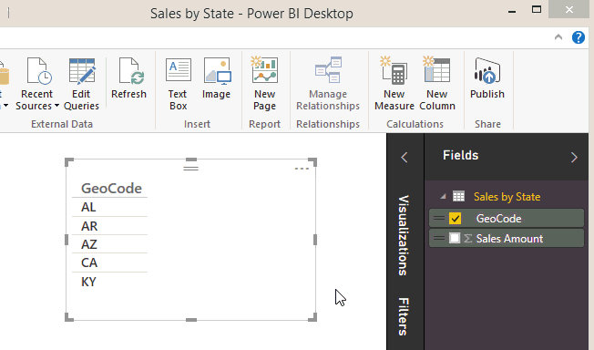

<properties
   pageTitle="在 Power BI Desktop 中的資料分類"
   description="在 Power BI Desktop 中的資料分類"
   services="powerbi"
   documentationCenter=""
   authors="davidiseminger"
   manager="mblythe"
   backup=""
   editor=""
   tags=""
   qualityFocus="no"
   qualityDate=""/>

<tags
   ms.service="powerbi"
   ms.devlang="NA"
   ms.topic="article"
   ms.tgt_pltfrm="NA"
   ms.workload="powerbi"
   ms.date="09/29/2016"
   ms.author="davidi"/>

# 在 Power BI Desktop 中的資料分類  

在 **Power BI Desktop**, ，讓 Power BI Desktop 可讓您知道如何它應該將其值在視覺效果時，您可以指定資料行的資料類別。

Power BI Desktop 匯入資料時，不只會取得資料本身，它也會取得資訊，例如資料表和資料行的名稱，無論是主索引鍵，等等。憑著此資訊，Power BI Desktop 可讓一些假設如何讓您能夠以好的預設方式建立視覺效果時。 

範例如下︰ 當 Power BI Desktop 偵測到資料行具有數字值時，您可能需要彙總以某種方式，因此它會在 [值] 區域中。 或者，使用日期時間值的資料行，它會假設您大概會使用它做為在折線圖上的時間階層軸。

但是，有某些情況下，會比較困難，例如地理位置。 請考慮下的表從 Excel 工作表︰

應該 Power BI Desktop 將代碼地理編碼的資料行中當做縮寫國家/地區或美國狀態？  因為類似的程式碼可以表示其中一個不清楚。  比方說，算是或阿爾巴尼亞、 AR 可以表示 Arkansas 或阿根廷或 CA 可能表示加州或加拿大，可能表示 AL。 當我們準備要在地圖上的我們建立欄位的圖表，它會有不同。  Power BI Desktop 應該會顯示反白顯示的國家/地區全世界的圖片或反白顯示的狀態與美國的圖片嗎？  您可以指定資料類別，就像這樣的資料。 資料分類進一步精簡 Power BI Desktop 可以用來提供最佳的視覺效果的資訊。  

**若要指定資料類別**

1.  在報表檢視或資料檢視中 **欄位** 清單中，選取您想要依不同分類的欄位。

2.  在功能區中，在 **資料模型化工具** 索引標籤上，按一下 **資料類別目錄︰** 下拉式清單。  這會顯示可能的資料類別，您可以選擇針對您的資料行清單。  某些選項可能會停用，如果將不會使用您的資料行的目前資料型別。  例如，如果資料行的二進位資料類型，Power BI Desktop 不會讓您選擇的地理資料類別。 

這樣就大功告成了 ！  任何通常會累算至視覺效果的行為現在會自動運作。  

您可能也會想要了解 [Power BI 行動應用程式的地理篩選](powerbi-desktop-mobile-geofiltering.md)。
