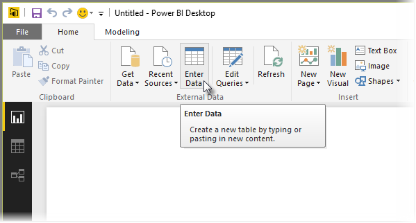

<properties
   pageTitle="Power BI Desktop 中直接輸入資料"
   description="輕鬆地將資料加入直接在 Power BI Desktop"
   services="powerbi"
   documentationCenter=""
   authors="davidiseminger"
   manager="mblythe"
   backup=""
   editor=""
   tags=""
   qualityFocus="no"
   qualityDate=""/>

<tags
   ms.service="powerbi"
   ms.devlang="NA"
   ms.topic="article"
   ms.tgt_pltfrm="NA"
   ms.workload="powerbi"
   ms.date="09/29/2016"
   ms.author="davidi"/>

# Power BI Desktop 中直接輸入資料

使用 Power BI Desktop，您可以直接輸入資料，並使用您的報表和視覺效果中的資料。 例如，您可以將活頁簿或 web 網頁的部分複製，然後將它貼到 Power BI Desktop。

若要直接輸入資料，請選取 **輸入資料** 從 **首頁** 功能區。

Power BI Desktop 可能嘗試在次要轉換資料，如果適當，就像這樣當您從任何來源載入資料。 例如，在下列情況下它會升級第一個標頭的資料列。

如果您想要使資料輸入 （或貼上），您可以選取 [編輯] 按鈕，以帶出 **查詢編輯器**, ，供您圖形及轉換資料之前帶入 Power BI Desktop。 您可以選取或 **負載** 所顯示的資料匯入] 按鈕。

當您選取 **負載**, ，Power BI Desktop 從您的資料，建立新的資料表，並可在 **欄位** 窗格。 下圖中，在 Power BI Desktop 顯示我的新資料表，稱為 *Table1* ，以及該資料表中所建立的兩個欄位。

這樣就大功告成了 – 就是將資料輸入 Power BI Desktop 這麼簡單。

您現在可以開始使用 Power BI Desktop 中的資料建立視覺效果，報表或其他您可能想要使用連線，例如 Excel 活頁簿、 資料庫或任何其他資料來源匯入的資料進行互動。

## 詳細資訊

有各式各樣的資料，您可以連接到使用 Power BI Desktop。 如需有關資料來源的詳細資訊，請參閱下列資源︰

-   [開始使用 Power BI Desktop](powerbi-desktop-getting-started.md)

-   [Power BI Desktop 中的資料來源](powerbi-desktop-data-sources.md)

-   [圖形，並結合資料與 Power BI Desktop](powerbi-desktop-shape-and-combine-data.md)

-   [連接到 Power BI Desktop 中的 Excel 活頁簿](powerbi-desktop-connect-excel.md)   

-   [連接至 Power BI Desktop 中的 CSV 檔案](powerbi-desktop-connect-csv.md)   
