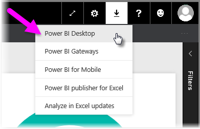

<properties
   pageTitle="取得 Power BI Desktop"
   description="下載並安裝 Power BI Desktop"
   services="powerbi"
   documentationCenter=""
   authors="davidiseminger"
   manager="mblythe"
   backup=""
   editor=""
   tags=""
   qualityFocus="monitoring"
   qualityDate="03/31/2016"/>

<tags
   ms.service="powerbi"
   ms.devlang="NA"
   ms.topic="get-started-article"
   ms.tgt_pltfrm="NA"
   ms.workload="powerbi"
   ms.date="09/29/2016"
   ms.author="davidi"/>
# 取得 Power BI Desktop

            **Power BI Desktop** 提供進階的查詢、 模型和報表建立功能，可讓您建立資料模型建立報表，並發行至 Power BI 服務共用您的工作。

若要下載最新版本的 Power BI Desktop，您可以從 Power BI 服務中，選取 [下載] 圖示，然後選取 **Power BI Desktop**。

您也可以下載最新版的直接從 Power BI Desktop [此下載連結](https://powerbi.microsoft.com/desktop)。

無論如何，一次 **Power BI Desktop** 下載完畢後，系統會提示您執行安裝檔案︰

            **Power BI Desktop** 安裝為應用程式，並執行您的桌面上。

當您啟動 **Power BI Desktop**, 、 *歡迎* 顯示畫面。

在這裡，您可以開始建立資料模型或報表，然後與其他人共用上的 Power BI 服務。 簽出 **更多資訊** 連結在本文結尾處的連結，輔助線，可協助您開始使用 **Power BI Desktop**。

## 最低需求

下列清單提供執行的最小需求 **Power BI Desktop**:

-    Windows 7 / Windows Server 2008 R2 或更新版本
-    .NET 4.5
-    Internet Explorer 9 或更新版本
-    
            **記憶體 (RAM):** 至少 1 GB 的可用、 1.5 GB 或更多建議。
-    
            **顯示︰** 至少 1440 x 900 或 1600 x 900 (16:9) 建議。 不建議較低的解析度，例如 1024 x 768 或 1280 x 800，超過這些解決方法的某些控制項 （例如關閉啟動螢幕） 顯示。
-    
            **CPU:** 1 ghz 或更快的 x86-或 x 64-位元處理器的建議。

## 詳細資訊

一旦您熟悉 **Power BI Desktop** 安裝，請將下列內容能幫助您快速啟動並執行︰

-   [開始使用 Power BI Desktop](powerbi-desktop-getting-started.md)
-   [使用 Power BI Desktop 查詢概觀](powerbi-desktop-query-overview.md)
-   [Power BI Desktop 中的資料來源](powerbi-desktop-data-sources.md)
-   [連接至 Power BI Desktop 中的資料](powerbi-desktop-connect-to-data.md)
-   [圖形，並結合資料與 Power BI Desktop](powerbi-desktop-shape-and-combine-data.md)
-   [在 Power BI Desktop 常見查詢工作](powerbi-desktop-common-query-tasks.md)   
