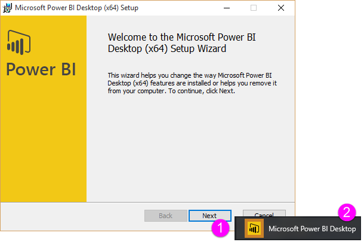
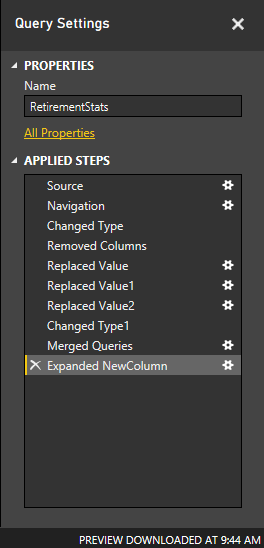
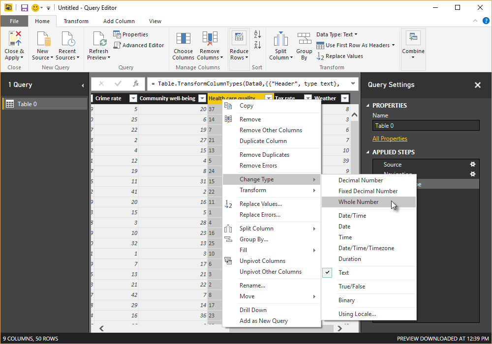
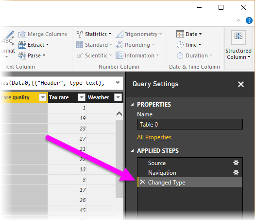
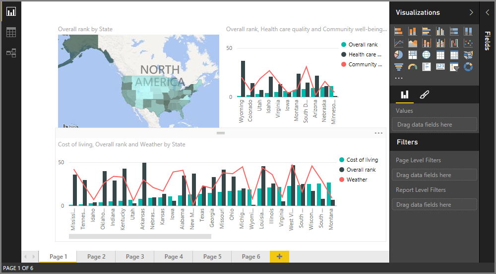
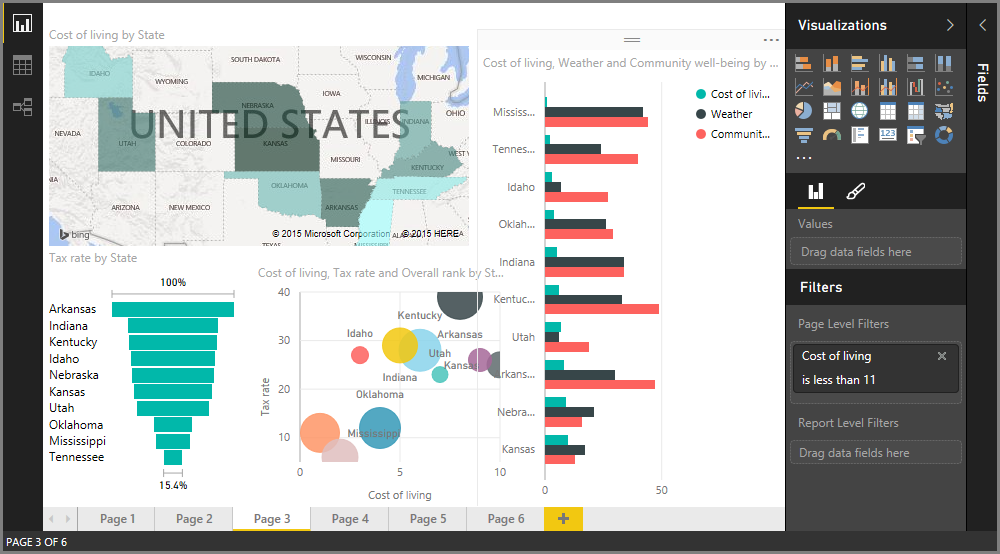
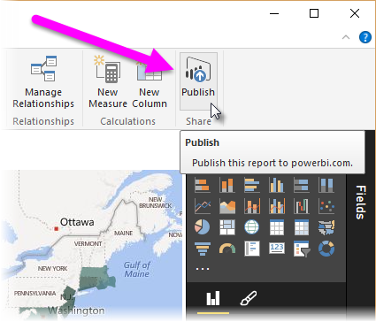
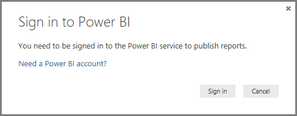
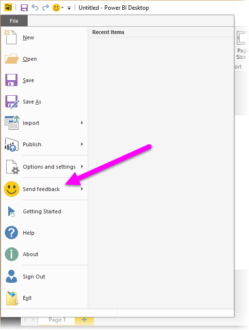

<properties
   pageTitle="開始使用 Power BI Desktop"
   description="開始使用 Power BI Desktop"
   services="powerbi"
   documentationCenter=""
   authors="davidiseminger"
   manager="mblythe"
   backup=""
   editor=""
   tags=""
   qualityFocus="no"
   qualityDate=""/>

<tags
   ms.service="powerbi"
   ms.devlang="NA"
   ms.topic="get-started-article"
   ms.tgt_pltfrm="NA"
   ms.workload="powerbi"
   ms.date="09/29/2016"
   ms.author="davidi"/>
# 開始使用 Power BI Desktop

歡迎使用 **取得 Power BI Desktop 入門指南**。 這個簡短的教學課程的 Power BI Desktop 取得您了解其運作方式，示範，以及加速您建置穩固的資料模型的能力，以及令人讚嘆的報告 —，增強您的商務智慧工作。 

想要觀賞而不是讀取？ 可自由 [看看我們開始使用影片](powerbi-desktop-videos.md)。 如果您想要依照符合範例資料的視訊，您可以和 [下載這個範例 Excel 活頁簿](http://go.microsoft.com/fwlink/?LinkID=521962)。

Power BI Desktop 可讓您建立查詢、 資料連接和輕鬆地與其他人共用報表的集合。 Power BI Desktop 整合 – 強大查詢引擎、 資料模型和視覺效果 – 經過實證的 Microsoft 技術，並與線上密切 [**Power BI 服務**](https://app.powerbi.com/)。

結合運用 **Power BI Desktop** （其中分析師和其他人可以建立功能強大的資料連接、 模型和報表） 和 [**Power BI 服務**](https://preview.powerbi.com/) （其中報告 Power BI Desktop 可以共用讓使用者可以檢視並與其互動），新深入了解資料的世界可以輕易地建立模型、 建置、 共用，及延伸。

資料分析師將會發現 Power BI Desktop 是功能強大、 有彈性和高度可存取的工具，以使用連線和圖形世界的資料、 建置穩固的模型，製作結構良好的報表。

## 如何使用本指南

您可以使用幾種方式在本指南 – 快速的概觀，以掃描或閱讀每個區段的強式的了解 Power BI Desktop 的運作方式。

如果您是急著您可以執行本指南的視覺化掃掠的幾分鐘，並會清楚 Power BI Desktop 的運作方式，以及如何使用它。 本指南的大部分組成視覺化顯示 Power BI Desktop 的運作方式的畫面。

更徹底的了解，您也可以閱讀每個區段，執行步驟，並已準備好張貼到您的 Power BI Desktop 檔案帶回家 **Power BI** 服務，並與其他人共用。

## Power BI Desktop 的運作方式

使用 Power BI Desktop，您 *連接到資料* （通常是多個資料來源）、 *圖形資料* （使用查詢來建立具洞察力、 吸引人的資料模型），並使用該模型 *建立報表* （如此其他人可以運用，為基礎，並共用）。

若要完成上述步驟時滿意 – 連接、 圖形，並報告 – 您可以將該工作儲存在 Power BI Desktop 檔案格式，也就是副檔名為.pbix。 Power BI Desktop 檔案可以共用和其他檔案一樣，但若要將相片上傳 （共用） 共用 Power BI Desktop 檔案最吸引人的方式會 [**Power BI 服務**](https://preview.powerbi.com/)。 

Power BI Desktop 可以集中、 可簡化，並且簡化哪些否則可以散佈、 中斷連線，和棘手程序的設計和建立商業智慧存放庫和報告。

不妨試試準備了嗎？ 讓我們開始這次的教學。

## 安裝並執行 Power BI Desktop

您可以下載從 Power BI Desktop **Power BI** 服務，藉由選取 **齒輪** 圖示，然後選取 **Power BI Desktop**。

Power BI Desktop 安裝為應用程式，並執行您的桌面上。

當您執行 Power BI Desktop *歡迎* 顯示畫面。

您可以 **取得資料**, ，請參閱 **最近使用的來源**, ，或 **開啟其他** **報表** 直接從 *歡迎* 螢幕 （從左窗格中的連結）。 如果您關閉螢幕 (選取 **x** 在右上角)，則 **報表** Power BI Desktop 的檢視會顯示。

Power BI Desktop 中有三種檢視︰ **報表** ] 檢視中， **資料** ] 檢視中，和 **關聯性** 檢視。 Power BI Desktop 也包含 **查詢編輯器**, ，如此即會開啟另一個視窗。 在 **查詢編輯器**, ，您可以建立查詢並轉換資料，然後載入模型到 Power BI Desktop，調整過的資料，以及建立報表。

下列畫面顯示三個檢視位於圖示左邊的 Power BI Desktop: **報表**, ，**資料**, ，和 **關聯性**, ，從上到下。 左側的黃色列會以目前顯示的檢視。 在此情況下， **報表** 目前顯示檢視。 您可以選取任何這些三個圖示來變更檢視。

安裝 Power BI Desktop 就可以連接至圖形資料的資料，並建立報表 （通常會依該順序）。 在接下來的章節，我們介紹每個依序。

## 連接到資料

安裝 Power BI Desktop，您就可以連接到的資料不斷擴充的世界。 有 *各種* 的查詢視窗中可用的資料來源。 下圖顯示如何連接到資料、 選取 **首頁** 功能區，然後 **取得資料 \> 詳細**。

 

這個快速導覽，我們將會連接到幾種不同 **Web** 資料來源。

假設您正在淘汰 – 您想要即時有很多的陽光，比較理想的稅金和良好健康照護 – 或也許您既是資料分析師，因為您想該資訊可協助您的客戶。 例如，或許您會想要協助太陽其中最常搭配太陽眼鏡零售商目標銷售量。

無論如何，下列 Web 資源已有意義的資料，這些主題，以及其他有關︰

[*http://www.bankrate.com/finance/retirement/best-places-retire-how-state-ranks.aspx*](http://www.bankrate.com/finance/retirement/best-places-retire-how-state-ranks.aspx)

選取 **取得資料 \> Web** 和貼上的位址。

 

當您選取 **確定**, 、 **查詢** Power BI Desktop 的功能就會開始運作。 查詢連絡人的網頁資源，而 **導覽** 視窗傳回它在網頁上所找到。 在此情況下，它所找到的資料表 (*Table 0*) 和整體的 Web 文件。 我們想要在資料表中，讓我們從清單中選取它。  **導覽** ] 視窗會顯示預覽。

 

此時我們可以編輯的查詢，然後再載入資料表中，選取 [ **編輯** 底部的視窗中，我們可以載入資料表或。

當我們選取 **編輯**, 、 查詢編輯器啟動並顯示代表資料表的檢視表。  **查詢設定** ] 窗格隨即顯示 (如果不是，您可以選取 **檢視** 從功能區，然後 **顯示 \> 查詢設定** 顯示 **查詢設定** 窗格)。 下面就是如所示。

 

如需有關連接到資料的詳細資訊，請參閱 [連接至 Power BI Desktop 中的資料](powerbi-desktop-connect-to-data.md)。

在下一個區段中，我們會調整的資料，使其符合我們的需求。 調整連接資料的程序稱為 *塑造* 資料。

## 圖形及合併資料

既然我們已經連接到資料來源，我們需要調整資料必須符合我們的需求。 有時候調整方式 *轉換* 資料 – 例如重新命名資料行或資料表、 變更數字的文字，移除資料列、 將第一個資料列設定為標頭，依此類推。

Power BI Desktop 中的查詢編輯器會大量使用按右鍵功能表，除了在功能區上擁有可用的工作。 您可以在選取的大部分 **轉換** 功能區，您也可以使用滑鼠右鍵按一下項目 （例如資料行），然後從出現的功能表中選擇。

## 圖形資料

您在圖形中的資料時 **查詢編輯器**, ，提供逐步指示 (， **查詢編輯器** 為您執行) 來調整資料做為 **查詢編輯器** 載入並顯示它。 原始資料來源不受影響。會調整此特定檢視的資料，或 *形狀*。

您指定 （例如重新命名資料表，或轉換資料類型，刪除資料行） 的步驟所記錄的 **查詢編輯器**, ，以及每次連接到資料來源執行這些步驟的這項查詢執行，讓資料永遠形狀您指定的方式。 每當您在 Power BI Desktop，或任何人都可以使用共用的查詢，例如，在使用查詢，就會發生此程序 **Power BI** 服務。 捕捉到這些步驟時，依序在 **查詢設定** 下的窗格 **套用步驟**。

下圖顯示 **查詢設定** 我們會逐步執行每個步驟，在下一步的幾個段落的形狀已有 – 查詢窗格。

 

讓我們回到我們停用資料，我們發現藉由連接到 Web 資料來源，然後圖形資料以符合我們的需求。

大部分的評等所引進簡單來說， **查詢編輯器** 做為整數，但並非全部都 （一個資料行包含文字和數字，因此它不自動轉換）。 我們必須為數字的資料。 沒問題 – 只要以滑鼠右鍵按一下資料行標頭，然後選取 **變更類型 \> 整數** 變更資料類型。 如果我們需要選擇多個資料行，我們第一次可以選取資料行然後按住 **SHIFT**, 選取其他相鄰的資料行，然後以滑鼠右鍵按一下資料行標頭，變更所有選取的資料行。 您也可以使用 **CTRL** 選取非相鄰的資料行。

 

您也可以變更，或 *轉換* 從文字標頭，使用這些資料行 **轉換** 功能區。 以下是 **轉換** 功能區中的，使用箭號指向 **資料型別** ] 按鈕，可讓您轉換到另一個目前的資料類型。

 

請注意，在 **查詢設定**, 、 **套用步驟** 反映所做的變更。 如果我想從成形的程序移除任何步驟，我只需選取該步驟，接著再選取 **X** 左邊的步驟。

 

我們需要進行一些詳細的變更，以取得查詢我們想要的位置︰

-   
            *移除第一個資料行* – 我們不需要它只會包含重複說出 「 取出您的狀態會排列次序淘汰 」 的資料列即成品的這個 Web 型資料表

<!-- -->

-   
            *修正一些錯誤* – 在網頁上，一個資料行有混合數字 （一個類別中的繫結某些州） 的文字。 運作方式以及在網站中，但不適用於我們的資料分析。 很容易 （在此情況下） 修正程式，並示範一些很棒的功能和特性的 **查詢編輯器** 及其 **套用的步驟**

<!-- -->

-   
            *變更資料表名稱* – 該 **Table 0** 不是很有用的描述元，而將它變更簡單

每個步驟中示範 **[圖形並結合資料儲存在 Power BI Desktop](powerbi-desktop-shape-and-combine-data.md)**。 請放心地查看該頁面上，或在這份文件，了解您可以接著繼續執行。 下一節會套用上述變更之後。

## 合併資料

有關各種狀態的詳細資料很有趣，而且會適用於建置其他分析工作和查詢。 但是有一個問題︰ 有大部分的資料會使用兩個字母縮寫狀態碼，不狀態的完整名稱。 我們需要想辦法狀態名稱關聯的縮寫。

我們很幸運︰ 沒有其他公用資料來源是這樣寫的但您還需要相當多的成形之前我們可以將它連接到我們停用的資料表。 以下是 Web 資源的州/省代碼︰

<http://en.wikipedia.org/wiki/List_of_U.S._state_abbreviations>

從 **首頁** 在功能區 **查詢編輯器**, ，我們選取 **取得資料 \> Web** 和輸入位址，然後選取 **確定**, ，和 **導覽** ] 視窗會顯示它找到該網頁上。

 

我們選取 **資料表 [編輯]** 因為它包含資料我們，但它要花相當多的成形削減與該資料表的資料。 每個步驟也會示範 **[圖形並結合資料儲存在 Power BI Desktop](powerbi-desktop-shape-and-combine-data.md)**。 為了摘要說明這些步驟，以下是我們要做什麼︰

我們選取 **編輯**, ，然後︰

-   
            *移除前兩個資料列* – 它們的方式建立網頁的資料表，以及我們不需要它們的結果。

<!-- -->

-   
            *移除下 26 列* – 所有領域，而我們不需要包含它們。

<!-- -->
-   
            *篩選出華盛頓特區* – 淘汰統計資料的資料表不包含 DC，因此我們將其排除清單。

<!-- -->

-   
            *移除一些不必要的資料行* – 我們只需要為其正式的兩個字母縮寫，狀態對應，所以我們可以移除其他資料行。

<!-- -->

-   
            *第一個資料列做為標頭* – 我們移除前三個資料列，因為目前的上方資料列是我們想要的標頭。

            **注意︰** 這是第註明的好時機 *順序* 套用中的步驟 **查詢編輯器** 很重要，而且可能會影響資料形狀的方式。 也很重要，請考慮如何一個步驟，可能會影響另一個後續的步驟。如果您移除步驟，從 **套用步驟**, ，後續的步驟可能無法運作，最初只因為影響查詢的一連串步驟。

-   
            *重新命名資料行和資料表本身* – 像往常一樣，有幾種方式可以重新命名資料行，您可以選擇您較偏好。

 

使用 *StateCodes* 資料表形狀，我們可以結合這些兩個資料表或查詢，其中一個，現在我們已有的資料表是我們套用至資料的查詢的結果，因為它們通常稱為 *查詢*。

有兩種主要合併查詢 – *合併* 和 *附加*。

當您有一或多個資料行，您想要新增到另一個查詢，您 **合併** 查詢。 當您有額外的資料列的資料，您想要新增到現有的查詢，您 **附加** 查詢。

在此情況下，我們想要合併的查詢。 若要開始，我們選取的查詢 *到* 我們想讓其他查詢合併，然後選取 **合併查詢** 從 **首頁** 功能區上的索引標籤。

 

 **合併** ] 視窗隨即出現，提示我們選擇哪一個資料表，我們想要合併到選取的資料表，然後為合併使用相符的資料行。 選取 *狀態* 從 *RetirementStats* 資料表 （查詢），然後選取 *StateCodes* （容易在此情況下，因為只有一個其他的查詢︰ 當您連接至各種資料來源時，有許多查詢可從中選擇） 的查詢。 當我們選取正確的相符資料行 – *狀態* 從 *RetirementStats*, ，和 *州名* 從 *StateCodes* – **合併** 視窗看起來如下所示，和 **確定** 按鈕啟用。

 

A **NewColumn** 建立查詢，因為它是已合併的現有查詢的資料表 （查詢） 的內容的結尾。 合併的查詢中的所有資料行都壓縮成 **NewColumn**, ，但您可以選擇 **展開** 資料表，並包含您想要的任何資料行。 若要展開合併的資料表，並選取要包含哪些資料行，選取 [展開] 圖示 ()。  **展開** ] 視窗隨即出現。

 

在此情況下，我們只想 *狀態碼* 資料行，讓我們選取該資料行，然後選取 **確定**。 清除此核取方塊，從 **使用原始資料行名稱做為前置** 合併的資料行，因為我們不需要或想要這樣; 如果不選取，就會名為 *NewColumn.State 程式碼* (原始的資料行名稱，或 *NewColumn*, ，再點，然後回到到查詢的資料行名稱)。

            **注意︰** 想玩一下如何納入， *NewColumn* 資料表嗎？ 您可以實驗，以及如果您不喜歡結果，只會刪除該步驟，從 **套用步驟** 清單中 **查詢設定** ] 窗格; 您查詢所傳回的狀態之前將它套用 **展開** 步驟。 具有要免費重做的機會，可以執行這項作業，直到展開程序會尋找您想要的方式，您要的次數。

我們現在有單一查詢 （資料表），結合兩個資料來源，其中每個已形狀來滿足我們的需求。 此查詢可以做為基礎的眾多其他，有趣的資料連接 – 例如外罩成本統計資料、 人口統計資料或在任何狀態的工作機會。

如需更完整說明每一種圖形，並結合資料的步驟，請參閱 [圖形並結合資料儲存在 Power BI Desktop](powerbi-desktop-shape-and-combine-data.md)。

現在，我們有足夠的資料來建立一些有趣的報表，全部都在 Power BI Desktop 內。 由於這是里程碑我們要儲存此 Power BI Desktop 檔案 – 我們稱它為 **開始使用 Power BI Desktop**。 若要套用的變更 **查詢編輯器** 並載入 Power BI Desktop 選取 **關閉及套用** 從 **首頁** 功能區。

## 建立報表

載入資料表時，您可以重新載入模型，以套用所做的變更之後，就可以進行其他變更。 但現在這會執行。 在 Power BI Desktop **報表** ] 檢視中，您可以開始建立報表。

 **報表** 檢視有五個主要區域︰

1.  功能區中，可顯示報表和視覺效果與相關聯的一般工作

2.   **報表** 檢視或畫布上，建立並排列視覺效果，

3.   **頁面** 索引標籤區域底部，可讓您選取或新增報表] 頁面

4.   **視覺效果** ] 窗格中，您可以在其中變更視覺效果，自訂色彩或軸、 套用篩選器、 拖曳欄位，

5.   **欄位** ] 窗格中，其中查詢項目和篩選器可以將它們拖曳至 **報表** 檢視，或拖曳至 **篩選** 區域 **視覺效果** 窗格

 

 **視覺效果** 和 **欄位** 窗格可摺疊選取邊緣，提供更多的空間中的小箭頭 **報表** 檢視，以建立酷炫的視覺效果。 修改時視覺效果，您也會看到這些箭號指向向上或向下，這表示您可以展開或摺疊該區段中，依此。

 

若要建立視覺效果，只需要將欄位從 **欄位** 清單拖曳至 **報表** 檢視。 在此情況下，我們將 *狀態* 欄位從 *RetirementStats*, ，並看看結果如何。

 

看看 …Power BI Desktop 自動建立地圖視覺效果，因為它會辨識 *狀態* 欄位包含地理位置資料。

請注意，在 **視覺效果** ] 窗格中，我可以選取不同類型的視覺效果，並在這些圖示下方區域中，我可以將欄位拖曳到不同的區域，以適用於圖例，或修改的視覺效果。

 

讓我們向前快轉速度，以及查看 **報表** 檢視看起來像後少數幾個視覺效果，以及為幾個新報表頁面。 如需報表的詳細資訊，請參閱 [Power BI Desktop 中的報表檢視](powerbi-desktop-report-view.md)。

第一個報表頁面提供的檢視方塊的資料是根據 *整體排名*。 當我們選取其中一個視覺效果， **欄位及篩選** 窗格顯示選取的欄位和結構的視覺效果 (欄位分別用於 **共用軸**, ，**資料行值**, ，和 **列值**)。

 

有六個 **頁面** 此報表中，每個視覺化資料的特定項目。

1.  第一頁，如上所示，顯示為基礎的所有狀態 *整體排名*。

2.  第二頁著重於根據前十個狀態 *整體排名*。

3.   第三個頁面的視覺效果最佳的 10 個狀態成本的持續更新 （以及相關聯的資料）。

4.   天氣是第四個頁面上，以 15 個 sunniest 狀態篩選的焦點。

5.   在第五個頁面上，隨之而來的社群繪製並以視覺化方式檢視的前 15 個狀態。

6.   最後，犯罪統計資料的視覺效果，顯示最佳 （和） 其實最後十個狀態。

以下是成本的生活為主的報表頁面的外觀。

 

有各種有趣的報表和視覺效果，您可以建立。

## 共用您的工作

既然我們已經有相當完整的 Power BI Desktop 報告，我們可以與他人分享上 **Power BI** 服務。 有數種方式來共用您的工作，在 Power BI Desktop。 您可以發行至 **Power BI** 服務，您可以上傳的.pbix 檔案，直接從 Power BI 服務，或您可以儲存.pbix 檔案，並將它傳送就像任何其他檔案一樣。

首先，讓我們看看發行至 **Power BI** 服務直接從 Power BI Desktop。 在 **首頁** 功能區中，選取 **發行**。

可能提示您登入 Power BI。

當您已登入並發佈程序已完成時，您會看到下列對話方塊。

當您登入 Power BI 時，您會看到 Power BI Desktop 檔案中載入 **儀表板**, ，**報表**, ，和 **資料集** 服務的區段。

另一種方式來共用您的工作是載入於 **Power BI** 服務。 下列連結會顯示 **Power BI** 服務瀏覽器中︰

`https://app.powerbi.com`

選取 **取得資料** 啟動載入 Power BI Desktop 報表的程序。

 

 **取得資料** 頁面出現時，您可以從中選取何處取得資料。 在此案例中，我們選取 **取得** 從 **檔案** 方塊。

 **檔案** 檢視隨即出現。 在此案例中，我們選取 **本機檔案**。

當您選取的檔案時，將檔案上傳 Power BI。

一旦上傳檔案時，您可以選取 [從檔案 **報表** Power BI 服務的左窗格中。

 **Power BI** 服務會顯示報表的第一頁。 頁面的底部，您可以選取任何索引標籤，顯示該報表的頁面。

 

您可以在報表中進行變更 **Power BI** 服務，方法是選取 **編輯報表** 頂端的報表畫布。

若要儲存報表時，選取 **檔案 \> 另存新檔** 從服務。 有各種有趣的視覺效果中，您可以建立 **Power BI** 服務從您的報表，您可以釘選到 *儀表板*。 若要了解儀表板中 **Power BI** 服務**[, ，請參閱設計絕佳的儀表板的秘訣](powerbi-service-tips-for-designing-a-great-dashboard.md)**。

 

儲存之後，選取 **共用** 主頁面上的圖示。

 

從這裡開始，您可以傳送一封電子郵件給同事與您想要共用的儀表板。

 

如需有關如何建立的詳細資訊，請共用及修改儀表板，請參閱 [共用儀表板](powerbi-service-share-unshare-dashboard.md)。

有各種引人注目相關資料結合和視覺效果，您可以使用 Power BI Desktop 與 Power BI 服務。 請參閱下一節，如需詳細資訊。

## 詳細資訊

有各種用途，您可以使用 Power BI Desktop。 如需有關其功能的詳細資訊，請參閱下列資源︰

-   [使用 Power BI Desktop 查詢概觀](powerbi-desktop-query-overview.md)

-   [Power BI Desktop 中的資料來源](powerbi-desktop-data-sources.md)

-   [連接至 Power BI Desktop 中的資料](powerbi-desktop-connect-to-data.md)

-   [圖形，並結合資料與 Power BI Desktop](powerbi-desktop-shape-and-combine-data.md)

-   [在 Power BI Desktop 常見查詢工作](powerbi-desktop-common-query-tasks.md)   

想要提供意見反應嗎？ 使用大 – **傳送回函** Power BI Desktop 中的功能表項目。 我們期待聽到您 ！

