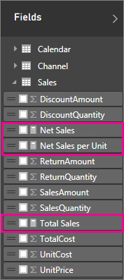
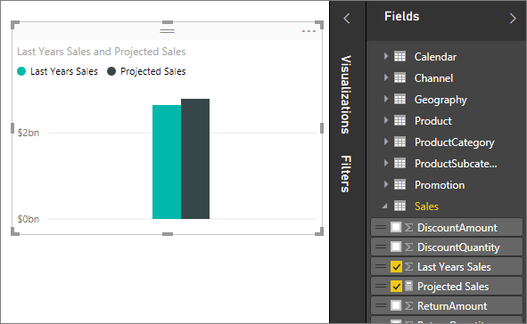

<properties
   pageTitle="Power BI Desktop 中的量值"
   description="Power BI Desktop 中的量值"
   services="powerbi"
   documentationCenter=""
   authors="davidiseminger"
   manager="mblythe"
   backup=""
   editor=""
   tags=""
   qualityFocus="no"
   qualityDate=""/>

<tags
   ms.service="powerbi"
   ms.devlang="NA"
   ms.topic="article"
   ms.tgt_pltfrm="NA"
   ms.workload="powerbi"
   ms.date="09/29/2016"
   ms.author="davidi"/>
# Power BI Desktop 中的量值

Power BI Desktop 可協助您建立按幾下即可深入了解您的資料。 但有時候這些資料就不包括回答一些最重要的問題所需的一切。 量值可協助您前往該處。

量值用於在某些最常見的資料分析。例如，計算的總和、 平均值、 最小或最大值、 計數或您自行使用 DAX 公式建立的其他進階的計算。 導出量值的結果永遠變更以回應您的報表，以便快速和動態特定資料瀏覽與程式互動。 讓我們仔細看。

## 了解量值

在 Power BI Desktop，量值會建立和使用報告檢視或資料檢視中。 您自行建立的量值會出現在欄位清單與計算機圖示。 您可以在任何內容，並將它們新增至新的或現有的視覺效果，就像任何其他欄位命名量值。

## 資料分析運算式

量值計算的運算式的公式的結果。 當您建立您自己的量值時，您將使用 [Data Analysis Expressions](https://msdn.microsoft.com/library/gg413422.aspx) (DAX) 公式語言。 DAX 包含 200 個以上的函數、 運算子和建構，程式的庫建立量值來計算結果幾乎任何資料分析需要廣大的靈活度。

DAX 公式非常類似 Excel 公式。 DAX 也有許多相同的函式，例如日期、 SUM 及左邊。 不過，DAX 的函式是使用類似我們具有 Power BI Desktop 中的關聯式資料。

## 讓我們看看一個範例

1 月是 Contoso 的銷售經理。 她會被要求提供轉售商銷售預測下一個會計年度。 她決定要預估根據去年的銷售量，6%的年度增加，所產生的各種促銷，接下來的六個月的排程。

若要報告的估計，她匯入去年的銷售資料 Power BI Desktop。 她轉售商銷售資料表中尋找 [SalesAmount] 欄位。 因為她匯入的資料只包含去年的銷售量，她將欄位重新命名 SalesAmount 最後一年銷售量。 她然後將最後一年銷售拖曳到報表畫布。 它會出現在圖表視覺效果是去年所有轉售商銷售的總和的單一值。

開發人員發現，即使自己並未指定自己的計算，其中一個已經自動提供。 Power BI Desktop 建立自己的量值可以加總所有的最後一年銷售額的值。

但是，Jan 必須計算銷售預測未來一年，這將會依據去年的銷售乘以 1.06 預期增加 6%的企業中的量值。 這項計算，則會建立自己的量值。 她使用新的量值的功能，建立新的量值，然後輸入下列 DAX 公式︰

    Projected Sales = SUM('Sales'[Last Years Sales])*1.06

然後年 1 月將她新 Projected Sales 量值拖曳到圖表。

非常快速且輕鬆，現在年 1 月都有量值來計算預測的銷售額。 她可以進一步分析預測，方法是透過篩選特定轉售商，或其報表中加入其他欄位。

## 進一步了解

我們只提供您的簡介，量值，但還有更多協助您了解如何建立您自己。 請參閱 [教學課程︰ 建立您自己的量值在 Power BI Desktop](powerbi-desktop-tutorial-create-measures.md), ，其中您可以下載範例檔案並取得有關如何建立多個量值的循序漸進的課程。  

若要深入一點 DAX，務必查看 [DAX 基本概念，在 Power BI Desktop](powerbi-desktop-quickstart-learn-dax-basics.md)。  [資料分析運算式參考](https://msdn.microsoft.com/library/gg413422.aspx) 提供詳細的文件個別的函式、 語法、 運算子和命名慣例。 DAX 已經行之幾年來，在 Power Pivot Excel 和 SQL Server Analysis Services，因此有許多其他很棒的資源可用，太。 請務必查看 [DAX 資源中心 Wiki](http://social.technet.microsoft.com/wiki/contents/articles/1088.dax-resource-center.aspx), ，其中 BI 社群的影響力成員會共用 DAX 的知識。


