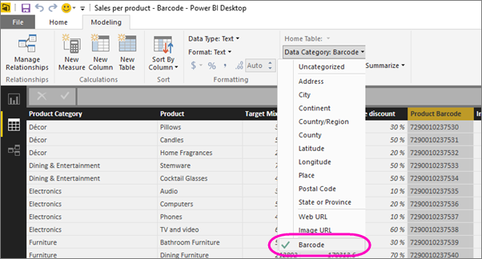

<properties 
   pageTitle="標記條碼欄位在 Power BI Desktop Power BI 行動應用程式"
   description="當您在 Power BI Desktop 中為模型中標記條碼欄位時，您可以在 iPhone 上篩選條碼自動在 Power BI 應用程式中的資料。"
   services="powerbi" 
   documentationCenter="" 
   authors="maggiesMSFT" 
   manager="mblythe" 
   editor=""
   tags=""
   qualityFocus="no"
   qualityDate=""/>
 
<tags
   ms.service="powerbi"
   ms.devlang="NA"
   ms.topic="article"
   ms.tgt_pltfrm="NA"
   ms.workload="powerbi"
   ms.date="09/29/2016"
   ms.author="maggies"/>

# 在 Power BI Desktop 標記條碼 Power BI 行動應用程式

您可以在 Power BI Desktop [將資料分類](powerbi-desktop-data-categorization.md) 在專欄中，因此 Power BI Desktop 知道如何處理以視覺方式在報表中的值。 您也可以將分類資料行做為 **條碼**。 當您或您的同事 [掃描條碼 Power BI 應用程式與產品](powerbi-mobile-scan-barcode-for-report.md) 在 iPhone，您會看到任何報表，其中包含該條碼。 當您在行動裝置應用程式中開啟報表時，Power BI 會自動篩選報表資料相關的條碼。

1. 在 Power BI Desktop，切換至 [資料檢視。

2. 選取具有條碼資料的資料行。 請參閱清單 [支援的條碼格式](#supported-barcode-formats) 下方。

3. 在 **模型** 索引標籤上，選取 **資料類別** > **條碼**。

    

4. 在報表檢視中，將這個欄位加入至您想要篩選的條碼視覺效果。

5. 儲存報表，並將它發行至 Power BI 服務。

現在當您開啟掃描器上 [iPhone 的 Power BI 應用程式](powerbi-mobile-ipad-iphone-apps.md) 和掃描條碼]，您會看到這份報表的報表清單中。 當您開啟報表時，按照您掃描產品條碼篩選其視覺效果。

## 支援的條碼格式
這些是 Power BI 辨識如果加上標籤 Power BI 報表中的條碼︰ 

- UPCECode 
- Code39Code  
- A39Mod43Code 
- EAN13Code 
- EAN8Code  
- 93Code  
- 128Code 
- PDF417Code 
- Interleaved2of5Code 
- ITF14Code 

### 請參閱  
- [掃描條碼從您在 iPhone 上的 Power BI 應用程式](powerbi-mobile-scan-barcode-for-report.md)
- [使用掃描條碼 iPhone 上發行](powerbi-mobile-scan-barcode-for-report.md#issues-with-scanning-a-barcode)
- [在 Power BI Desktop 中的資料分類](powerbi-desktop-data-categorization.md)  
- [開始使用 iPhone 應用程式的 Power BI](powerbi-mobile-iphone-app-get-started.md)  
- [開始使用 Power BI](powerbi-service-get-started.md)  
- 問題了嗎？ [請嘗試詢問 Power BI 社群](http://community.powerbi.com/)
