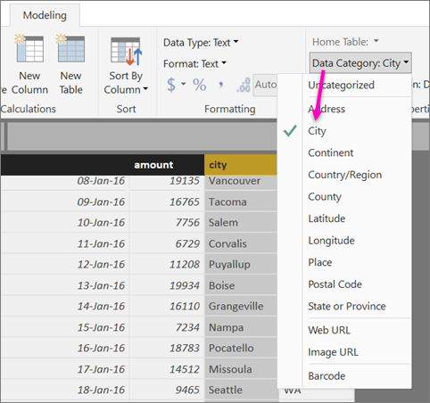

<properties 
   pageTitle="設定地理篩選在 Power BI Desktop Power BI 行動應用程式"
   description="當您設定地理 Power BI Desktop 的模型中的篩選時，您可以自動在 iOS Power BI 行動應用程式位置的篩選資料。"
   services="powerbi" 
   documentationCenter="" 
   authors="maggiesMSFT" 
   manager="mblythe" 
   editor=""
   tags=""
   qualityFocus="no"
   qualityDate=""/>
 
<tags
   ms.service="powerbi"
   ms.devlang="NA"
   ms.topic="article"
   ms.tgt_pltfrm="NA"
   ms.workload="powerbi"
   ms.date="10/12/2016"
   ms.author="maggies"/>

# 設定地理篩選在 Power BI Desktop Power BI 行動應用程式

您可以在 Power BI Desktop [分類地理資料](powerbi-desktop-data-categorization.md) 資料行，因此 Power BI Desktop 知道如何處理以視覺方式在報表中的值。 額外的好處在於，當您或您的同事檢視該報表 Power BI 行動 iOS 應用程式，在 Power BI 會自動提供符合您所在的地理篩選器。 

例如，假設您是銷售經理，到符合的客戶，以及您想要快速篩選您計劃要瀏覽特定客戶的銷售總額及營收。 您想要切入您目前的位置資料的狀態、 縣市或實際的地址。 稍後，如果您有剩餘時間，您想要瀏覽附近的其他客戶。 您可以 [篩選報表所要尋找這些客戶您的位置](powerbi-mobile-geofiltering.md)。

> [AZURE.NOTE] 如果報表中的地理名稱將以英文 & #150; 時，您可以只在行動應用程式中的位置依篩選例如，「 紐約市"或者"Germany"。

## 識別在報表中的地理資料

1. 在 Power BI Desktop，切換到 [資料檢視 。

2. 選取資料行加上地理資料 & #151;例如，City 資料行。

    

3. 上 **模型** 索引標籤上，選取 **資料類別**, ，然後正確類別 & #151; 在此範例中， **縣 （市)**。

    

4. 繼續在模型中設定任何其他欄位的地理資料類別。 

    > [AZURE.NOTE] 您可以設定每個資料類別的多個資料行在模型中，但是如果您這樣做模型無法篩選的 Power BI 行動應用程式中的地理位置。 若要使用地理篩選行動應用程式中，設定每個資料類別 & #151; 只有一個資料行例如，只有一個 **縣 （市)** 資料行中，一個 **州或省** 資料行和一個 **國家/地區** 資料行。 

## 使用您的地理資料建立視覺效果

5. 切換至 [報表檢視 , ，並建立使用中資料的地理欄位的視覺效果。 

    

    在此範例中，模型也包含城市和州一起一個資料行中的顯示的計算資料行。 閱讀有關 [在 Power BI Desktop 中建立導出資料行](powerbi-desktop-calculated-columns.md)。

    

6. 將報表發行至 Power BI 服務。

## 適用於 iOS 的 Power BI 應用程式中檢視報表

1. 在報表開啟 [Power BI 應用程式適用於 iOS](powerbi-mobile-ipad-iphone-apps.md)。

2. 如果您的地理位置與報表中的資料，您可以篩選它自動至您的位置。

    

深入了解 [篩選報表 iOS Power BI 行動應用程式裡的位置](powerbi-mobile-geofiltering.md)。

### 請參閱  

- [在 Power BI Desktop 中的資料分類](powerbi-desktop-data-categorization.md)  
- 問題了嗎？ [請嘗試詢問 Power BI 社群](http://community.powerbi.com/)