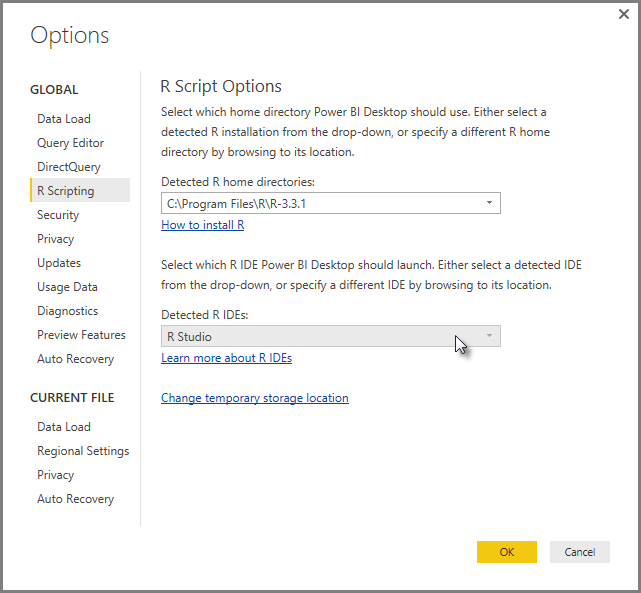
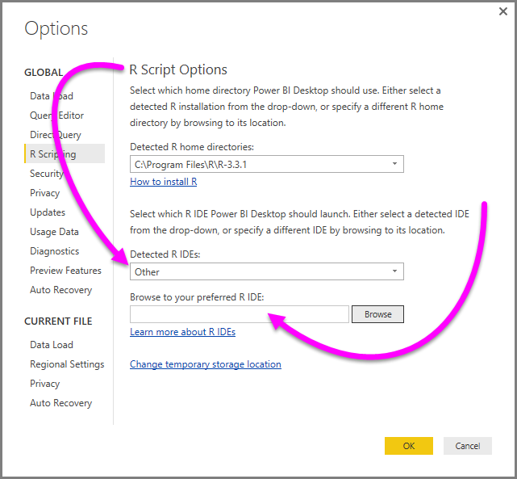
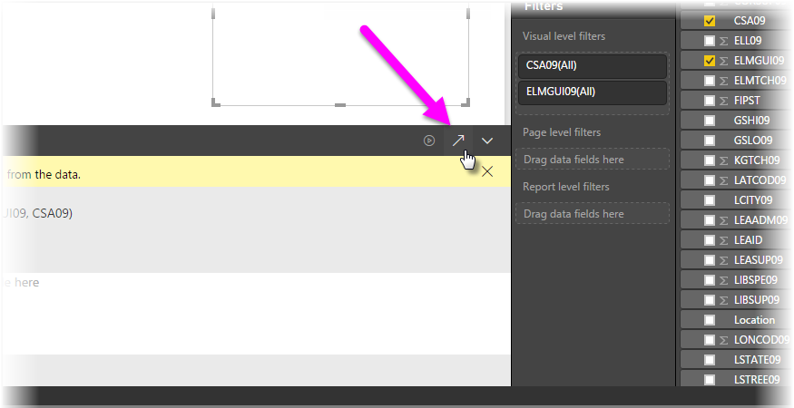

<properties
   pageTitle="使用 Power BI 外部的 R IDE"
   description="您可以啟動並使用 Power BI 外部的 IDE"
   services="powerbi"
   documentationCenter=""
   authors="davidiseminger"
   manager="mblythe"
   backup=""
   editor=""
   tags=""
   qualityFocus="no"
   qualityDate=""/>

<tags
   ms.service="powerbi"
   ms.devlang="NA"
   ms.topic="article"
   ms.tgt_pltfrm="NA"
   ms.workload="powerbi"
   ms.date="09/15/2016"
   ms.author="davidi"/>

# 使用 Power BI 外部的 R IDE

使用 **Power BI Desktop**, ，您可以使用外部 R IDE （整合式開發環境） 來建立並改善 R 指令碼，然後在 Power BI 中使用這些指令碼。

### 啟用外部 R IDE

之前，您必須使用 R 指令碼編輯器中的 **Power BI Desktop** 建立和執行 R 指令碼。 在此版本中，您可以啟動您從外部的 R IDE **Power BI Desktop** 和您的資料會自動匯入並顯示在 R 的 IDE。 在這裡，您可以修改該外部 R IDE 中的指令碼，然後將它貼回至 **Power BI Desktop** 建立 Power BI 視覺效果和報表。

開頭為 2016 年 9 月發行的 **Power BI Desktop** （版本 2.39.4526.362），您可以指定您想要使用，並將它從自動啟動的 R IDE **Power BI Desktop**。

### 需求

若要使用這項功能，您需要安裝 **R IDE** 本機電腦上。 
            **Power BI Desktop** 不含、 部署或安裝的 R 引擎，所以您必須個別安裝 **R** 本機電腦上。 您可以選擇哪些 R IDE，可使用下列選項︰

-   您可以安裝您最喜愛的 R IDE，其中有許多是使用免費的例如 [革命開放下載頁面](https://mran.revolutionanalytics.com/download/), ，而 [CRAN 儲存機制](https://cran.r-project.org/bin/windows/base/)。

-   
            **Power BI Desktop** 也支援 [R Studio](https://www.rstudio.com/) 和 **Visual Studio 2015** 與 [*R Tools for Visual Studio*](https://beta.visualstudio.com/vs/rtvs/) 編輯器。

-   您也可以安裝不同的 R IDE，並讓 **Power BI Desktop** 啟動這個 **R IDE** 進行下列其中一項︰
    -   您可以建立關聯 **。R** 檔案與您想要的外部 IDE **Power BI Desktop** 來啟動。
    -   您可以指定.exe， **Power BI Desktop** 選取應該啟動 *其他* 從 **R 指令碼選項** 區段 **選項** ] 對話方塊。 您必須將 **選項** ] 對話方塊，請前往 **檔案 > 選項和設定 > 選項**。

        

如果您有多個安裝的 R Ide，您可以指定將由環境中啟動的 *偵測到 R 的 Ide* 下拉式清單中 **選項** ] 對話方塊。

根據預設， **Power BI Desktop** 將會啟動 **R Studio** 做為外部 R IDE 如果它安裝在本機電腦; 如果 **R Studio** 未安裝，並可 **Visual Studio 2015** 與 **R Tools for Visual Studio**, ，改為將會啟動。 如果安裝任一這些 R 的 Ide，與應用程式相關聯 **。R** 檔案就會啟動。

如果沒有 **。R** 檔案關聯存在，就可以指定自訂的 IDE 中的路徑 *瀏覽至您慣用的 R IDE* 區段 **選項** ] 對話方塊。 您也可以藉由選取啟動不同的 R IDE **設定** 齒輪圖示旁邊 **啟動 R IDE** 箭號圖示，請在 **Power BI Desktop**。

### 啟動 Power BI Desktop 從 R IDE

若要啟動從 R IDE **Power BI Desktop**, ，請執行下列步驟。

1.   將資料載入 **Power BI Desktop**。

2.   選取中的某些欄位 **欄位** 您想要使用的窗格。 如果您尚未啟用指令碼視覺效果，系統會提示您執行這項操作。

   

3.   當啟用指令碼視覺效果時，您可以選取從 R visual **視覺效果** ] 窗格中，這會建立空白 R visual 準備好要顯示您的指令碼的結果。  **R 指令碼編輯器** 窗格也會出現。

   

4.   現在您可以選取您想要使用 R 指令碼中的欄位。 當您選取欄位， **R 指令碼編輯器** 欄位會自動建立指令碼，根據您選取的欄位。 您可以建立 （或貼上） 直接在 R 指令碼 **R 指令碼編輯器** ] 窗格中，您您可以將它保留空白。

   

   > 
            **注意︰** R 視覺效果的預設彙總類型是 *不摘要*。

5.   您現在可以啟動直接從您 R 的 IDE **Power BI Desktop**。 選取 **啟動 R IDE** ] 按鈕，右側 **R 指令碼編輯器** 標題列，如下所示。

   

6.   指定的 R IDE 為啟動 Power BI Desktop，如下圖所示 (此圖中 **RStudio** 是 R IDE 的預設值)。

   

   > 
            **注意︰** **Power BI Desktop** 新增指令碼的前三行，讓它可以匯入您的資料從 **Power BI Desktop** 之後執行指令碼。

7.   任何您在建立指令碼 **R 指令碼編輯器窗格** 的 **Power BI Desktop** 會出現在 R IDE 中的第 4 行開始。 此時，您可以在 R IDE 中建立 R 指令碼。 在 R 指令碼在 R IDE 中完成之後，您需要複製並貼到 **R 指令碼編輯器** ] 窗格中的 **Power BI Desktop**, ，*排除* 指令碼的前三行， **Power BI Desktop** 自動產生。 請不要的複製的指令碼的前三行回 **Power BI Desktop**, ，這些行只用於匯入資料，從您 R ide **Power BI Desktop**。

### 已知的限制

啟動 Power BI Desktop 直接從 R IDE 有一些限制︰

-  自動匯出您的指令碼從您的 R IDE 到 **Power BI Desktop** 不支援。

-  
            **R 的用戶端** 編輯器 (RGui.exe) 不支援，因為在編輯器本身並不支援開啟檔案。

### 詳細資訊

請看看 R 下列其他資訊 Power BI 中。

-   [在 Power BI Desktop 中執行 R 指令碼](powerbi-desktop-r-scripts.md)

-   [建立使用 R 的 Power BI 視覺效果](powerbi-desktop-r-visuals.md)
