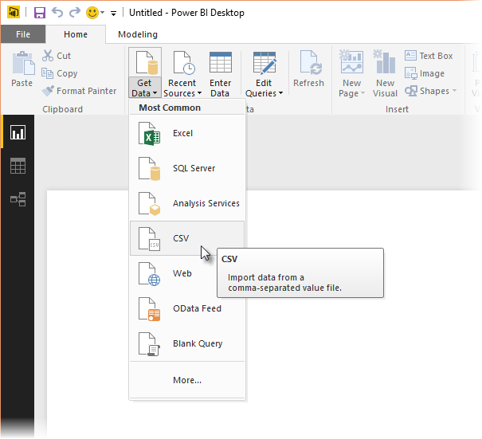

<properties
   pageTitle="在 [查詢編輯器] 中使用 R"
   description="適用於進階分析 Power BI Desktop 查詢編輯器] 中使用 R"
   services="powerbi"
   documentationCenter=""
   authors="davidiseminger"
   manager="mblythe"
   backup=""
   editor=""
   tags=""
   qualityFocus="no"
   qualityDate=""/>

<tags
   ms.service="powerbi"
   ms.devlang="NA"
   ms.topic="article"
   ms.tgt_pltfrm="NA"
   ms.workload="powerbi"
   ms.date="10/12/2016"
   ms.author="davidi"/>

# 在 [查詢編輯器] 中使用 R

您可以使用 **R**, ，程式語言，廣泛用於統計學家、 資料科學家和資料分析師在 Power BI Desktop **查詢編輯器**。 這項整合到 R 的 **查詢編輯器** 可讓您執行資料清理使用 R，和在資料集，其中包括遺漏資料，預測，完成執行進階的資料成形和分析和叢集中，只是想等等。 
            **R** 是功能強大的語言，而且可以用於 **查詢編輯器** 來準備您的資料模型，以及建立報表。

## 安裝 R

若要使用 **R** 在 Power BI Desktop 的 **查詢編輯器**, ，您必須安裝 **R** 本機電腦上。 您可以下載並安裝 **R** 免費從許多位置，包括 [革命開放下載頁面](https://mran.revolutionanalytics.com/download/), ，而 [CRAN 儲存機制](https://cran.r-project.org/bin/windows/base/)。

## 在 [查詢編輯器] 中使用 R

若要示範如何使用 **R** 中 **查詢編輯器**, ，我們將使用股票市場資料集為基礎的範例。CSV 檔案，您可以 [從這裡下載](http://download.microsoft.com/download/F/8/A/F8AA9DC9-8545-4AAE-9305-27AD1D01DC03/EuStockMarkets_NA.csv) 並依照指示進行。 此範例中的步驟如下所示︰

1.  首先，載入資料 **Power BI Desktop**。 在此範例中，我們將會載入 *EuStockMarkets_NA.csv* 檔案。 選取 **取得資料 > CSV** 從 **首頁** 在功能區 **Power BI Desktop**。

    

2.  選取檔案，並選取 **開啟**, ，並顯示在 CSV **CSV 檔案** ] 對話方塊。

    

3.  將資料載入後，您會看到它在 **欄位** Power BI Desktop 中的] 窗格。

    

4.  開啟 **查詢編輯器** 選取 **編輯查詢** 從 **首頁** 索引標籤中 **Power BI Desktop**。

    

5.  在 **轉換** 索引標籤上，選取 **執行 R 指令碼** 和 **執行 R 指令碼** 編輯器隨即出現 （下一個步驟中所示）。 請注意 15 到 20 的資料列會遭受資料遺失，您無法看到下圖中其他資料列一樣。 以下顯示如何 R 可以 （且會） 的步驟為您完成這些資料列。

    

6.  此範例中，我們會輸入下列指令碼︰

        library(mice)
        tempData <- mice(dataset,m=1,maxit=50,meth='pmm',seed=100)
        completedData <- complete(tempData,1)
        output <- dataset
        output$completedValues <- completedData$"SMI missing values"

    >
            **注意︰** 需要有 *滑鼠* 先前的指令碼，才能正常運作的 R 環境中安裝的程式庫。 若要安裝滑鼠，執行下列命令在 R 安裝: |     > install.packages('mice')

    當放入 **執行 R 指令碼** ] 對話方塊中，程式碼看起來如下所示︰

    

7.  當我們選取 **確定**, ，**查詢編輯器** 會顯示資料隱私權的相關警告。

    

8.  R 指令碼在 Power BI 服務正常運作，所有的資料來源必須設定為 *公用*。 如需隱私權設定及含意的詳細資訊，請參閱 [隱私權等級](powerbi-desktop-privacy-levels.md)。

    

    一旦我們這麼做，我們會看到新的資料行中 **欄位** 也稱為 *completedValues*。 請注意，還有幾個遺漏的資料元素，例如資料列 15 到 18。 我們會看到 R 處理的方式，下一節。

    之 [警示] 工作區

R 指令碼，只是五個行 **查詢編輯器** 填入遺漏的值與預測模型。

## 從 R 指令碼資料建立視覺效果

現在我們可以建立視覺效果，請參閱如何 R 指令碼的程式碼使用 *滑鼠* 程式庫已完成遺漏的值，如下圖所示。

一旦該 visual 已完成，而且我們可能想要使用所建立的任何其他視覺效果 **Power BI Desktop**, ，我們可以儲存 **Power BI Desktop** 檔案 （用於儲存為.pbix 檔案），然後使用 [資料模型，包括部分，Power BI 服務中的 R 指令碼。

>
            **注意︰** 要完成這些步驟，以查看已完成的.pbix 檔案？ 您很幸運-您可以下載已完成 **Power BI Desktop** 檔案，這些範例中使用 [這裡](http://download.microsoft.com/download/F/8/A/F8AA9DC9-8545-4AAE-9305-27AD1D01DC03/Complete Values with R in PQ.pbix)。

一旦您已上載.pbix 檔案至 Power BI 服務，兩個步驟是啟用 （服務） 中的資料重新整理，以及啟用視覺效果來更新的服務 （資料需要存取的視覺效果更新的 R） 中所需。 額外的步驟如下所示︰

-   
            **啟用排定的重新整理資料集** -若要啟用排定的重新整理活頁簿，其中包含您的資料集使用 R 指令碼，請參閱 [設定排定的重新整理](powerbi-refresh-scheduled-refresh.md), ，其中也包含下列資訊 **個人閘道**。

-   
            **個人閘道安裝** -您需要 **個人閘道** 所在檔案的所在，其中 R 已安裝，也不 Power BI 服務必須存取該活頁簿並重新轉譯任何更新的視覺效果的電腦上安裝。 您可以取得更多有關如何 [安裝和設定個人閘道](powerbi-personal-gateway.md)。

## 限制

有一些限制，包括 R 指令碼中建立的查詢 **查詢編輯器**:

-   所有的 R 資料來源設定必須設為 *公用*, ，以及在查詢中建立所有其他步驟 **查詢編輯器** 也必須是公用。 若要取得資料來源設定，在 **Power BI Desktop** 選取 **檔案 > 選項和設定 > 資料來源設定**。

    

    從 **資料來源設定** 對話方塊中，選取資料來源，然後選取 **編輯權限** ，並確定 **私密性等級** 設為 *公用*。

        

-   若要啟用 R 視覺效果的資料集排程重新整理，您必須啟用 **排定的重新整理** 還有 **個人閘道** 裝載活頁簿和 R 安裝在電腦上安裝。 如需兩者的詳細資訊，請參閱這篇文章提供連結以了解每個前的一節。

有各種用途，您可以使用 R 和自訂查詢執行，因此探索並圖形資料只是您想要顯示的方式。
