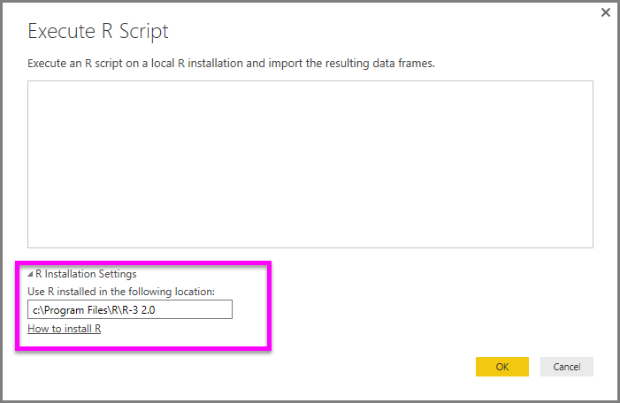

<properties
   pageTitle="在 Power BI Desktop 中執行 R 指令碼"
   description="在 Power BI Desktop 中執行 R 指令碼"
   services="powerbi"
   documentationCenter=""
   authors="davidiseminger"
   manager="mblythe"
   backup=""
   editor=""
   tags=""
   qualityFocus="no"
   qualityDate=""/>

<tags
   ms.service="powerbi"
   ms.devlang="NA"
   ms.topic="article"
   ms.tgt_pltfrm="NA"
   ms.workload="powerbi"
   ms.date="09/29/2016"
   ms.author="davidi"/>

# 在 Power BI Desktop 中執行 R 指令碼

您可以直接在 Power BI Desktop，執行 R 指令碼，並產生資料集匯入 Power BI Desktop 資料模型。

## 安裝 R

若要執行 Power BI Desktop R 指令碼，您需要安裝 **R** 本機電腦上。 您可以下載並安裝 **R** 免費從許多位置，包括 [革命開放下載頁面](https://mran.revolutionanalytics.com/download/), ，而 [CRAN 儲存機制](https://cran.r-project.org/bin/windows/base/)。 目前版本的 Power BI Desktop 中的 R 指令碼支援的安裝路徑中的 Unicode 字元，以及空白 （空的字元）。

## 執行 R 指令碼
Power BI Desktop 中的幾個步驟中，您可以執行 R 指令碼和建立資料模型，從中您就可以建立報表，並將 Power BI 服務上分享它們。 R 指令碼的 Power BI Desktop 現在支援包含小數點 （.） 和逗號 （，） 的數字格式。

### 準備 R 指令碼
若要執行 Power BI Desktop R 指令碼，在本機 R 開發環境中，建立指令碼並確定已順利執行。

若要執行 Power BI Desktop 指令碼，請確定指令碼順利執行新的和未修改的工作區中。 這表示，所有套件和相依性必須明確地載入並執行。 您可以使用 *source （)* 執行相依的指令碼。

當準備和執行 R 指令碼在 Power BI Desktop 時，有一些限制︰
-   只有資料框架會匯入，因此請確定您要匯入至 Power BI 的資料都會在資料框架
-   類型為複雜和向量的資料行不會匯入，並會在建立的資料表中的錯誤值取代。
-   N/A 會轉譯為 Power BI Desktop 中的 NULL 值的值
-   任何 R 指令碼執行時間超過 30 分鐘的逾時
-   在 R 指令碼中，等待使用者輸入，例如互動式呼叫中止指令碼執行
-   設定工作目錄中的 R 指令碼中，當您 *必須* 定義的工作目錄，而非相對路徑的完整路徑

### 執行 R 指令碼並匯入資料

1.   在 Power BI Desktop 中找到的 R 指令碼資料連接器 **取得資料**。 若要執行 R 指令碼，請選取 **取得資料 &gt; 其他...**, ，然後選取 **其他 &gt; R 指令碼** 如下圖所示。

    

2.   如果您的本機電腦上安裝 R，已安裝最新的版本會選取做為 R 引擎。 只要將您的指令碼複製到指令碼] 視窗，然後選取 **確定**。

    

3.   如果未安裝 R，就不會識別，或者如果有多個安裝在本機電腦上的，展開 **R 安裝設定** 以顯示 [安裝選項，或選取哪一個安裝您想要執行 R 指令碼。

    

    如果已安裝 R 會無法識別，您可以明確地提供它的位置，在文字方塊中提供當您展開 **R 安裝設定**。 在上述映像路徑 *C:\Program Files\R\R-3.2.0* 在文字方塊中明確提供。

    [選項] 對話方塊的 R 指令碼區段中，集中 R 安裝設定。 若要指定 R 安裝設定，請選取 **檔案 > 選項和設定** 然後 **選項 > R 指令碼**。 如果有多個安裝 R，則會出現下拉式選單，可讓您選取要使用哪一個安裝。

    

4.   選取 **確定** 執行 R 指令碼。 當指令碼順利執行時，然後您可以選擇新增到 Power BI 模型產生的資料框架。

### 重新整理
您可以重新整理 Power BI Desktop 中的 R 指令碼。 當您重新整理的 R 指令碼時，Power BI Desktop R 指令碼一次 Power BI Desktop 的環境中執行。

### 詳細資訊

請看看 R 下列其他資訊 Power BI 中。

-   [在 Power BI Desktop 建立 R 視覺效果](powerbi-desktop-r-visuals.md)

-   [使用 Power BI 外部的 R IDE](powerbi-desktop-r-ide.md)
