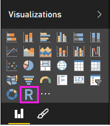
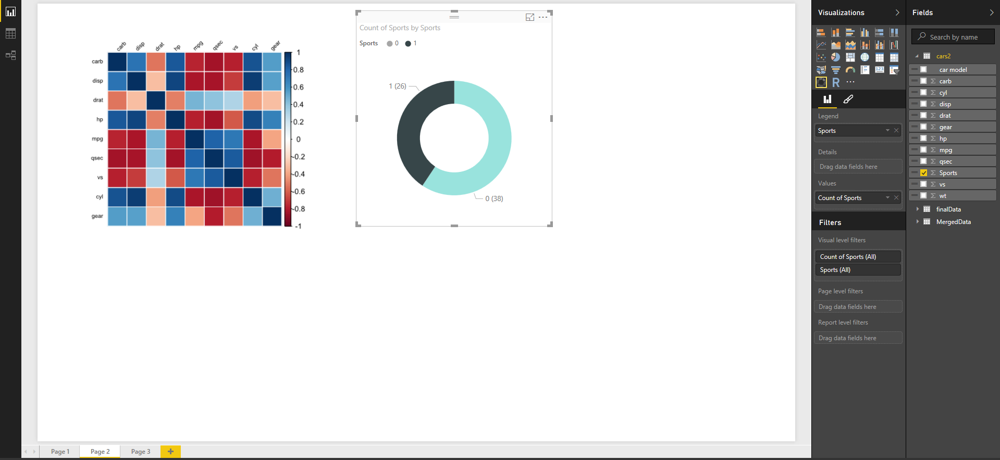

<properties
   pageTitle="建立使用 R 的 Power BI 視覺效果"
   description="建立使用 R 的 Power BI 視覺效果"
   services="powerbi"
   documentationCenter=""
   authors="davidiseminger"
   manager="mblythe"
   backup=""
   editor=""
   tags=""
   qualityFocus="no"
   qualityDate=""/>

<tags
   ms.service="powerbi"
   ms.devlang="NA"
   ms.topic="article"
   ms.tgt_pltfrm="NA"
   ms.workload="powerbi"
   ms.date="09/08/2016"
   ms.author="davidi"/>

# 建立使用 R 的 Power BI 視覺效果  

使用 Power BI Desktop，您可以使用 R 來視覺化資料。

### 安裝 R

Power BI Desktop 不含、 部署或安裝 R 引擎。 若要執行 Power BI Desktop R 指令碼，您必須個別安裝 **R** 本機電腦上。 您可以下載並安裝 **R** 免費從許多位置，包括 [革命開放下載頁面](https://mran.revolutionanalytics.com/download/), ，而 [CRAN 儲存機制](https://cran.r-project.org/bin/windows/base/)。 目前版本的 Power BI Desktop 中的 R 指令碼支援的安裝路徑中的 Unicode 字元，以及空白 （空的字元）。

### 啟用 R 視覺效果
1.   啟用 R 視覺效果，請選取 **檔案 > 選項和設定 > 選項** 和 **選項** 頁面出現，請確定您的本機 R 安裝中所指定 **R 指令碼** 區段 **選項** ] 視窗中，如下圖所示。 在下圖中，則路徑的本機安裝的 R **C:\Program Files\R\R-3.2.0** ，在文字方塊中明確提供該路徑。 請確定它會顯示正確的路徑會反映您想要使用的 Power BI Desktop 本機 R 安裝。

    

一旦您指定 R 安裝時，就可以開始建立 R 視覺效果。

#### 在 Power BI Desktop 中建立 R 視覺效果

1.   選取 **R Visual** 圖示 **視覺化** ] 窗格中所示下圖中，新增 R 視覺化。

    

2.   當您將 R visual 加入報表時，Power BI Desktop 會執行下列作業︰

   a） R 視覺影像預留位置會出現在報表畫布。

   b) **R 指令碼編輯器** 中間窗格的底部會出現。

  

3.   接下來，新增您想要使用 R 指令碼中的欄位 **值** 一節中 **欄位** 也很簡單，就如同任何其他 Power BI Desktop visual。 已加入的欄位 **欄位** 也可用於在 R 指令碼，並可以加入新欄位，或移除不必要的欄位 **欄位** 也使用時，才能在您的 R 指令碼，在 Power BI Desktop **R 指令碼編輯器**。 Power BI Desktop 會自動偵測您已加入或移除哪些欄位。

> 
            **注意︰** R 視覺效果的預設彙總類型是 *不摘要*。

4.   現在您可以使用您選取要建立繪圖的資料。 當您選取的欄位， **R 指令碼編輯器** 產生繫結程式碼為主的 [編輯器] 窗格上方的灰色一節中所做的選擇支援的 R 指令碼。 當您選取或移除額外的欄位，支援在 R 指令碼編輯器中的程式碼是自動產生或隨之移除。

    在下圖所示的範例中，選取三個欄位︰ hp 齒輪，以及 drat。 由於這些選取項目，R 指令碼編輯器會產生下列繫結程式碼︰
      -  資料框架呼叫 **資料集** 建立
        -  該框架組成不同使用者所選取的欄位
      -  預設彙總 *不摘要*
      -  類似於資料表視覺效果，欄位分組，並重複的資料列只能出現一次

    

    >
            **提示︰** ，您可能在某些情況下不想自動發生，群組或您所有的資料列才會出現，包括重複項目。 在此情況下，您可以加入此造成所有的資料列視為唯一的並讓群組資料集加入索引欄位。

    產生的資料框架稱為 **資料集**, ，而且可以存取所選資料行，藉由其各自的名稱。 例如，存取齒輪欄位，藉由撰寫 *dataset$ 齒輪* R 指令碼中。 使用空格或特殊字元的欄位，以單引號括住。

5. 您選取的欄位所自動產生之資料框架，您就可以撰寫 R 指令碼，而產生的繪圖 R 預設裝置。 指令碼完成後，請選取 **執行** 從 **R 指令碼編輯器** 標題列 (**執行** 是標題列右側)。

    當 **執行** 會選取此選項，Power BI Desktop 識別繪圖和呈現在畫布上。
由於此處理序執行於本機的 R 安裝，請確定安裝必要的套件。

    當發生下列任一種狀況時，power BI Desktop 都視覺效果︰
      - 
            **執行** 選取從 **R 指令碼編輯器** 標題列
      - 每當資料變更時，由於資料重新整理、 篩選或反白顯示

下圖的相互關聯繪圖程式碼範例會顯示，並繪製的汽車的不同類型的屬性之間的相互關聯。

若要取得放大的視覺效果，您可以減少 **R 指令碼編輯器**。 當然，像在 Power BI Desktop 其他視覺效果，您可以跨選取只運動的車輛 visual 甜甜圈 （循 visual 右側，上述範例映像） 繪製的相互關聯的篩選器。

您也可以修改自訂視覺效果，R 指令碼，並利用 R 的強大功能，將參數加入至繪圖命令。

原始的繪圖命令的下列項目︰

    corrplot(M, method = "color",  tl.cex=0.6, tl.srt = 45, tl.col = "black")

在 R 指令碼進行一些變更，現在的命令為下列︰

    corrplot(M, method = "circle", tl.cex=0.6, tl.srt = 45, tl.col = "black", type= "upper", order="hclust")

如此一來，R visual 現在繪製圓形，只會考慮在上半部，並重新排序矩陣叢集關聯的屬性，如下圖所示。

當執行 R 指令碼，而產生的錯誤時，不繪製 R 視覺效果和在畫布上顯示錯誤訊息。 如需有關錯誤的詳細資訊，請選取 **查看詳細資料** 從 R visual 錯誤在畫布上。

> 
            **R 指令碼的安全性︰** R 視覺效果都從 R 指令碼可能包含與安全性或隱私權風險的程式碼建立。 當嘗試檢視或 R 視覺化與互動，第一次，使用者會看到安全性警告訊息。 如果您信任作者及來源，或在您檢閱並了解 R 指令碼之後，只啟用 R 視覺效果。

#### 已知的限制

Power BI Desktop R 視覺效果有一些限制︰

-  資料大小的限制 – R visual 用於繪製資料僅限於 150000 資料列。 如果選取多個 150000 資料列，只有前 150000 資料列會使用，而且在映像上顯示一則訊息。

-  計算時間限制 – 如果 R visual 計算超過 5 分鐘時，卻造成錯誤的執行時間。

-  關聯性︰ 與其他 Power BI Desktop 視覺效果，如果您選取不同的資料表，它們之間沒有定義關聯性的資料欄位一樣會發生錯誤。

-  R 視覺效果會重新整理基礎資料更新、 篩選和反白顯示。 不過，映像本身不是互動式，而且不得的交叉篩選來源。

-  R 視覺效果回應反白顯示其他視覺效果，但您不能以跨篩選其他項目按一下 visual R 中的項目上。

-  只有繪圖繪製 R 預設顯示裝置的正確顯示在畫布上。 避免明確地使用不同的 R 顯示裝置。

-  在這一版 RRO 安裝不自動識別的 32 位元版本的 Power BI Desktop，所以您必須手動提供 R 安裝目錄的路徑 **選項和設定 > 選項 > R 指令碼**。

### 詳細資訊

請看看 R 下列其他資訊 Power BI 中。

-   [在 Power BI Desktop 中執行 R 指令碼](powerbi-desktop-r-scripts.md)

-   [使用 Power BI 外部的 R IDE](powerbi-desktop-r-ide.md)
