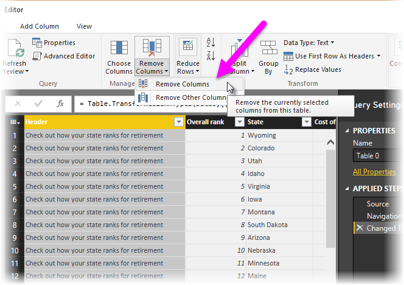
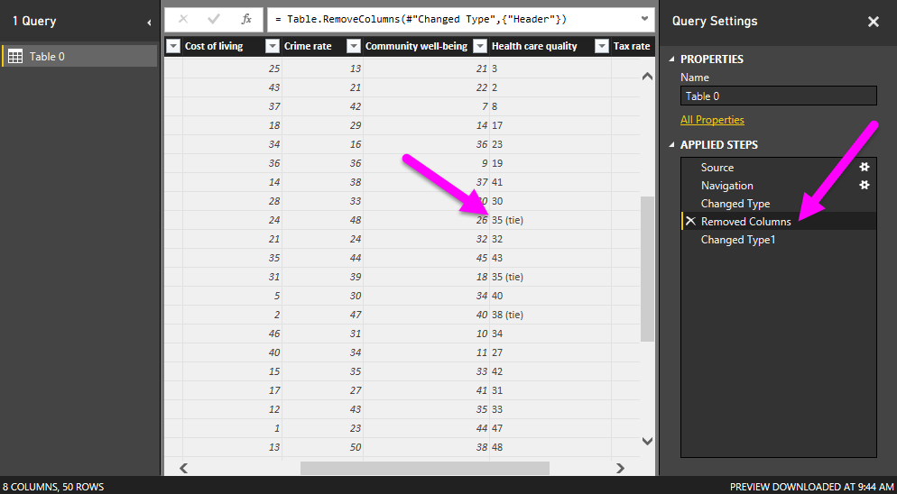
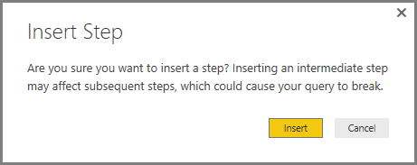
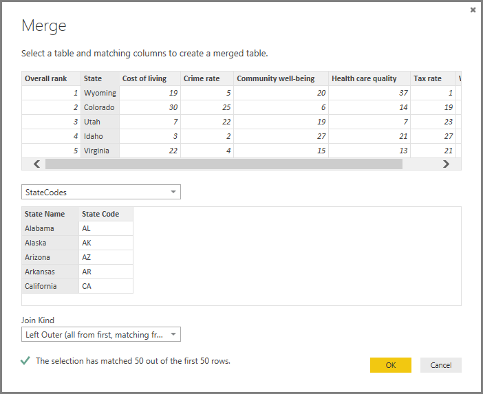

<properties
   pageTitle="圖形，並結合 Power BI Desktop 中的資料"
   description="圖形，並結合 Power BI Desktop 中的資料"
   services="powerbi"
   documentationCenter=""
   authors="davidiseminger"
   manager="mblythe"
   backup=""
   editor=""
   tags=""
   qualityFocus="no"
   qualityDate=""/>

<tags
   ms.service="powerbi"
   ms.devlang="NA"
   ms.topic="article"
   ms.tgt_pltfrm="NA"
   ms.workload="powerbi"
   ms.date="09/29/2016"
   ms.author="davidi"/>
# 圖形，並結合 Power BI Desktop 中的資料

使用 **Power BI Desktop**, ，您可以連線到許多不同類型的資料來源，然後使資料符合您的需求。 
            *塑造* 資料表示的轉換資料 – 例如重新命名資料行或資料表、 變更數字的文字，移除資料列、 將第一個資料列設定為標頭，依此類推。 
            *結合* 資料表示連接到兩個或多個資料來源，如有需要然後將彙總形式加以 * * 他們到一個有用的查詢。

本文件將示範如何使用 Power BI Desktop，反白顯示的一些最常見工作的查詢。 此處所使用的查詢描述的詳細資料，包括如何建立查詢從頭 [開始使用 Power BI Desktop](powerbi-desktop-getting-started.md)。

它是很有幫助， **查詢編輯器** Power BI Desktop 中充分利用按右鍵功能表，以及在功能區。 您可以在選取的大部分 **轉換** 功能區，您也可以使用滑鼠右鍵按一下項目 （例如資料行），然後從出現的功能表中選擇。

## 圖形資料

當圖形在 [查詢編輯器] 中的資料時，您提供的逐步指示 （為您執行查詢編輯器） 來調整資料，因為查詢編輯器會載入並顯示它。 原始資料來源不受影響。會調整此特定檢視的資料，或 *形狀*。

您指定 （例如重新命名資料表，或轉換資料類型，刪除資料行） 會記錄由 [查詢編輯器] 中，而每次連接到資料來源的這項查詢這些步驟執行，因此資料永遠都是步驟形狀您指定的方式。 每當您使用查詢編輯器功能的 Power BI Desktop，或任何人都可以使用共用的查詢，例如上,，就會發生此程序 **Power BI** 服務。 捕捉到這些步驟時，依序在 **查詢設定** 下的窗格 **套用步驟**。

下圖顯示 **查詢設定** 我們會逐步執行每個步驟，在下一步的幾個段落的形狀已有 – 查詢窗格。

使用中的停用資料 [開始使用 Power BI Desktop](https://powerbi.uservoice.com/knowledgebase/articles/471664), ，而我們找到連接至 Web 的資料來源，讓我們圖形資料以符合我們的需求。

簡單來說，一個資料行的分數所不會自動在轉換文字數字查詢編輯器會載入資料表中，且我們需要這些數字。 沒問題 – 只要以滑鼠右鍵按一下資料行標頭，然後選取 **變更類型 \> 整數** 加以變更。 若要選擇多個資料行，請先選取資料行，然後按住 **SHIFT**, 選取其他相鄰的資料行，然後以滑鼠右鍵按一下資料行標頭，變更所有選取的資料行。 您也可以使用 **CTRL** 選擇非相鄰的資料行的索引鍵。

您也可以 *轉換* 標頭文字從這些資料行 **轉換** 功能區。 以下是 **轉換** 功能區中的，使用箭號指向 **資料型別** ] 按鈕，可讓您轉換到另一個目前的資料類型。

請注意，在 **查詢設定**, 、 **套用步驟** 反映任何成形的步驟，套用至資料。 如果我想要移除成形的程序中的任何步驟，我只需選取 **X** 左邊的步驟。 在下圖中， **套用步驟** 反映到目前為止的步驟︰ 連線到網站 (**來源**); 選取資料表 (**導覽**); 同時載入資料表時，查詢編輯器會自動變更文字為基礎的數字資料行和 *文字* 至 *整數* (**變更類型**)。 排名的一個資料行不會自動變更數字為基礎的型別，以及我們將了解為什麼在接下來幾個段落。

我們可以使用這個查詢之前，我們需要進行一些變更，以取得其資料，我們想要的位置︰

-   
            *移除第一個資料行* – 我們不需要它只會包含重複說出 「 取出您的狀態會排列次序淘汰 」 的資料列的是此正在 Web 為基礎的資料表的資料來源的成品

-   
            *修正一些錯誤* – 其中一個資料行， **健康醫療品質**, ，其中已在網站上記下的文字包含幾個繫結中狀態的排名 *(tie)* 其數字之後。 在網站上正常運作，但需要我們手動轉換的文字資料的資料行。 很容易修正此問題使用 Power BI Desktop，並執行此動作示範的酷炫功能 **套用步驟** 中查詢

-   
            *變更資料表名稱* – 該 **Table 0** 不是很有用的描述元，而將它變更簡單

若要移除的第一個資料行，只要選取的資料行，然後選擇 **首頁** ] 索引標籤，從功能區，然後 **移除資料行** 如下圖所示。

接下來我們需要解決的文字資料行，並將其轉換為數字。 一開始看似簡單，我們就可以變更的類型 **健康醫療品質** 數字的資料行的文字 (例如 *整數*, ，或 *十進位數字*)。 當我們變更中的型別，但是 **文字** 至 **整數**, ，然後尋找我們發現該資料行中的值，透過查詢編輯器報告一些錯誤。

有數種方法，以取得有關每個錯誤的詳細資訊。 您可以選取儲存格 (而不需要的單字 **錯誤**)，或按一下 word **錯誤** 直接。 如果您選取儲存格 *沒有* 直接按一下 word **錯誤**, ，查詢編輯器視窗的底部顯示資訊時發生錯誤。

如果您按一下 word *錯誤* 查詢，直接建立 **套用步驟** 中 **查詢設定** 窗格，並顯示錯誤的相關資訊。

若要回到 [查詢編輯器，您必須移除該步驟，方法是選取 **X** 旁邊。

當我們選取最近 **套用步驟**, ，我們會看到剛才所述，如下圖所示。

由於查詢編輯器會循序記錄步驟，我們可以選擇變更類型，在前的步驟 **套用步驟**, ，並查看該儲存格的值之前轉換，如下圖所示。

好，現在我們可以修正這些值，和 *然後* 變更類型。 由於查詢編輯器，循序記錄的步驟，但彼此，您可以移動每個 **套用步驟** 向上或向下的順序。 只要以滑鼠右鍵按一下任何步驟，以及查詢編輯器會提供一個功能表，讓您執行下列動作︰ **重新命名**, ，**刪除**, ，**刪除** **直到結束** （移除目前的步驟和所有後續步驟太）、 **移**, ，或 **下移**。

此外，您可以選取 **套用步驟** 任何地方在清單中，並繼續塑造此時序列中的資料。 查詢編輯器會自動插入新的步驟，直接之後目前選取之 **套用步驟**。 讓我們來試試。

首先，我們選取 **套用步驟** 之前變更的類型 **健康醫療品質** 資料行。 然後我們會取代，以便只保留文字 」 (tie) 」 的儲存格的值。 以滑鼠右鍵按一下包含 「 35 (tie) 」 的儲存格，然後選取 *取代值...* 從出現的功能表。 請注意這 **套用步驟** 是目前選取 （之前變更類型的步驟）。

我們要插入的步驟，因為查詢編輯器並且警告我們，這樣做的危險性-後續步驟可能會造成查詢中斷。 我們必須謹慎，並仔細考量 ！ 由於這是教學課程中，我們要反白顯示的查詢編輯器來示範如何建立、 刪除、 插入和重新排列步驟很炫的功能，我們將直接推入，然後選取 **插入**。

有三個繫結，因此我們每個取代值。 當您建立新套用的步驟，執行的動作-在此情況下，基礎的查詢編輯器名稱 **取代值**。 當您在查詢中有多個具有相同名稱的步驟時，查詢編輯器會加上數字 （依序） 每個後續 **套用步驟** 以區分它們。

下列畫面顯示三個 **取代值** 中的步驟 **查詢設定**, ，但它也會顯示其他能夠更有趣的是︰ 因為我們移除了文字 」 (tie) 」 的每個執行個體 **健康醫療品質** 資料行， **變更類型** 步驟現在完成 *未發生任何錯誤*。

            **注意︰** 您也可以 **移除錯誤** （使用功能區或快顯功能表），以移除任何資料列中有錯誤。 在此情況下它會移除擁有的所有狀態 」*(tie)*」 從我們的資料，和我們不想這麼做 – 我們例如所有狀態，而且想要將它們保存在資料表中。

好了，稍微複雜，但它是強大而靈活查詢編輯器的良好範例。

最後，我們想要將該資料表的名稱變更為具描述性。 當我們取得建立報表時，就特別有用，特別是當我們連接到多個資料來源，而且它們列出所有具有描述性的資料表名稱， **欄位** 窗格 **報表** 檢視。

變更資料表名稱很簡單︰ 在 **查詢設定** 窗格底下 **屬性**, ，只要輸入新名稱的資料表，如下所示在下圖中，並叫用 **Enter**。 讓我們將此資料表 *RetirementStats*。

好了，我們已經形狀之範圍內，我們需要該資料。 下一步我們要連接到另一個資料來源，及結合資料。

## 合併資料

有關各種狀態的詳細資料很有趣，而且會適用於建置其他分析工作和查詢。 但是有一個問題︰ 有大部分的資料會使用兩個字母縮寫狀態碼，不狀態的完整名稱。 我們需要想辦法狀態名稱關聯的縮寫。

我們很幸運︰ 沒有其他公用資料來源是這樣寫的但您還需要相當多的成形之前我們可以將它連接到我們停用的資料表。 以下是 Web 資源的州/省代碼︰

<http://en.wikipedia.org/wiki/List_of_U.S._state_abbreviations>

從 **首頁** 功能區中 [查詢編輯器] 中，我們選取 **新來源 \> Web** 輸入地址，選取 [確定] 和 [導覽] 會顯示它在網頁上所找到。

 

我們選取 **資料表 [編輯]** 包含資料，因為我們想，但它要花一段將削減向我們想要該資料表的資料。

> 
            **提示︰** 是否有更快或更容易的方法來完成下列步驟？ 沒錯，我們可以建立 *關聯性* 之間的兩個資料表和圖形的關聯性為基礎的資料。 下列步驟仍適合學習使用資料表，只是知道的關聯性可以幫助您快速使用資料從多個資料表。

若要取得這項資料至圖形，我們可以採取下列步驟︰

-   移除前兩個資料列 – 它們的方式建立網頁的資料表，以及我們不需要它們的結果。 從 **首頁** 功能區中，選取 **減少資料列 \> 移除資料列 \> 移除頁首資料列**。

 **移除頁首資料列** ] 視窗隨即出現，您想要移除可讓您指定資料列數目。

-   移除下 26 個資料列 – 所有領域，而我們不需要包含它們。 從 **首頁** 功能區中，選取 **減少資料列 \> 移除資料列 \> 移除底部資料列**。

-   因為 RetirementStats 資料表沒有華盛頓特區的資訊，我們需要篩選從我們的清單。 選取下拉式清單旁邊的箭號區域狀態] 欄中，然後清除旁邊的核取方塊 **聯邦學區**。

-   移除一些不必要的資料行 – 我們只需要為其正式的兩個字母縮寫，狀態對應，所以我們可以移除下列資料行︰ **Column2**, ，**Column3**, ，然後 **Column5** 透過 **Column10**。 先選取資料行 2，然後按住 **CTRL** 鍵，然後選取要移除的其他資料行 (這可讓您選取多個非連續的資料行)。 從功能區上的 [首頁] 索引標籤，選取 **移除資料行 \> 移除資料行**。

-   第一個資料列做為標頭 – 我們移除前三個資料列，因為目前的上方資料列是我們想要的標頭。 您可以選取 **使用第一個資料列做為標頭** 從 **首頁** 索引標籤上，或從 **轉換** 在功能區] 索引標籤。

            **注意︰** 這是第註明的好時機 *順序* 的套用在 「 查詢編輯器 」 中的步驟很重要，而且可能會影響資料形狀的方式。 也很重要，請考慮如何一個步驟，可能會影響另一個後續的步驟。如果移除套用的步驟中的步驟，後續的步驟可能方式與原先預期的是，因為查詢的步驟順序的影響。

            **另一個附註︰** 當您調整 [查詢編輯器] 視窗，讓較小的寬度時，某些功能區項目會緊縮至發揮最大的可見的空間。 當您增加 [查詢編輯器] 視窗的寬度時，以便充分利用增加的功能區區的展開功能區項目。

-   重新命名資料行和資料表本身 – 像往常一樣，有幾種方式可以重新命名資料行;第一次選取的資料行，然後選取 [ **重新命名** 從 **轉換** ] 索引標籤功能區中，或按一下滑鼠右鍵，然後選取 **重新命名...** 從出現的功能表。 下圖有箭號指向這兩個選項。您只需要選擇其中一個。

讓我們來加以重新命名以 *州名* 和 *狀態碼*。 若要重新命名資料表，只要輸入名稱 **名稱** 方塊 **查詢設定** 窗格。 讓我們將此資料表 *StateCodes*。

既然我們已經成形 StateCodes 資料表我們想要的方式，讓我們結合這些兩個資料表或查詢，一次，現在我們已有的資料表是我們套用至資料的查詢的結果，因為它們通常稱為 *查詢*。

有兩種主要合併查詢 – *合併* 和 *附加*。

當您有一或多個資料行，您想要新增到另一個查詢，您 **合併** 查詢。 當您有額外的資料列的資料，您想要新增到現有的查詢，您 **附加** 查詢。

在此情況下，我們想要合併的查詢。 若要開始，從左窗格的 [查詢編輯器中，我們選取的查詢 *到* 我們想讓其他查詢合併，在此情況下為 *RetirementStats*。 然後選取 **結合 \> 合併查詢** 從 **首頁** 功能區上的索引標籤。

可能會提示您設定的私密性等級，以確保不包括結合的資料或傳送的資料，您不想傳送。

下一步 **合併** ] 視窗隨即出現，提示我們選擇哪一個資料表，我們想要合併到選取的資料表，然後為合併使用相符的資料行。 選取狀態，從 *RetirementStats* 資料表 （查詢），然後選取 *StateCodes* （容易在此情況下，因為只有一個其他的查詢︰ 當您連接至各種資料來源時，有許多查詢可從中選擇） 的查詢。 當我們選取正確的相符資料行 – **狀態** 從 *RetirementStats*, ，和 **州名** 從 *StateCodes* – **合併** 視窗看起來如下所示，和 **確定** 按鈕啟用。

A **NewColumn** 建立查詢，因為它是已合併的現有查詢的資料表 （查詢） 的內容的結尾。 合併的查詢中的所有資料行都壓縮成 **NewColumn**, ，但您可以選擇 **展開** 資料表，並包含您想要的任何資料行。

若要展開合併的資料表，並選取要包含哪些資料行，選取 [展開] 圖示 ()。  **展開** ] 視窗隨即出現。

在此情況下，我們只想 **狀態碼** 資料行，讓我們選取該資料行，然後選取 **確定**。 清除核取方塊，從使用原始資料行名稱做為前置詞因為我們不需要或想要這樣。如果我們離開選取時，應命名為合併的資料行 **NewColumn.State 程式碼** (原始的資料行名稱，或 **NewColumn**, ，然後點，然後回到到查詢的資料行名稱)。

            **注意︰** 想玩一下如何納入， **NewColumn** 資料表嗎？ 您可以實驗，以及如果您不喜歡結果，只會刪除該步驟，從 **套用步驟** 清單中 **查詢設定** ] 窗格; 您查詢所傳回的狀態之前將它套用 **展開** 步驟。 具有要免費重做的機會，可以執行這項作業，直到展開程序會尋找您想要的方式，您要的次數。

我們現在有單一查詢 （資料表），結合兩個資料來源，其中每個已形狀來滿足我們的需求。 此查詢可以做為基礎的眾多其他，有趣的資料連接 – 例如外罩成本統計資料、 人口統計資料或在任何狀態的工作機會。

若要套用變更並關閉查詢編輯器]，選取關閉及套用從 **首頁** 功能區索引標籤。 已轉換資料集會出現在 Power BI Desktop，您可以準備用來建立報表。

## 詳細資訊

有各種用途，您可以使用 Power BI Desktop。 如需有關其功能的詳細資訊，請參閱下列資源︰

-   [開始使用 Power BI Desktop](powerbi-desktop-getting-started.md)

-   [使用 Power BI Desktop 查詢概觀](powerbi-desktop-query-overview.md)

-   [Power BI Desktop 中的資料來源](powerbi-desktop-data-sources.md)

-   [連接至 Power BI Desktop 中的資料](powerbi-desktop-connect-to-data.md)

-   [在 Power BI Desktop 常見查詢工作](powerbi-desktop-common-query-tasks.md)   

想要提供意見反應嗎？ 使用大 – **傳送回函** Power BI Desktop 中的功能表項目。 我們期待聽到您 ！

 
