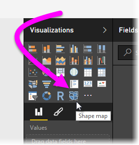

<properties
   pageTitle="在 Power BI Desktop （預覽） 中使用圖形對應"
   description="建立可在 Power BI Desktop 中使用圖形對應區域的相對比較"
   services="powerbi"
   documentationCenter=""
   authors="davidiseminger"
   manager="mblythe"
   backup=""
   editor=""
   tags=""
   qualityFocus="no"
   qualityDate=""/>

<tags
   ms.service="powerbi"
   ms.devlang="NA"
   ms.topic="article"
   ms.tgt_pltfrm="NA"
   ms.workload="powerbi"
   ms.date="10/12/2016"
   ms.author="davidi"/>

# 在 Power BI Desktop （預覽） 中的圖形對應

在 Power BI Desktop，您會建立 **圖案對應** 視覺化地圖上顯示相對比較的區域，將不同的色彩套用至不同的區域。 相對於 **對應** 視覺化， **圖案對應** 無法顯示精確點在地圖上的地理位置資料; 相反地，其主要用途是來著色它們以不同的方式，在地圖上顯示區域的相對比較。

            **圖形對應** 視覺項目以 ESRI/TopoJSON 對應具有吸引人能夠使用自訂的對應，您可以建立，例如地理位置，座位安排、 floor 計劃，以及其他等等。 使用自訂對應的功能不適用於此預覽版本中的 **圖案對應**, ，但此功能時，才會啟用自訂對應來自下一步的 Power BI Desktop 每月更新所預期的預覽。

## 建立圖形對應

您可以測試 **圖案對應** 與對應的控制項，會傳送此預覽版本，或只要它符合呼叫下一節中所述的需求，您可以使用您自己的自訂對應 **使用自訂的對應**。

 **圖案對應** visual 僅供預覽，而且您必須啟用 Power BI Desktop 中。 為已啟用 **圖案對應**, ，請選取 **檔案 > 選項和設定 > 選項 > 預覽功能**, ，然後選取 **圖案對應** 核取方塊。 您必須重新啟動 Power BI Desktop 之後進行選擇。

一次 **圖案對應** 已啟用，按一下 [ **圖案對應** 控制項從 **視覺效果** 窗格。

Power BI Desktop 建立空 **圖案對應** 視覺化設計畫布。

執行下列步驟來建立 **圖案對應**:

1.  在 **欄位** ] 窗格中，區域名稱 （或縮寫） 的資料欄位拖曳到 **位置** 值區，以及資料量值欄位到 **值** （您還不會看到對應） 的值區。

    > 
            **附註︰** 請參閱節 **取得地圖資料**, 底下，如需如何快速取得地圖資料來測試 **圖案對應**。

    

2.  在 **格式** 設定] 窗格中，展開 **圖形**, ，然後選取從 **標準對應** 下拉式清單來顯示您的資料。 此時會呈現出現，如下圖所示。

    

    > 
            **附註︰** 中 **區域金鑰** 這篇文章的最後一節是集合的資料表，可用來測試對應區域索引鍵 **圖案對應** 視覺化。

3.  然後，您可以修改地圖投射和縮放設定，以及資料點的色彩從 **格式** 設定] 窗格中。 您也可以修改縮放設定。 例如，您可以變更色彩、 設定最大值和最小值，並以此類推。

    

4.  您也可以加入至類別資料行 **圖例** 貯體，並分類類別為基礎的地圖區域。

## 使用自訂的對應

您可以使用具有自訂對應 **圖案對應** ，只要它們位於 **TopoJSON** 格式。 如果您的對應是在另一種格式，您可以使用的線上工具例如 [**對應設計師**](http://mapshaper.org/) 轉換您 *形狀檔* 或 *GeoJSON* 會對應到 **TopoJSON** 格式。

若要使用您 **TopoJSON** 檔案對應 ShapeMap 視覺效果加入至報表，將一些資料加入 *位置* 和 *值* 值區。 然後，在 **視覺效果** 窗格 **格式** 區段選取 （小畫家圖示下, 圖中顯示為 (1)），依序展開 **圖形** 區段，然後選取 **+ 加入地圖**。

## 取得地圖資料

若要快速取得資料到模型，因此您可以測試 **圖案對應**, ，就可以複製本文中，結尾的資料表，然後選取 **輸入資料** 從 **首頁** 功能區。

然後您可以將資料表貼入 Power BI Desktop。 上方資料列會自動被視為標頭。

您可以輸入新的資料行，只要輸入新的資料行名稱 （在空白資料行右邊），然後在每個資料格，就像您可以在 Excel 中加入值。 完成時，選取 [ **負載** 和資料表會加入至資料模型的 Power BI Desktop。

## 預覽行為及需求

有幾個考量和需求，此預覽版本的 **圖案對應**:

-    **圖案對應** visual 僅供預覽，而且您必須啟用 Power BI Desktop 中。 為已啟用 **圖案對應**, ，請選取 **檔案 > 選項和設定 > 選項 > 預覽功能**, ，然後選取 **圖案對應** 核取方塊。

-   目前，您也必須擁有 **值** 在順序中設定的值區 **圖例** 分類才能正常運作。 預計會改善這種行為的最終發行版本 **圖案對應**。

-   發行版本 **圖案對應** 都會有使用者介面會顯示對應的索引鍵的目前選取的對應; 在此預覽中，您可以參考下列中找到的資料表中的地圖區域索引鍵 **區域金鑰** 一節。

## 區域索引鍵

使用下列 **區域金鑰** 在此預覽版本，若要測試 **圖案對應**。

### 澳洲︰ 狀態

|id|abbr|iso|名稱|郵遞區號|
|---|---|---|---|---|
|au wa| WA| AU WA|  澳洲西部|  WA|
|au vic|Vic|AU VIC| 維多利亞|   VIC|
|au 工作 |工作|AU 工作|    塔斯馬尼亞    |工作|
|au sa  |SA |AU SA  |南澳大利亞|   SA|
|au qld |Qld|AU QLD |昆士蘭|    QLD|
|au nt  |NT |AU NT  |北半球領域|    NT|
|au nsw |NSW|AU NSW |新南威爾斯|   NSW|
|au act |ACT|AU ACT |澳大利亞首都領土|  ACT|

### 奧地利︰ 狀態

|id|    iso|    名稱|   名稱-en|    郵遞區號|
|---|---|---|---|---|
|在 wi-fi| 在 9|   科技|   維也納| 工作指導|
|在 vo| 在 8|   Vorarlberg| Vorarlberg| VO|
|在 tr| 在 7|   Tirol|  蒂羅爾叛變|  TR|
|在 st| 在 6|   Steiermark| Styria| ST|
|在 sz| 在 5|   Salzburg|   Salzburg|   SZ|
|在 oo| 在 4|   Oberösterreich| 上層奧地利|  OO|
|在無| 在 3|   Niederösterreich|   較低的奧地利|  否|
|在 ka| 在 2|   Kärnten|    Carinthia|  KA|
|在 bu| 在-1|   Burgenland| Burgenland| BU|

### 巴西︰ 狀態

|id|
|---|
|Tocantins
|Pernambuco
|Goias
|Sergipe
|聖保羅
|聖 Catarina
|Roraima
|Rondonia
|Rio 摩卡不要 Sul
|Rio 摩卡不要 Norte
|Rio de Janeiro
|Piaui
|Parana
|Paraiba
|並行
|Minas Gerais
|Mato Grosso
|Maranhao
|Mato Grosso 執行 Sul
|Distrito 聯邦
|Ceara
|Espirito 島
|布
|Amazonas
|Amapa
|Alagoas
|Acre
|訴訟區域 1
|訴訟區域 2
|訴訟區域 3
|訴訟區域 4

### 加拿大︰ 省

|id|    iso |名稱|  郵遞區號|
|---|---|---|---|
|ca nu| CA NU|  努勒維特|    NU|
|ca nt| CA NT|  西北領地|  NT
|ca yt| CA YT|  Yukon|  YT
|ca sk| CA SK|  薩克其萬|   SK
|ca qc| CA QC|  魁北克| QC
|ca pe| CA PE|  王子 Edward 島|   PE
|ca 上| CA ON|  安大略|    ON
|ca ns| CA NS|  斯科 |NS
|ca nl| CA NL|  紐芬蘭和拉布拉多|  NL
|ca nb| CA NB|  New Brunswick| NB
|ca mb| CA MB|  曼尼托巴|   MB
|ca bc| CA BC|  不列顛哥倫比亞省    |BC
|ca ab| CA AB|  目前 |AB

### 法國︰ 區域

|id |名稱|  名稱-en|
|---|---|---|
|Alsace |Alsace|    Alsace
|隆恩 Alpes|   Rhône Alpes|    隆恩 Alpes
|Provence-Alpes-Cote d'Azur|    Provence-Alpes-Côte d'Azur| Provence-Alpes-Cote d'Azur
|Poitou Charentes|  Poitou Charentes|   Poitou Charentes
|Picardie   |Picardie|  Picardy
|支付 de la Loire|  支付 de la Loire|   支付 de la Loire
|Nord Pas de-Calais|    Nord Pas de-Calais| Nord Pas de-Calais
|Midi Pyrenees| Midi Pyrénées|  Midi Pyrenees
|賴|  賴|   賴
|Limousin|  Limousin|   Limousin
|Languedoc Roussillon|  Languedoc Roussillon|   Languedoc Roussillon
|Ile-del-法國|    Île-de-法國|  Ile-de-France
|Haute Normandie|   Haute Normandie|    上限同時
|Franche-Comte| Franche Comté|  Franche-Comte
|函式庫| 函式庫|  科西嘉島
|上香檳 Ardenne| 上香檳 Ardenne|  上香檳 Ardenne
|中心 Val de Loire|   中心 Val de Loire|    中心 Val de Loire
|Bretagne|  Bretagne|   Brittany
|Bourgogne| Bourgogne|  勃
|Basse Normandie|   Basse Normandie|    較低的同時
|Auvergne|  Auvergne|   Auvergne
|Aquitaine| Aquitaine|  Aquitaine

### 德國︰ 狀態

|id|    iso|    名稱|   名稱-en|    郵遞區號
|---|---|---|---|---|
|de-是| DE-是|  柏林| 柏林| 是
|de th| DE TH|  Thüringen|  Thuringia|  TH
|de st| DE ST|  Sachsen Anhalt| 克遜 Anhalt|  ST
|de sn| DE SN|  Sachsen |克遜|    SN
|de mv| DE MV|  Mecklenburg Vorpommern| Mecklenburg Vorpommern| MV
|de bb| DE BB|  布蘭登 |布蘭登|   BB
|de-sh| DE-SH|  Schleswig Holstein| Schleswig Holstein| SH
|de sl| DE SL|  Saarland|   Saarland|   SL
|de rp| DE RP|  Rheinland Pfalz|    Rhineland Palatinate|   RP
|de nw| DE NW|  Nordrhein Westfalen|    北歐萊茵 Westphalia| NW
|de ni| DE NI|  Niedersachsen|  較低的克遜|   NI
|de 他| DE 他|  Hessen| Hesse|  他
|de hh| DE HH|  Hamburg|    Hamburg|    HH
|de hb| DE HB|  Bremen| Bremen| HB
|de-由| DE-由|  Bayern| 巴伐利亞|    由
|de bw| DE BW|  巴登 Württemberg|  巴登 Wurttemberg|  BW

### 愛爾蘭︰ 郡

|id|
|---|
|Wicklow
|Wexford
|Westmeath
|Waterford
|Sligo
|Tipperary
|Roscommon
|Offaly
|Monaghan
|Meath
|Mayo
|Louth
|Longford
|Limerick
|Leitrim
|Laoighis
|Kilkenny
|Kildare
|Kerry
|Galway
|都柏林
|Donegal
|軟木
|Clare
|Cavan
|Carlow

### 義大利︰ 區域

|id|iso|名稱|名稱-en|郵遞區號|
|---|---|---|---|---|
|it vn| IT 34|  Veneto| Veneto| VN
|it vd| IT 23|  耶 d'Aosta|  Aosta 矽谷|   VD
|it um| IT 55|  翁布里| 翁布里| UM
|it tt| IT 32|  Trentino Alto Adige|    Trentino 南部蒂羅爾叛變|   TT
|it tc| IT 52|  Toscana|    塔斯卡尼|    TC
|it sc| IT 82|  Sicilia|    西西里島| SC
|it sd| IT 88|  Sardegna|   Sardinia|   SD
|it pm| IT 21|  Piemonte|   蒙特|   PM
|it ml| IT 67|  Molise| Molise| ML
|it mh| IT-57|  Marche| Marche| MH
|it lm| IT 25|  Lombardia|  倫巴底|   LM
|it lg| IT 42|  Liguria|    Liguria|    LG
|it lz| IT 62|  Lazio|  Lazio|  LZ
|it fv| IT 36|  Friuli-Venezia Giulia|  Friuli-Venezia Giulia|  FV
|它-e| IT 45|  Emilia-Romagna| Emilia-Romagna| ER
|it cm| IT 72|  坎佩尼亞|   坎佩尼亞|   CM
|it lb| IT 78|  Calabria|   Calabria|   LB
|it bc| IT 77|  Basilicata| Basilicata| BC
|it pu| IT 75|  Apulia| Puglia| PU
|it ab| IT 65|  Abruzzo|    Abruzzo|    AB

### 墨西哥︰ 狀態

|id|    abreviatura|    iso|    名稱|   名稱-en|    郵遞區號|
|---|---|---|---|---|---|
|mx zac|    Zac。|   MX ZAC| Zacatecas|  Zacatecas|  ZA
|mx yuc|    Yuc。|   MX YUC| Yucatán|    尤卡坦|    YU
|mx ver|    Ver.|   MX VER| Veracruz|   Veracruz|   V
|mx tla|    Tlax。|  MX TLA| 斯卡拉|   斯卡拉|   TL
|mx tam|    Tamps。| MX TAM| Tamaulipas| Tamaulipas| TM
|mx] 索引標籤|    索引標籤。|   MX] 索引標籤| 塔瓦斯科|    塔瓦斯科|    TB
|mx son|    兒子。|   MX SON| [艷陽天]| [艷陽天]| 因此
|mx sin|    Sin。|   MX SIN| Sinaloa|    Sinaloa|    SI
|mx slp|    S.L.P.| MX SLP| San Luis Potosí|    San Luis Potosi|    SL
|mx roo|    Q.R.|   MX ROO| Quintana Roo|   Quintana Roo|   QR
|mx 佇列|    Qro。|   MX 佇列| Querétaro|  Queretaro|  QE
|mx pue|    Pue。|   MX PUE| Puebla| Puebla| PU
|mx oax|    Oax。|   MX OAX| Oaxaca| Oaxaca| OA
|mx nle|    N.L.|   MX NLE| 祕世| 祕 Leon| NL
|mx 雅倫|    雅倫。|   MX 雅倫| Nayarit|    Nayarit|    NA
|mx 程式|    Mor.|   MX 程式| Morelos|    Morelos|    MR
|mx mic|    Mich.|  MX MIC| Michoacán|  Michoacan|  MC
|mx mex|    Méx。|   MX MEX| Estado de México|   墨西哥狀態|   MX
|mx jal|    Jal。|   MX JAL| Jalisco|    Jalisco|    JA
|mx hid|    Hgo。|   MX HID| Hidalgo|    Hidalgo|    HI
|mx 群組|    群組|   MX 群組| Guerrero|   Guerrero|   GR
|mx gua|    Gto。|   MX GUA| Guanajuato| Guanajuato| GT
|mx 工期|    Dgo。|   MX 工期| Durango|    Durango|    DU
|mx 差異|    欄。|   MX 差異| Ciudad de México|   墨西哥城|    自由度
|mx 欄|    Coah。|  MX 欄| Chiapas| Chiapas| CL
|mx 真品證明書|    Chis。|  MX 真品證明書| Coahuila|   Coahuila|   CA
|mx chh|    Chih。|  MX CHH| 齊驊華|  齊驊華|  CH
|mx 香港特別行政區中文|    CDMX。|  MX 香港特別行政區中文| Chiapas|    Chiapas|    CP
|mx 攝影機|    訓練營。|  MX 攝影機| Campeche|   Campeche|   CM
|mx bcs|    B.C.S.| MX BCS| 墨西哥加州 Sur|    墨西哥加州 Sur|    BS
|mx bcn|    B.C.|   MX BCN| 墨西哥加州|    墨西哥加州|    BN
|mx agu|    Ag。|   MX AGU| Aguascalientes| Aguascalientes| AG

### 荷蘭︰ 省

|id|    iso|    名稱|   名稱-en|
|---|---|---|---|
|nl 和| NL 和|  Zuid 荷蘭|   南部荷蘭
|nl z| NL Z|  Zeeland|    Zeeland
|nl ut| NL UT|  Utrecht|    Utrecht
|nl 動作| NL 動作|  Overijssel| Overijssel
|nl nh| NL NH|  北荷蘭|  北歐荷蘭
|nl nb| NL NB|  北 Brabant|  北歐 Brabant
|nl l| NL L|  Limburg|    Limburg
|nl gr| NL GR|  Groningen|  Groningen
|nl ge| NL GE|  Gelderland| Gelderland
|nl-fr| NL-FR|  Fryslân|    Friesland
|nl 奧蘭多市| NL 奧蘭多市|  Flevoland|  Flevoland
|nl dr| NL DR|  Drenthe|    Drenthe

### 英國︰ 國家 （地區)

|id|    iso|    名稱|
|---|---|---|
|gb wls|    GB WLS| Wales
|gb sct|    GB SCT| 蘇格蘭
|gb nir|    GB NIR| 北馬愛爾蘭
|gb eng|    GB ENG| 英國

### 美國︰ 狀態

|id|    名稱|   郵遞區號|
|---|---|---|
|我們英哩| 密西根|   MI
|我們-ak| 阿拉斯加| AK
|我們為大家| 夏威夷| HI
|我們-佛羅里達州| 佛羅里達州|    FL
|我們-la| 路易斯安那州|  洛杉磯
|我們-ar| Arkansas|   AR
|我們-sc| South Carolina| SC
|我們-ga| 喬治亞|    GA
|我們 ms| 密西西比|    MS
|我們-al| 算是|    AL
|我們-nm| 新墨西哥州| NM
|我們 tx| 德州|  TX
|我們-tn| 美國|  TN
|我們的 nc| 北卡羅來那州| NC
|我們的 [確定]| Oklahoma|   [確定]
|我們-az| 亞歷桑那|    AZ
|我們慢動作| 密蘇里州|   MO
|我們-va| 維吉尼亞州|   VA
|我們-市| Kansas| 市
|我們-ky| 肯塔基州|   KY
|我們的 co| Colorado|   CO
|我們-md| Maryland|   MD
|我們-wv| 西維吉尼亞州|  WV
|我們-de| Delaware|   DE
|我們 dc| District of Columbia|   DC
|我們的 il| 伊利諾|   IL
|我們-喔| 俄亥俄州|   喔
|我們 ca| 加州| CA
|我們-ut| 猶他州|   UT
|我們-內華達州拉斯維加斯| Nevada| 內華達州拉斯維加斯
|我們單元| 印第安納|    IN
|我們-nj| 紐澤西州| NJ
|我們-ri| 羅德島|   RI
|我們-ct| Connecticut|    CT
|我們-pa| 賓州|   PA
|我們-ny| New York|   NY
|我們-ne| 送到內布拉斯加|   NE
|我們的 ma| 麻州|  MA
|我們-ia| 愛荷華州|   IA
|我們-nh| 新罕布夏州|  NH
|我們-或| 奧勒崗| 或
|我們-mn| 明尼蘇達|  MN
|我們-vt| Vermont|    VT
|我們識別碼| 更改為 Idaho|  ID
|我們的指導| 威斯康辛|  工作指導
|我們-wy| Wyoming|    WY
|我們-sd| 南達科他|   SD
|我們-nd| 北達科他|   ND
|我們-我| Maine|  我
|我們-mt| Montana|    MT
|我們-wa| 華盛頓| WA
