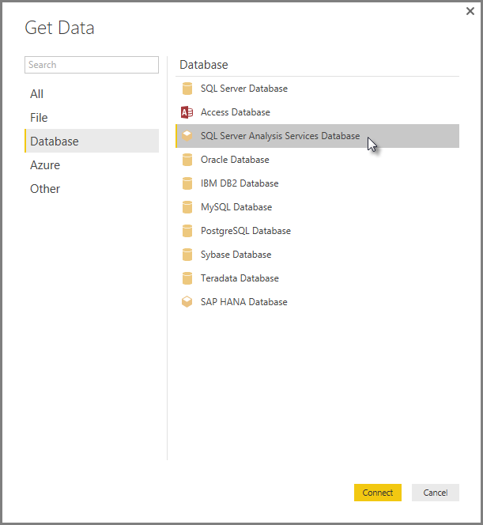

<properties
   pageTitle="Power BI Desktop 中的 analysis Services 多維度資料"
   description="Power BI Desktop 中的 analysis Services 多維度資料"
   services="powerbi"
   documentationCenter=""
   authors="davidiseminger"
   manager="mblythe"
   backup=""
   editor=""
   tags=""
   qualityFocus="no"
   qualityDate=""/>

<tags
   ms.service="powerbi"
   ms.devlang="NA"
   ms.topic="article"
   ms.tgt_pltfrm="NA"
   ms.workload="powerbi"
   ms.date="10/12/2016"
   ms.author="davidi"/>

# 連接到 SSAS 多維度模型 Power BI Desktop 中  

您可以使用 Power BI Desktop，存取 **SSAS 多維度模型**, ，通常稱為 **SSAS MD**。

若要連接到 **SSAS MD** 資料庫，請選取 **取得資料 &gt; 資料庫 &gt; SQL Server Analysis Services 資料庫** 如下圖所示。

            **SSAS 多維度模型** 即時連接模式會在 Power BI 服務和支援 Power BI Desktop。 您也可以發行，並將使用的報表上傳 **SSAS 多維度模型** Power BI 服務的即時模式中。

## 功能的 SSAS MD
下列章節說明特性與功能的 Power BI 和 SSAS MD 連線。

### 多維度模型的表格式中繼資料
下表顯示多維度物件與表格式中繼資料傳回至 Power BI Desktop 之間的對應。 Power BI 查詢模型以取得表格式中繼資料，並根據傳回的中繼資料的 Analysis Services 建立視覺效果，例如資料表、 矩陣、 圖表或交叉分析篩選器時執行適當 DAX 查詢。

|BISM Multidimentional 物件 |表格式中繼資料|
|---|---|
|Cube|型號 |
|Cube 維度 | 資料表 |
|維度的屬性 （索引鍵） 名稱） | 資料行  |
|量值群組 | 資料表|
|量值 | 量值 |
|不含相關聯的量值群組的量值 | 一個資料表內 *量值*|
|量值群組]-> [Cube 維度關聯性 | Relationship |
|檢視方塊 | 檢視方塊|
|KPI | KPI |
|使用者/父子式階層 | 階層架構 |

### 量值、 量值群組和 Kpi
多維度 cube 中的量值群組會在 Power BI 中含 ∑ 符號旁邊中的資料表以 **欄位** 窗格。 導出量值沒有相關聯的量值群組之下稱為的特殊資料表 *量值* 表格式中繼資料中。

在多維度模型中，您可以定義在中找到的 cube 中一組量值或 Kpi *顯示資料夾*, ，有助於簡化複雜的模型。 Power BI 會辨識在表格式中繼資料，顯示資料夾，並顯示顯示資料夾中的量值和 Kpi。 在多維度資料庫支援的 Kpi *值*, ，*目標*, ，*狀態圖形* 和 *趨勢圖形*。

### 維度屬性類型
多維度模型也支援維度屬性與特定維度屬性類型產生關聯。 例如， **Geography** 維度中 *縣 （市)*, ，*縣市*, ，*國家/地區* 和 *郵遞區號* 維度屬性都有與其相關聯的型別會公開在表格式中繼資料的適當地理位置。 Power BI 會辨識中繼資料，讓您可以建立地圖視覺效果。 認得的這些關聯 *對應* 中的項目旁邊的圖示 **欄位** Power BI 中的窗格。

當您提供包含影像的 Url （統一資源定位器） 的欄位，power BI 也可以呈現影像。 您可以指定這些欄位為 *ImageURL* 型別在 SQL Server Data Tools （或後續 Power BI 中） 和其型別資訊提供給 Power BI 表格式中繼資料中。 Power BI 然後可以從 URL 擷取這些映像，並以視覺方式顯示它們。

### 父子式階層
多維度模型支援父子式階層，會顯示為 *階層* 表格式中繼資料中。 父子式階層的每個層級會公開表格式中繼資料中的隱藏資料行。 父子式維度的索引鍵屬性不會公開在表格式中繼資料。

### 維度導出的成員
多維度模型支援建立各種類型的 *導出成員*。 兩個最常見的導出成員的類型如下所示︰

-   導出成員屬性階層和非同層級的 *所有*
-   使用者階層導出的成員

多維度模型公開 *導出成員屬性階層上的* 做為資料行的值。 有幾個其他選項和條件約束同時公開這類型的導出成員︰
-   維度屬性能擁有選用的 *UnknownMember*
-   包含導出的成員屬性不能為維度的索引鍵屬性，除非它是唯一的維度屬性
-   包含導出的成員的屬性不可以是父子式屬性

使用者階層導出的成員不會顯示在 Power BI。 相反地，您將能夠連接到包含使用者階層導出的成員的 cube，但是您將無法看到導出的成員，如果不符合上述項目符號清單中所述的條件約束。

### 安全性
多維度模型支援維度和資料格層級的安全性，透過 *角色*。 當您連接到 cube 中包含 Power BI 時，您會驗證並評估以進行適當的權限。 當使用者具有 *維度安全性* 套用，個別的維度成員不會看到被 Power BI 中的使用者。 不過，當使用者具有 *資料格安全性* 定義權限，其中某些資料格為限制，則該使用者無法連接到 cube 中使用 Power BI。

## 在 Power BI Desktop SSAS 多維度模型的限制
若要使用的某些限制 **SSAS MD**:

-   伺服器必須執行 SQL Server 2012 SP1 CU4 或更新版本的 Analysis Services Power BI Desktop SSAS MD 連接器才能正常運作
-   資料格層級的格式，並轉譯功能不支援這一版的 SSAS 好 在即將發行的 Power BI Desktop 將會啟用這些功能。
-   
            *動作* 和 *命名集* 不會公開至 Power BI，但您仍然可以連接到 cube，也包含 *動作* 或 *命名集* 建立視覺效果和報告。

此外，如先前所述您就無法建立與此版本的報表發佈 **SSAS MD** Power BI 服務。

## 在 Power BI Desktop SSAS MD 的支援的功能
在 Power BI Desktop 支援 SSAS MD 的下列功能︰

-   在此版本中支援使用下列項目 **SSAS MD** (您可以取得 [的詳細資訊](https://msdn.microsoft.com/library/jj969574.aspx) 有關這些功能):
    - 顯示資料夾
    - KPI 趨勢
    - 預設成員
    - 維度屬性
    - 維度導出成員 (必須是單一真實成員，當維度有一個以上的屬性時，它不能維度的索引鍵屬性，除非它是唯一的屬性，而且它不能是父子式屬性)
    - 維度屬性類型
    - 階層架構
    - 量值 （不論有無量值群組）
    - 量值做為變化
    - KPI
    - ImageUrls
    - 維度安全性
