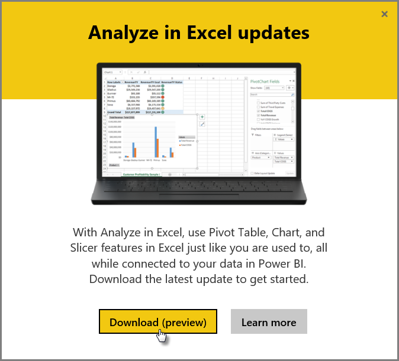
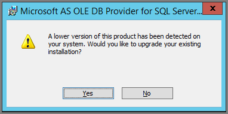

<properties
   pageTitle="疑難排解在 Excel 中分析"
   description="在 Excel 中進行分析的常見問題的解決方案"
   services="powerbi"
   documentationCenter=""
   authors="davidiseminger"
   manager="mblythe"
   backup=""
   editor=""
   tags=""
   qualityFocus=""
   qualityDate=""/>

<tags
   ms.service="powerbi"
   ms.devlang="NA"
   ms.topic="article"
   ms.tgt_pltfrm="NA"
   ms.workload="powerbi"
   ms.date="09/27/2016"
   ms.author="davidi"/>

# 疑難排解在 Excel 中分析

有時候可能會使用在您收到非預期的結果或功能的 Excel 中進行分析時無法運作的如您預期般。 使用 [在 Excel 中進行分析時，此頁面會提供解決方案的常見問題。

> 
            **注意︰** 沒有專門用來描述及啟用的個別頁面 [在 Excel 中的進行分析](powerbi-service-analyze-in-excel.md)。

> 如果您遇到未列出，以下的案例，而且它會造成問題，您可以尋求進一步協助上 [社群網站](http://community.powerbi.com/), ，或者您可以建立 [支援票證](https://powerbi.microsoft.com/support/)。

本文包含下列的疑難排解章節︰

-   更新的 OLE DB 提供者的 Excel 文件庫
-   判斷是否需要更新您的 Excel 文件庫
-   無法連接錯誤
-   禁止的錯誤
-   沒有資料模型
-   權杖過期的錯誤
-   無法存取內部部署 Analysis services
-   無法將任何項目拖曳到樞紐分析表值區域 （沒有任何量值）

## 更新的 OLE DB 提供者的 Excel 文件庫
若要使用 **在 Excel 中的進行分析**, ，電腦必須已安裝目前的 OLE DB 提供者。 這 [社群文章](http://community.powerbi.com/t5/Service/Analyze-in-Excel-Initialization-of-the-data-source-failed/m-p/30837#M8081) 是確認您的安裝的 OLE DB 提供者，或下載最新版本的絕佳來源。

Excel 文件庫必須符合您的 Windows 版本以其位元層級。 如果您有 64 位元 Windows 安裝，您需要安裝 64 位元 OLE DB 提供者。

若要下載最新的 Excel 文件庫，請瀏覽 Power BI，然後選取 **向下箭號** 右上角的 Power BI 服務，然後選取 **在更新 Excel 中的進行分析**。

在出現的對話方塊，選取 **下載 （預覽）**。

## 判斷是否需要更新您的 Excel 文件庫
您可以從上一節中的連結下載最新版的 Excel OLE DB 提供者程式庫。 一旦您下載適當的舊資料提供者程式庫，並開始安裝，針對您目前安裝的版本會進行檢查。

如果 Excel OLE DB 提供者用戶端程式庫是最新狀態，將會看到一個對話方塊，如下所示︰

C:\Users\davidi\Desktop\powerbi-content-pr\articles\media\powerbi-desktop-troubleshooting-analyze-in-excel

或者，如果您要安裝新的版本比您的電腦上的版本還新，會出現下列對話方塊︰

如果您看到的對話方塊，提示您升級時，您應該繼續進行安裝，以取得最新版本在電腦上安裝的 OLE DB 提供者。

## 無法連接錯誤
主要原因 *無法連接* 錯誤是電腦的 OLE DB 提供者用戶端程式庫不是最新。 如需有關如何判斷正確的更新資訊和下載連結，請參閱 **更新 Excel 文件庫的 OLE DB 提供者** 稍早在本文。

## 禁止的錯誤
有些使用者擁有多個 Power BI 帳戶，而且當 Excel 會嘗試連接到 Power BI 使用現有的認證，它可能會使用不需要存取資料集或您想要存取的報表的認證。

當發生這種情況時，您可能會收到錯誤標題為 **禁止**, ，這表示您可能要登入 Power BI 並沒有資料集的權限的認證。 在發生後 **禁止** 錯誤，當系統提示您輸入認證，使用有權存取您想要使用的資料集的認證。

如果您仍然遇到錯誤，以有權限的帳戶登入 Power BI，並確認您可以檢視並存取您嘗試存取在 Excel 中的 Power BI 中的資料集。

## 沒有資料模型
如果您遇到錯誤指出 **找不到 OLAP cube 模型**, ，則您正嘗試存取的資料集不包含資料模型，並因此無法在 Excel 中分析。

## 權杖過期的錯誤
如果您收到 **權杖過期** 錯誤，就表示您最近未曾使用 **在 Excel 中的進行分析** 所使用的電腦上的功能。 只需重新輸入您的認證，或重新開啟檔案，以及錯誤應該會消失。

## 無法存取內部部署 Analysis Services
如果您正嘗試存取已連線到內部部署 Analysis Services 資料的資料集，您可能會收到錯誤訊息。 
            **在 Excel 中分析** 支援連接至資料集和報表上的內部 **Analysis Services** 使用連接字串，只要您的電腦位於相同的網域 **Analysis Services** 伺服器和您的帳戶具有存取權， **Analysis Services** 伺服器。

目前不支援內部部署 Analysis Services 連接。

## 無法將任何項目拖曳到樞紐分析表值區域 （沒有任何量值）

當 **在 Excel 中的進行分析** 會連接到外部 OLAP 模型 （這是 Excel 連接到 Power BI 的方式）， *樞紐分析表* [需要 **量值** 外部模型中定義](https://support.microsoft.com/kb/234700), ，因為伺服器上執行所有的計算。 這是當您使用本機資料來源的不同 (例如在 Excel 中，或您正在使用中的資料集的資料表 **Power BI Desktop** 或 **Power BI 服務**)，在此情況下表格式模型可以使用在本機和 [您可以使用隱含量值](https://msdn.microsoft.com/library/gg399077.aspx), ，這是動態產生，並不會儲存在資料模型的量值。 在這些情況下，在 Excel 中的行為是不同的行為 **Power BI Desktop** 或 **Power BI 服務**︰ 有可能是資料行的資料可視為 Power BI 中的量值，但不能在 Excel 中的值 （量值）。

若要解決此問題，您有幾個選項︰

1.  建立 [中您的資料模型中的量值 **Power BI Desktop**](powerbi-desktop-tutorial-create-measures.md), ，然後將資料模型，以發行 **Power BI 服務** 及發行從 Excel 的資料集的存取。
2.  建立 [從 Excel PowerPivot 資料模型中的量值](https://support.office.com/article/Create-a-Measure-in-Power-Pivot-d3cc1495-b4e5-48e7-ba98-163022a71198)。
3.  如果您匯入資料從 Excel 活頁簿具有僅資料表 （和任何資料模型），那麼您可以 [將資料表加入至資料模型](https://support.office.com/article/Add-worksheet-data-to-a-Data-Model-using-a-linked-table-d3665fc3-99b0-479d-ba09-a37640f5be42), ，然後遵循選項 2︰ 正上方，建立資料模型中的量值。

一旦您的量值定義之模型的 Power BI 服務中，您就能夠使用它們 **值** Excel 樞紐分析表的區域。

## 另請參閱  

[在 Excel 中分析](powerbi-service-analyze-in-excel.md)

[教學課程︰ 在 Power BI Desktop 中建立您自己的量值](powerbi-desktop-tutorial-create-measures.md)

[在 PowerPivot 中的量值](https://msdn.microsoft.com/library/gg399077.aspx)

[在 PowerPivot 中建立量值](https://support.office.com/article/Create-a-Measure-in-Power-Pivot-d3cc1495-b4e5-48e7-ba98-163022a71198)

[使用連結的資料表的資料模型中加入工作表資料](https://support.office.com/article/Add-worksheet-data-to-a-Data-Model-using-a-linked-table-d3665fc3-99b0-479d-ba09-a37640f5be42)

[Excel 中 OLAP 和非-OLAP 樞紐分析表之間的差異](https://support.microsoft.com/kb/234700)
