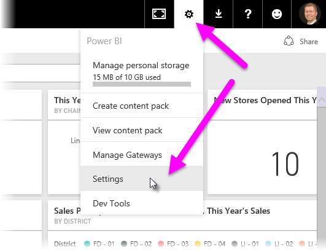
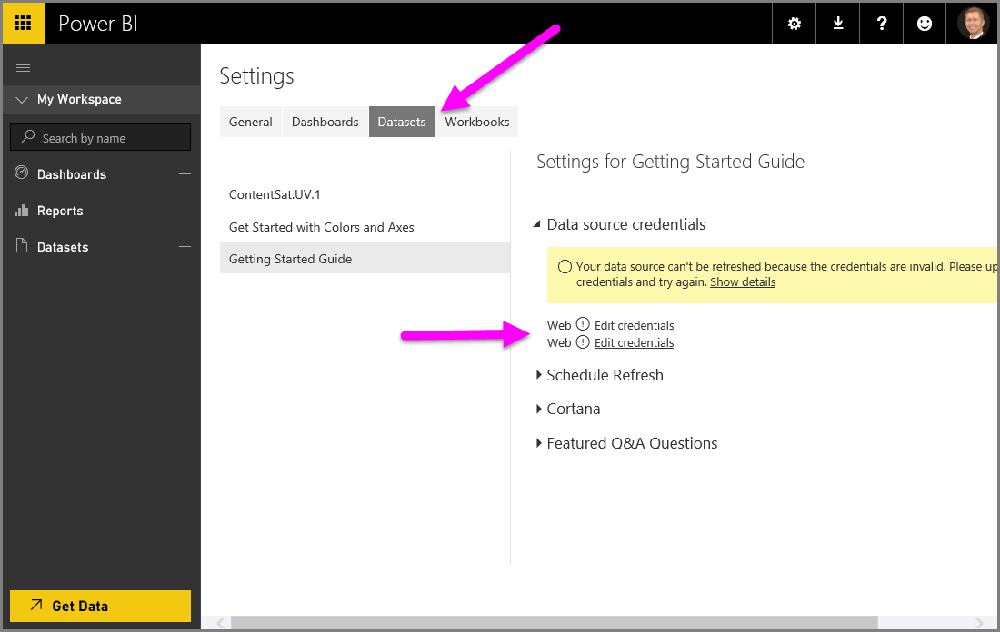

<properties
   pageTitle="在 Power BI Desktop 中使用 DirectQuery"
   description="在 Power BI Desktop 中使用 DirectQuery"
   services="powerbi"
   documentationCenter=""
   authors="davidiseminger"
   manager="mblythe"
   backup=""
   editor=""
   tags=""
   qualityFocus="no"
   qualityDate=""/>

<tags
   ms.service="powerbi"
   ms.devlang="NA"
   ms.topic="article"
   ms.tgt_pltfrm="NA"
   ms.workload="powerbi"
   ms.date="09/29/2016"
   ms.author="davidi"/>

# 在 Power BI Desktop 中使用 DirectQuery  

使用 Power BI Desktop，當您連接到資料來源，可能經常會將一份資料匯入 Power BI Desktop。 對於某些資料來源，可用的替代方式是︰ 直接連接到資料來源使用 **DirectQuery**。

## 支援的資料來源  
目前支援下列資料來源：  

-   SQL Server
-   Azure SQL 資料庫
-   Azure SQL 資料倉儲
-   [SAP HANA](powerbi-desktop-sap-hana.md)
-   [Oracle 資料庫](powerbi-desktop-directquery-for-oracle-teradata.md)
-   [Teradata 資料庫](powerbi-desktop-directquery-for-oracle-teradata.md)
-   [Amazon Redshift （預覽）](powerbi-desktop-connect-redshift.md)
-   [Impala （預覽）](powerbi-desktop-connect-impala.md)

## 如何使用 DirectQuery 連接  
當您使用 **取得資料** 連接到資料來源所支援 **DirectQuery**, ，[連線] 視窗可讓您選取您要連接的方式。  

選取的差異 **匯入** 和 **DirectQuery** 如下所示︰

            **匯入** – 選取的資料表和資料行匯入至 Power BI Desktop。 當您建立或視覺效果與互動，Power BI Desktop 將會使用匯入的資料。 您必須重新整理資料，會匯入至完整的資料集，查看自初始匯入] 或 [最新的重新整理基礎資料發生的任何變更。

            **DirectQuery** – 匯入或複製到 Power BI Desktop 任何資料。 選取的資料表和資料行出現在您的 Power BI Desktop **欄位** 清單。 當您建立或視覺效果與互動，Power BI Desktop 查詢基礎資料來源，這表示您永遠檢視目前的資料。

許多的資料模型和資料轉換時，可以使用使用 **DirectQuery**, ，但有一些限制。 在建立或視覺效果與互動，來查詢基礎來源和重新整理視覺效果所需的時間會視基礎資料來源的效能。 最近已要求服務要求時所需的資料，當 Power BI Desktop 會使用新的資料來減少顯示的視覺效果所需的時間。 選取 **重新整理** 從 **首頁** 功能區可確保所有視覺效果會以目前的資料重新整理。

使用時，請參閱下列各節，如需有關的優點、 限制和重要考量 **DirectQuery**。

## 使用 DirectQuery 的優點  
有兩個主要的好處，使用 **DirectQuery**:

-   
            **DirectQuery** 可讓您建立視覺效果的地方，否則會有可行，第一次匯入的非常大型資料集上的所有資料

-   基礎資料變更可能需要重新整理的資料，因此對於某些報表中，如果需要顯示目前的資料可能需要大型資料傳輸，進行重新匯入資料的緣故。 相較之下， **DirectQuery** 報表一律會使用目前的資料

## DirectQuery 的限制
目前有一些限制使用 **DirectQuery**:

-   所有資料表都必須都來自單一資料庫

-   如果 **查詢編輯器** 查詢是過於複雜，會發生錯誤。 若要修正的錯誤，您必須是刪除問題的步驟中 **查詢編輯器**, ，或 *匯入* 資料，而不要使用 **DirectQuery**

-   關聯性篩選僅限於單一方向，而不是兩個方向

-   時間智慧功能不適用於 **DirectQuery**。 例如，日期資料行 （年、 季、 月、 日等等） 的特殊處理不支援在 **DirectQuery** 模式。

-   根據預設，限制會放在 DAX 運算式中的量值; 允許請參閱下列段落，如需詳細資訊

-   傳回資料時使用 1 百萬個資料列限制 **DirectQuery**。 這不會影響彙總或計算用來建立使用傳回的資料集 **DirectQuery**, ，傳回的資料列。 比方說，您可以使用您在資料來源執行的查詢彙總 10 萬個資料列，並準確的結果傳回該彙總的 Power BI 使用 **DirectQuery** Power BI，只要傳回的資料為小於 1 百萬個資料列。 如果超過 1 百萬個資料列則會傳回從 **DirectQuery**, ，Power BI 會傳回錯誤。

為了確保傳送至基礎資料來源的查詢都可接受的效能，限制所加諸於量值預設。 進階的使用者可以選擇略過這項限制，藉由選取 **檔案 > 選項** 然後 **設定 > 選項 > DirectQuery**, ，然後選取選項 *允許不受限制的量值在 DirectQuery 模式下**。 選取該選項時，可以使用適用於量值的任何 DAX 運算式。 不過，使用者必須知道，匯入資料時很好執行的某些運算式可能會導致緩慢的查詢在 DirectQuery 模式中的後端來源。

## 使用 DirectQuery 時的重要考量

下列三個點應該列入考量時使用 **DirectQuery**:

-   
            **效能和負載** - **DirectQuery** 要求傳送到來源資料庫，因此若要重新整理視覺效果所需的時間是取決於該後端來源的時間來回應查詢 （或） 查詢的結果。 建議的回應時間 （以傳回要求的資料） 使用 **DirectQuery** 的視覺效果為五秒或更少，最多建議結果回應時間為 30 秒。 並使用報表的使用者經驗變得實在不佳。 此外，一旦報表發行至 Power BI 服務時，任何查詢，會超過幾分鐘的時間會逾時，和使用者會收到錯誤。

    來源資料庫上的負載也必須考量，會使用已發行的報表的 Power BI 使用者數目為基礎。 使用 *資料列層級安全性* (RLS) 可以有很顯著的影響; 非 RLS 儀表板] 磚中單一資料庫查詢的多個使用者結果共用但磚的重新整理需要使用一個查詢使用 RLS 的儀表板] 磚時，通常表示 *每位使用者*, ，因而大幅增加來源資料庫上的負載，可能會影響到效能。

    Power BI 建立盡可能有效率的查詢。 在某些情況下不過，產生的查詢可能無法夠有效率，若要避免此重新整理將會失敗。 這種情況的其中一個範例時，產生的查詢會擷取極大量的資料列 （超過 1 百萬個） 資料來源的後端，下列的錯誤情況下會發生︰

        The resultset of a query to external data source has exceeded
        the maximum allowed size of '1000000' rows.

    簡單的圖表，其中包含彙總選項設為非常高基數的資料行，可能會發生這種情況下 *不總結*。 視覺效果必須只能有 1 百萬下方基數的資料行，或必須具有適當的篩選器套用。

-   
            **安全性** -所有使用者都使用已發行的報表都連接到後端資料來源使用 Power BI 服務發行集之後輸入的認證。 這是同樣的情況下，為已匯入資料︰ 所有使用者都看到相同的資料，無論任何後端來源中所定義的安全性規則。

-   
            **支援的功能** -中的並非所有功能 **Power BI Desktop** 支援 **DirectQuery** 模式中，或有一些限制。 此外，還有一些功能在 Power BI 服務 (例如 *快速 Insights*)，並不適用於資料集使用 **DirectQuery**。 這樣一來，當使用這類功能的限制 **DirectQuery** 決定是否要使用時應該納入考量 **DirectQuery**。   

## 發行至 Power BI 服務
建立的報表使用 **DirectQuery** 可以發行至 Power BI 服務。

如果使用的資料來源是 **Azure SQL Database** 或 **Azure SQL 資料倉儲**, ，必須提供認證，才能讓已發行的報表會顯示在 Power BI 服務。

您可以提供認證，藉由選取 **設定** 齒輪 Power BI 中的圖示，然後選取 [ **設定**。

Power BI 顯示 **設定** 視窗。 從該處選取 **資料集** 索引標籤，然後選擇 [使用資料集 **DirectQuery**, ，然後選取 **編輯認證**。

提供認證，直到開啟已發行的報表，或探索與建立資料集 **DirectQuery** 連線 **Azure SQL Database** 或 **Azure SQL 資料倉儲** 會產生錯誤。

資料來源以外的其他 **Azure SQL Database** 或 **Azure SQL 資料倉儲** 使用 DirectQuery，並必須安裝企業閘道，而且必須註冊資料來源建立資料連線。 您可以 [深入了解企業閘道](http://go.microsoft.com/fwlink/p/?LinkID=627094)。
