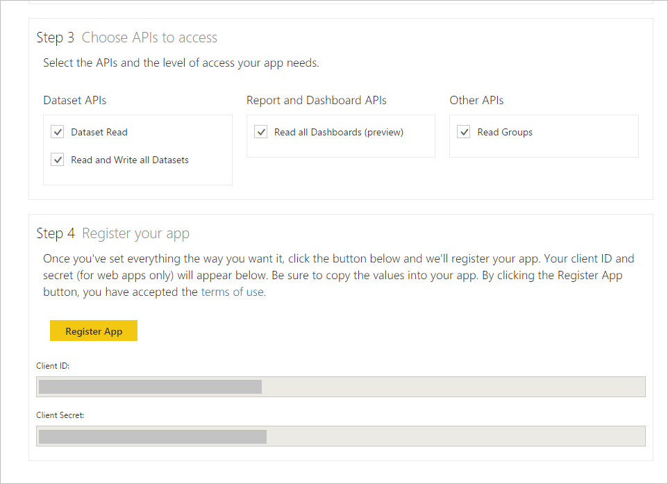

<properties
   pageTitle="註冊用戶端應用程式"
   description="註冊用戶端應用程式"
   services="powerbi"
   documentationCenter=""
   authors="guyinacube"
   manager="mblythe"
   backup=""
   editor=""
   tags=""
   qualityFocus="no"
   qualityDate=""/>

<tags
   ms.service="powerbi"
   ms.devlang="NA"
   ms.topic="article"
   ms.tgt_pltfrm="NA"
   ms.workload="powerbi"
   ms.date="08/23/2016"
   ms.author="asaxton"/>

# 註冊用戶端應用程式

本文將說明如何註冊 Power BI 用戶端應用程式中的 **Azure Active Directory (Azure AD)**。 您要允許 Power BI REST API 應用程式存取 Azure AD 註冊用戶端應用程式。 這可讓您建立您的應用程式的身分識別，並指定 Power BI REST 資源的權限。 如需 Power BI 權限，請參閱 [Power BI 權限](powerbi-developer-power-bi-permissions.md)。

            **重要** 註冊 Power BI 應用程式，您需要先 [Azure Active Directory 租用戶和組織使用者](powerbi-developer-create-an-azure-active-directory-tenant.md), ，和 [Power BI 服務帳戶](powerbi-developer-sign-up-for-power-bi-service.md)。

有兩種方式註冊用戶端應用程式︰ 使用 Power BI 應用程式註冊工具或 Azure 管理入口網站上。 Power BI 應用程式註冊工具是最簡單的選項，因為有幾個欄位來填入。 如果您想要變更您的應用程式，這可以透過 Azure 管理入口網站。

### 本文內容

- [使用 Power BI 應用程式註冊工具註冊用戶端應用程式](#clientTool)
- [使用 Azure 管理入口網站中註冊用戶端應用程式](#client)
- [如何在 Azure 管理入口網站取得的用戶端識別碼](#clientID)

## 使用 Power BI 應用程式註冊工具註冊用戶端應用程式
您必須註冊用戶端應用程式中的 **Azure Active Directory** 來建立您的應用程式的身分識別並指定 Power BI REST 資源的權限。 當您註冊的用戶端應用程式，例如主控台應用程式，您收到 **用戶端識別碼**。   **用戶端識別碼** 應用程式用於向要求權限的使用者識別自己。
以下是如何使用 Power BI 應用程式註冊工具註冊用戶端應用程式︰

1.  請移至 dev.powerbi.com/apps。
2.  在 Power BI 應用程式註冊工具中，請依照下列四個步驟︰

            **步驟 1** -選擇 **登入** 來登入您 Azure AD 的帳戶。 您會看到您在 [歡迎使用列的名稱。

            **步驟 2** – 輸入您的應用程式的相關資訊。

  * 
            **應用程式名稱**︰ 應用程式的名稱。
  * 
            **應用程式類型**︰ 選擇 [原生應用程式。
  * 
            **重新導向 URI**: 原生用戶端應用程式重新導向 uri 會提供 AAD 更多詳細資料就會進行驗證之特定應用程式。 任何有效的 Uri 將正常運作，例如 https://login.live.com/oauth20_desktop.srf。

            **步驟 3** – 選擇 Api 來存取。 如需 Power BI 的存取權限的詳細資訊，請參閱 [Power BI 權限](powerbi-developer-power-bi-permissions.md)。

            **步驟 4** -若要註冊您的應用程式，請按 **註冊應用程式**。 在 Azure AD 中註冊應用程式之後，您會得到 **用戶端識別碼**。 請確認您已複製用戶端識別碼。 您稍後可以取得用戶端識別碼 **Azure 管理入口網站**。 請參閱 [如何在 Azure 管理入口網站取得的用戶端識別碼](#clientID)。

您現在可以使用您的應用程式的用戶端識別碼。 下一節會說明如何使用 Azure 管理入口網站註冊用戶端應用程式。

## 使用 Azure 管理入口網站中註冊用戶端應用程式
您必須註冊用戶端應用程式中的 **Azure Active Directory** 來建立您的應用程式的身分識別並指定 Power BI REST 資源的權限。 當您註冊的用戶端應用程式，例如主控台應用程式，您收到 **用戶端識別碼**。   **用戶端識別碼** 應用程式用於向要求權限的使用者識別自己。

若要了解如何驗證用戶端應用程式使用 Azure AD **用戶端識別碼**, ，請參閱 [驗證用戶端應用程式](powerbi-developer-authenticate-a-client-app.md)。

### 註冊用戶端應用程式

以下是如何註冊用戶端應用程式︰
1. 接受 [Microsoft Power BI API 條款](https://powerbi.microsoft.com/api-terms)。
2. 登入 https://manage.windowsazure.com 在 Microsoft Azure 訂閱。
3. 在左側的服務面板中，選擇 [ **ACTIVE DIRECTORY**。
4. 按一下您屬於 active directory。

  

5. 按一下 [ **應用程式**。

    

6. 按一下 [ **新增**。

    

7. 在 **告訴我們您的應用程式**, ，輸入 **名稱**, ，然後選擇 [ **原生用戶端應用程式** 類型，然後按一下 [ **下一步** 圖示...

    

8. 在 **應用程式資訊**, ，輸入 **重新導向 URI**。 用戶端應用程式重新導向 uri 會提供 AAD 更多詳細資料就會進行驗證之特定應用程式。 用戶端應用程式中，您可以使用任何有效的 Uri，例如 https://login.live.com/oauth20_desktop.srf。

9.  按一下 [ **完成** 圖示。
10. 在 [應用程式] 頁面中，選擇 [ **設定**。 您會看到您 **用戶端識別碼**。
11. 在 **組態** 頁面上，其他應用程式的權限] 下按一下 **新增應用程式**。

    

12. 在 **其他應用程式的權限**, ，選擇 [ **Power BI 服務**。

    

      
            **重要** 如果看不到 **Power BI 服務** 中 **其他應用程式的權限** ] 清單中，您需要註冊 [Power BI 服務](https://www.powerbi.com/)。 若要註冊 Power BI 服務，您必須至少一個組織的使用者 Azure Active Directory (AAD) 租用戶中。 如果您沒有 Azure Active Directory (AAD) 租用戶，請參閱 [建立 Azure Active Directory 租用戶](powerbi-developer-create-an-azure-active-directory-tenant.md) Azure AD 租用戶中建立 Azure AD 租用戶和組織使用者。

13. 按一下 [ **完成** 圖示。
14. 在 **其他應用程式的權限** 群組中，選擇所有 **委派的權限**, ，並選擇一個或多個權限。 如需 Power BI 權限的詳細資訊，請參閱 [Power BI 權限](powerbi-developer-power-bi-permissions.md)。

    

15. 按一下 **[儲存]**。

## 如何取得用戶端應用程式識別碼
當您註冊的用戶端應用程式，例如主控台應用程式，您收到 **用戶端識別碼**。   **用戶端識別碼** 應用程式用於向要求權限的使用者識別自己。

以下是如何取得用戶端識別碼︰

1. 登入 https://manage.windowsazure.com 在 Microsoft Azure 訂閱。
2. 在左側的服務面板中，選擇 [ **ACTIVE DIRECTORY**。
3. 按一下您屬於 active directory。
4. 按一下 [ **應用程式**。
5. 選擇一個應用程式。
6. 在 [應用程式] 頁面中，選擇 [ **設定**。
7. 在 **設定** 頁面中，複製 **用戶端識別碼**。

    

## 請參閱

[Power BI 權限](powerbi-developer-power-bi-permissions.md)  
[Azure Active Directory 租用戶和組織使用者](powerbi-developer-create-an-azure-active-directory-tenant.md)  
[Power BI 服務帳戶](powerbi-developer-sign-up-for-power-bi-service.md)  
[驗證用戶端應用程式](powerbi-developer-authenticate-a-client-app.md)  
[Power BI REST API 概觀](powerbi-developer-overview-of-power-bi-rest-api.md)  
更多的問題嗎？ [試用 Power BI 社群](http://community.powerbi.com/)